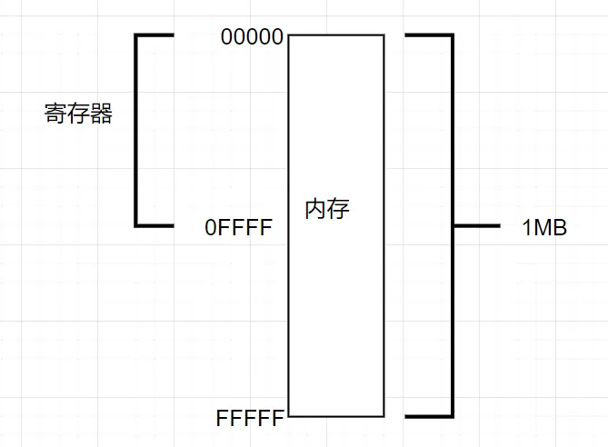
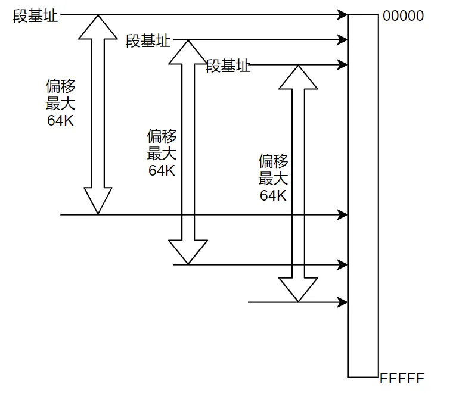
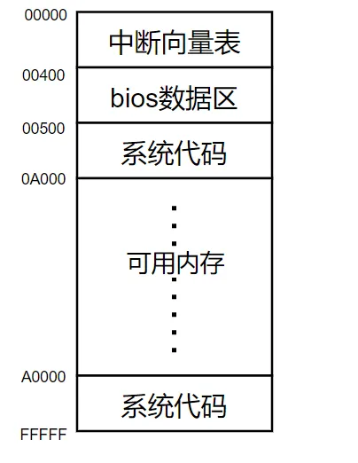
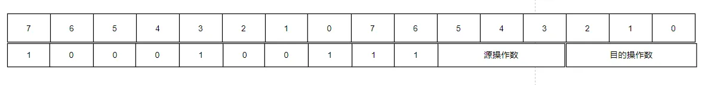

- [内存的分段管理](#内存的分段管理)
  - [dos系统内存分布](#dos系统内存分布)
  - [段寄存器](#段寄存器)
- [8086指令集](#8086指令集)
  - [指令的机器码构成](#指令的机器码构成)

# 内存的分段管理

8086CPU的寄存器是16位的，所以它能够访问的内存空间是64KB。但是，8086CPU的地址总线是20位的，所以它能够访问的内存空间是1MB。这就意味着，8086CPU的寄存器无法直接访问所有的内存空间。



为了解决这个问题，8086CPU引入了段寄存器，通过段寄存器和偏移地址的组合，8086CPU可以访问1MB的内存空间。



## dos系统内存分布

低地址内存空间：0x00000~0x9FFFF ，用于存放各种数据，大小为640KB

高地址内存空间：0xA0000~0xFFFFF，用于显示和BIOS，大小为384KB



## 段寄存器

地址表示方式：`段地址:偏移地址`

基址寄存器：`BX`、`BP`、`SI`、`DI`

| 表示方式 | 用途           |
| --- | -------------- |
| CS:IP | 代码段寄存器，指令指针寄存器 |
| DS:DX | 数据段寄存器，数据指针寄存器 |
| SS:SP | 栈段寄存器，栈指针寄存器   |
| ES:SI | 附加段寄存器，源变址寄存器   |
| ES:DI | 附加段寄存器，目标变址寄存器   |
| ES:BP | 附加段寄存器，基址寄存器     |
| ES:BX | 附加段寄存器，基址寄存器     |

这些表示方式中，`:`前面的部分是**段地址**，`:`后面的部分是**偏移地址**。称作**逻辑地址**。`物理地址=段地址*10h+偏移地址`。

# 8086指令集

8086CPU的指令语法：`操作码 目标操作数, 源操作数`
* 操作码：指令的功能
* 目标操作数：指令执行的结果存放的地址
* 源操作数：指令执行的操作数

**常用指令：**
* `mov`：数据传送指令，将源操作数传送到目标操作数
* `add`：加法指令，将源操作数与目标操作数相加，结果存入目标操作数
* `sub`：减法指令，将源操作数从目标操作数中减去，结果存入目标操作数
* `mul`：乘法指令，将源操作数与目标操作数相乘，结果存入目标操作数
* `div`：除法指令，将源操作数除以目标操作数，商存入目标操作数，余数存入DX寄存器
* `jmp`：跳转指令，将程序控制转移到指定的地址
* `call`：调用指令，将程序控制转移到指定的地址，并将返回地址压入栈中
* `ret`：返回指令，从栈中弹出返回地址，并将程序控制转移到该地址
* `push`：压栈指令，将操作数压入栈中
* `pop`：弹栈指令，从栈中弹出操作数
* `cmp`：比较指令，将源操作数与目标操作数进行比较，但不改变目标操作数的值
* `int`：中断指令，调用中断服务程序

## 指令的机器码构成

```
mov r16, r16
89C0 MOV AX,AX      100010 0 1 11 000 000
89C8 MOV AX,CX      100010 0 1 11 001 000
89D0 MOV AX,DX      100010 0 1 11 010 000
89D8 MOV AX,BX      100010 0 1 11 011 000
89E0 MOV AX,SP      100010 0 1 11 100 000
89E8 MOV AX,BP      100010 0 1 11 101 000
89F0 MOV AX,SI      100010 0 1 11 110 000
89F8 MOV AX,DI      100010 0 1 11 111 000

mov r8, r8 
88C0 MOV AL,AL    100010 0 0 11 000 000
88C8 MOV AL,CL    100010 0 0 11 001 000
88D0 MOV AL,DL    100010 0 0 11 010 000
88D8 MOV AL,BL    100010 0 0 11 011 000
88E4 MOV AH,AH    100010 0 0 11 100 100
88EC MOV AH,CH    100010 0 0 11 101 100
88F4 MOV AH,DH    100010 0 0 11 110 100
88FC MOV AH,BH    100010 0 0 11 111 100

mov r16, [EA]
8B04 MOV AX,[SI]       100010 1 1 00 000 100
8B05 MOV AX,[DI]       100010 1 1 00 000 101
8B1C MOV BX,[SI]       100010 1 1 00 011 100
8B1D MOV BX,[DI]       100010 1 1 00 011 101

8B18 MOV BX,[BX+SI]          100010 1 1 00 011 000
8B1F MOV BX,[BX]             100010 1 1 00 011 111
8B1E0100 MOV BX,[0001]       100010 1 1 00 011 110 0000 0001 0000 0000
8B5E01 MOV BX,[BP+01]        100010 1 1 01 011 110 0000 0001
8B5801 MOV BX,[BX+SI+01]     100010 1 1 01 011 000 0000 0001
8B980101 MOV BX,[BX+SI+0102] 100010 1 1 10 011 000 0000 0002 0000 0001
8B9E0201 MOV BX,[BP+0102]    100010 1 1 10 011 110 0000 0002 0000 0001
89DB MOV BX,BX               100010 0 1 11 011 011

A10201 MOV AX,[0102] 1010000 1 0000 0010 0000 0001
A00201 MOV AL,[0102] 1010000 0 0000 0010 0000 0001
A30201 MOV [0102],AX 1010001 1 0000 0010 0000 0001
A20201 MOV [0102],AL 1010001 0 0000 0010 0000 0001

mov r8, [EA]
8A04 MOV AL,[SI]    100010 1 0 00 000 100
8A24 MOV AH,[SI]    100010 1 0 00 100 100
8A05 MOV AL,[DI]    100010 1 0 00 000 101
8A1C MOV BL,[SI]    100010 1 0 00 011 100
8A1D MOV BL,[DI]    100010 1 0 00 011 101

mov [EA], r16
8904 MOV [SI],AX    100010 0 1 00 000 100
8905 MOV [DI],AX    100010 0 1 00 000 101
891C MOV [SI],BX    100010 0 1 00 011 100
891D MOV [DI],BX    100010 0 1 00 011 101
89D9 MOV CX,BX               100010 0 1 11 011 001
891E0100 MOV [0001],BX       100010 0 1 00 011 110 0000 0001 0000 0000
895F01 MOV [BX+01],BX        100010 0 1 01 011 111 0000 0001
895801 MOV [BX+SI+01],BX     100010 0 1 01 011 000 0000 0001
89980201 MOV [BX+SI+0102],BX 100010 0 1 10 011 000 0000 0010 0000 0001

mov [EA], r8
8804 MOV [SI],AL    100010 0 0 00 000 100
8805 MOV [DI],AL    100010 0 0 00 000 101
881C MOV [SI],BL    100010 0 0 00 011 100
881D MOV [DI],BL    100010 0 0 00 011 101

mov r16, imm16
B8FFFF MOV AX,FFFF  101110 0 0 1111 1111 1111 1111
BBFFFF MOV BX,FFFF  101110 1 1 1111 1111 1111 1111

mov r8, imm8
B0FF MOV AL,FF      1011 0 000 1111 1111
B3FF MOV BL,FF      1011 0 011 1111 1111

mov [EA], imm16
C704FFFF MOV WORD PTR [SI],FFFF 1100 011 1 0000 0100 1111 1111 1111 1111
C705FFFF MOV WORD PTR [DI],FFFF 1100 011 1 0000 0101 1111 1111 1111 1111

mov [EA], imm8
C604FF MOV BYTE PTR [SI],FF     1100 011 0 0000 0100 1111 1111
C605FF MOV BYTE PTR [DI],FF     1100 011 0 0000 0101 1111 1111

mov r16, segment register
8EC0 MOV ES,AX 10001110 11 0 00 000

mov segment register, r16 
8CC0 MOV AX,ES 10001100 11 0 00 000
```



| 寄存器 | 机器码 | 代码 |
| --- | --- | --- |
| ax | 000 | 0 |
| bx | 001 | 1 |
| cx | 010 | 2 |
| dx | 011 | 3 |
| sp | 100 | 4 |
| bp | 101 | 5 |
| si | 110 | 6 |
| di | 111 | 7 |