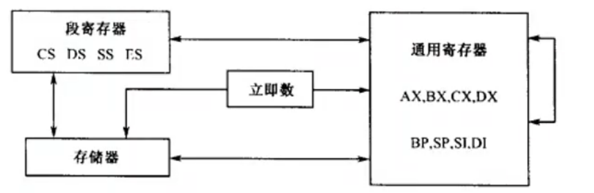

- [数据传送类指令](#数据传送类指令)
  - [传送指令 MOV(move)](#传送指令-movmove)
  - [堆栈操作指令](#堆栈操作指令)
  - [交换指令 XCHG(exchange)](#交换指令-xchgexchange)
  - [换码指令](#换码指令)
  - [标志寄存器传送指令](#标志寄存器传送指令)
  - [地址传送指令](#地址传送指令)
  - [输入输出指令](#输入输出指令)
- [算术运算类指令](#算术运算类指令)
  - [加法](#加法)
  - [比较指令 CMP](#比较指令-cmp)
  - [乘法指令](#乘法指令)
  - [除法指令 DIV](#除法指令-div)
- [位操作类指令](#位操作类指令)
- [串操作类指令](#串操作类指令)
- [控制转移类指令](#控制转移类指令)
- [处理器控制类指令](#处理器控制类指令)

# 数据传送类指令

## 传送指令 MOV(move)

把一个字节或字的操作数从源地址传送到目标地址。不存在从存储器向存储器的传送指令。



例如：

```
// es -> ds
mov ax, es
mov ds, ax
```

## 堆栈操作指令

push: 将操作数压入堆栈

pop: 将操作数从堆栈弹出

保存所有寄存器到堆栈
* 16位：pusha/popa
* 32位：pushad/popad

例如：

```
// 将 ax 压入堆栈
push ax
// 将 ax 弹出
pop ax
// 保存所有寄存器到堆栈 顺序为：ax, cx, dx, bx, sp, bp, si, di
pushad
// 从堆栈恢复所有寄存器 顺序为：di, si, bp, sp, bx, dx, cx, ax
popad
```

## 交换指令 XCHG(exchange)

数据交换指令。交换两个操作数的内容。效率优于mov指令。
  * 寄存器与寄存器
  * 寄存器与存储器
  * 不存在存储器与存储器之间的交换

例如：

```
// 交换 ax 与 bx
xchg ax, bx
// 交换 al 与 ah
xchg al, ah
```

## 换码指令

将BX指定的缓冲区中、AL指定的字节偏移处的字节传送到AL中。

例如：

```
// al <-- ds:[bx + al];
mov bx, 0
mov al, 10
xlat 
```

## 标志寄存器传送指令

* 低8位传送指令：LAHF/SAHF
* 16位传送指令：PUSHF/POPF

例如：

```
// 将标志寄存器入栈
pushf
// 修改标志
e ss:sp 7283
// 将标志寄存器出栈
popf
```

## 地址传送指令

* LEA(load effective address): 将有效地址传送到寄存器
* LDS(load double segment): 将段寄存器和偏移地址传送到寄存器，偏移地址放入指定寄存器，段寄存器放入DS
* LES(load extra segment): 将段寄存器和偏移地址传送到寄存器，偏移地址放入指定寄存器，段寄存器放入ES

例如：

```
// 将 ds:[bx + si] 的地址传送到 ax
lea ax, ds:[bx + si]
// 将 ds:[bx + si] 的值传送到 ax 和 ds
lds ax, ds:[bx + si]
// 将 es:[bx + si] 的值传送到 ax 和 es
les ax, es:[bx + si]
```

## 输入输出指令

* IN: 将端口数据输入到寄存器
* OUT: 将寄存器数据输出到端口

例如：

```
// 将端口 0x70 的数据输入到 al
in al, 0x70
// 将 al 的数据输出到端口 0x70
out 0x70, al
```

# 算术运算类指令

## 加法

* ADD: 加法
* ADC: 带进位加法，正常情况下与ADD指令相同，当CF=1时，结果加1
* INC: 加1，不影响CF标志位

例如：

```
// 将 ax 加 1
inc ax
// 将 ax 加 1，并设置 CF 标志位
adc ax, 1
// 将 ax 加 1，并设置 CF 标志位
add ax, 1
```

## 比较指令 CMP

* 比较两个操作数，根据比较结果设置标志位
* 比较指令与减法指令相同，但结果不保存

例如：

```
// 比较 ax 与 bx
cmp ax, bx
```

## 乘法指令

无符号数乘法 MUL
* 如果乘积的高一半位（AH/DX/EDX）包含有乘积的有效位，则CF=1、OF=1，否则CF=0、OF=0

有符号数乘法 IMUL

| 位数 | 隐含的被乘数 | 乘积的存放位置 | 举例 |
| ---- | ------------ | -------------- | ---- |
| 8    | AL           | AX             | MUL BL |
| 16   | AX           | DX:AX          | MUL BX |
| 32   | EAX          | EDX:EAX        | MUL EBX |

例如：

```
mov al, ff
mov bl, ff
mul bl

r ax ffff
r bx ffff
mul bx
```

## 除法指令 DIV

无符号数除法 DIV Reg/Mem

有符号数除法 IDIV Reg/Mem
* 影响标志位 CF、OF、SF、ZF、PF、AF

除法溢出
* 被除数远大于除数时，所得的商可能超出他所能表示的范围
* idiv 溢出
  * 字节除时商不在-128~127范围内，或字除时商不在-32768~32767范围内
* div 溢出
  * 8位除法结果大于8位，16位除法结果大于16位

| 位数 | 被除数 | 除数 | 商 | 余数 |
| ---- | ------ | ---- | -- | ---- |
| 8    | AX     | 8位   | AL | AH   |
| 16   | DX:AX  | 16位  | AX | DX   |
| 32   | EDX:EAX | 32位  | EAX | EDX  |

例子：

```
mov ax, 10
mov bl, 3
div bl
```

# 位操作类指令

# 串操作类指令

# 控制转移类指令

# 处理器控制类指令