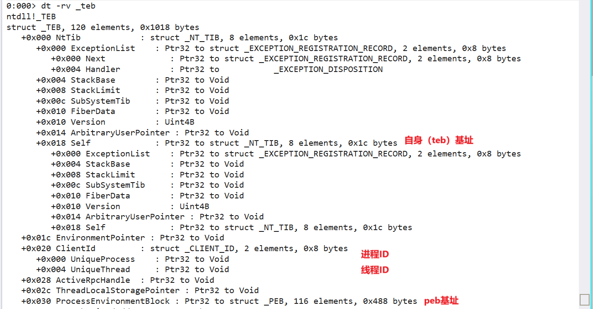
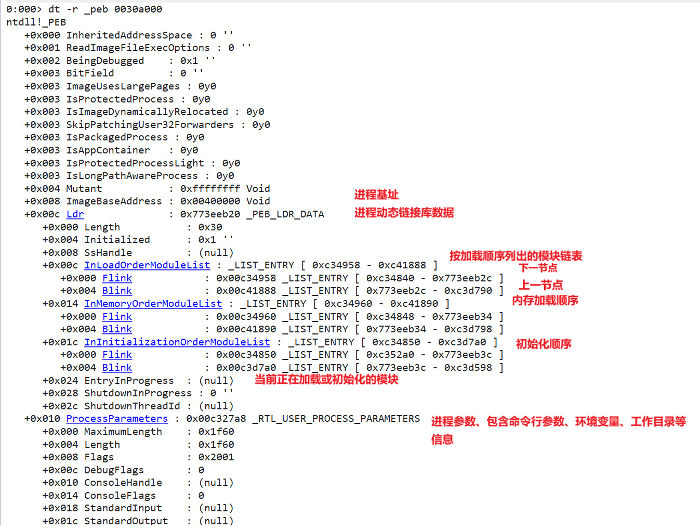

- [teb和peb](#teb和peb)
  - [teb（Thread Environment Block） 线程环境块](#tebthread-environment-block-线程环境块)
  - [peb（Process Environment Block） 进程环境块](#pebprocess-environment-block-进程环境块)
- [Windbg命令](#windbg命令)

# teb和peb

## teb（Thread Environment Block） 线程环境块

**TEB**中包含了线程的堆栈指针、TLS（线程本地存储）指针、异常处理链表指针、用户模式分页表指针等信息。**TEB**中的`FS`段寄存器通常被设置为`fs:[0]`，指向当前线程的TEB结构体。

通过TEB结构体我们可以看到`+0x18`是自生段基址，也就是`fs:[0]`，指向TEB结构体。`+0x30`是PEB进程环境块基址，指向PEB结构体。

## peb（Process Environment Block） 进程环境块

**PEB**中包含了进程的代码、数据段指针、进程的环境变量、进程启动参数信息以及加载的dll信息等。**PEB**结构体中的`FS段寄存器`通常被设置为`0x30`，指向当前进程的**PEB**结构体。

在PEB结构体中，`+0x0c`指向_PEB_LDR_DATA（动态链接库数据）结构体和_LDR_DATA_TABLE_ENTRY（动态链接库数据表项），`+0x08`指向进程基址，`+0x10`指向_RTL_USER_PROCESS_PARAMETERS（进程参数）结构体。

# Windbg命令

* !peb 查看进程环境块
* !teb 查看线程环境块
* g $exentry 跳转到程序入口点
* dt -rv _TEB 查看teb结构体类型以及子结构体类型
* dt !_TEB 查看_teb结构体类型
* dt !_PEB 查看_peb结构体类型
* dt _peb [address] 使用peb结构体查看内存地址的内容
* dd [address] 查看内存地址的内容
* du [address] 查看内存地址的内容（字符串形式）
* r $tib 查看线程环境块地址
* r $peb 查看进程环境块地址
* x [dllname]!functionname 查找dll中的函数地址 - dll名和函数名都可以使用通配符