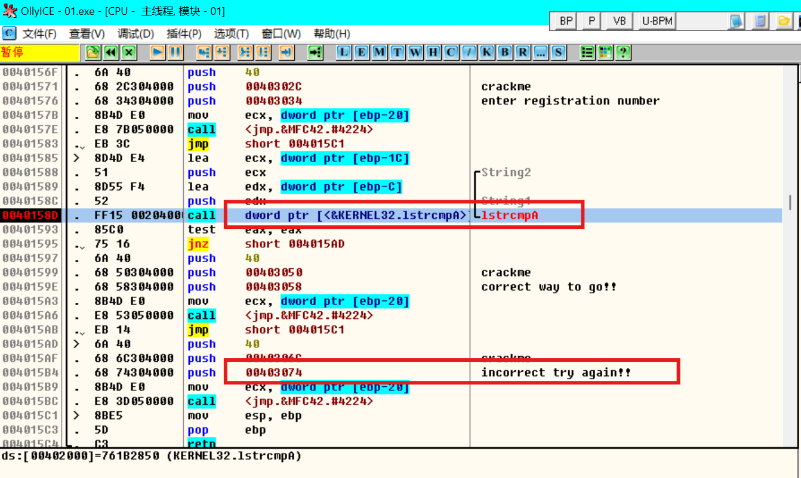

- [补丁](#补丁)
  - [1. 找到程序过程函数](#1-找到程序过程函数)
  - [2. 找到`WM_CLOSE`消息处理函数](#2-找到wm_close消息处理函数)
  - [3. 打补丁](#3-打补丁)
- [crack](#crack)

# 补丁

扫雷应用程序中，打补丁，让程序在关闭时，弹出对话框显示是否关闭。

## 1. 找到程序过程函数

在开发中，调用`registerclass`函数注册窗口类时，要用到过程函数。在这里可以找到过程函数地址。

* 方式一
  * 通过`符号`搜索`registerclassa`，找到`kernel32.dll`中的`registerclassa
  数。
  * `右键`->`搜索`->`当前模块`->`跨模块调用`，搜索`registerclassa`，
  `winmine.exe`中的`registerclassa`函数。
  * 通过查看`registerclassa`函数的参数找到过程函数地址。`01001bc9`
* 方式二
  * 通过`句柄`，找到窗口过程函数
* 方式三
  * 通过消息处理，比如说菜单消息的弹出对话框，通过`dialogbox`找到过程函数

## 2. 找到`WM_CLOSE`消息处理函数

找到过程函数之后，找到`WM_CLOSE`消息在哪里处理。`WM_CLOSE == 0x0010`。找到`cmp 10`的地方，这里扫雷没有该比较，所以可以知道`WM_CLOSE`消息是在`defwindowprocw`函数中处理。

## 3. 打补丁

在不改变程序原有功能的前提下，我们将`call defwindowprocw`修改为调用我们自己的函数`myproc`，在`myproc`中处理`defwindowprocw`和`WM_CLOSE`消息。

1. 找到一块空闲内存

``` asm
01004A62                         | push ebp                                  |
01004A63                         | mov ebp,esp                               |
01004A65                         | push ebx                                  |
01004A66                         | push ecx                                  |
01004A67                         | push edx                                  |
01004A68                         | push edx                                  |
01004A69                         | push esi                                  | esi:"p{Z"
01004A6A                         | push edi                                  |
01004A6B                         | mov ebx,dword ptr ss:[ebp+C]              | [ebp+0C]:BaseThreadInitThunk
01004A6E                         | cmp ebx,10                                |
01004A71                         | jne winmine.1004A8C                       |
01004A73                         | push 1                                    |
01004A75                         | push winmine.1004AD7                      | 1004AD7:"are you ok?"
01004A7A                         | push 0                                    |
01004A7C                         | push 0                                    |
01004A7E                         | nop                                       |
01004A7F                         | nop                                       |
01004A80                         | nop                                       |
01004A81                         | nop                                       |
01004A82                         | call <user32.MessageBoxA>                 |
01004A87                         | cmp eax,2                                 |
01004A8A                         | je winmine.1004AA9                        |
01004A8C                         | push dword ptr ss:[ebp+14]                | [ebp+14]:RtlInitializeExceptionChain+6B
01004A8F                         | push dword ptr ss:[ebp+10]                |
01004A92                         | push dword ptr ss:[ebp+C]                 | [ebp+0C]:BaseThreadInitThunk
01004A95                         | push dword ptr ss:[ebp+8]                 |
01004A98                         | call dword ptr ds:[<DefWindowProcW>]      |
01004A9E                         | pop edi                                   |
01004A9F                         | pop esi                                   | esi:"p{Z"
01004AA0                         | pop edx                                   |
01004AA1                         | pop ecx                                   |
01004AA2                         | pop ebx                                   |
01004AA3                         | mov esp,ebp                               |
01004AA5                         | pop ebp                                   |
01004AA6                         | ret 10                                    |
01004AA9                         | jmp winmine.1004A9E                       |
```

2. 将原有的`call defwindowprocw`修改调用我们自己的函数

``` asm
010021B5                         | call winmine.1004A62                      |
```

# crack

找出 `01.exe` 正确的序列号。

1. 通过字符串搜索，找到调用该字符串的函数地址
 
在 `OllyICE` 中右键选择 `Ultra String Reference` -> `Find ASCII` ，找到字符串 `incorrect try again!!` ，双击转到该字符串的地址。

2. 在该地址处附近找到我们自己输入的字符串，或者比较字符串的函数。



分析和我们输入字符串比较的字符串，找出序列号。 `<BrD-SoB>`