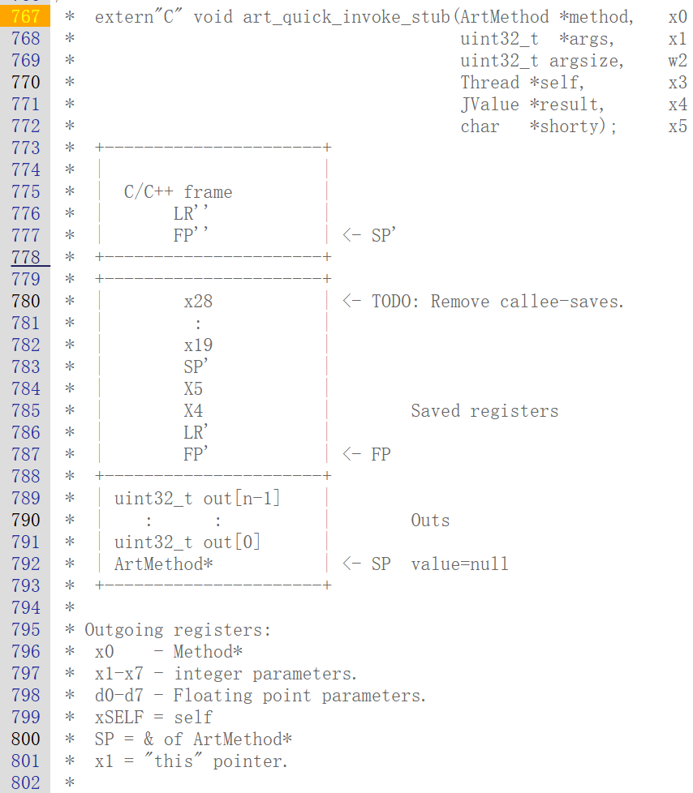
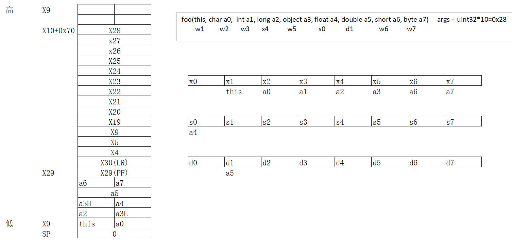

<!-- @import "[TOC]" {cmd="toc" depthFrom=1 depthTo=6 orderedList=false} -->

<!-- code_chunk_output -->

- [hook点](#hook点)
- [函数调用流程](#函数调用流程)
  - [`CallIntMethod`](#callintmethod)
  - [`InvokeVirtualOrInterfaceWithVarArgs`](#invokevirtualorinterfacewithvarargs)
  - [`InvokeWithArgArray`](#invokewithargarray)
  - [`Invoke`](#invoke)
    - [`art_quick_invoke_stub`](#art_quick_invoke_stub)
      - [`INVOKE_STUB_CREATE_FRAME`](#invoke_stub_create_frame)
      - [`INVOKE_STUB_CALL_AND_RETURN`](#invoke_stub_call_and_return)

<!-- /code_chunk_output -->


# hook点

> https://xrefandroid.com/android-8.1.0_r81/xref/art/runtime/art_method.h#entry_point_from_quick_compiled_code_

* 所有的方法都让他走机器码，如果是字节码则进行编译，不是字节码则让他走解释执行
* 所有的方法都对 `entry_point_from_quick_compiled_code_` 进行内联hook

# 函数调用流程

## `CallIntMethod`

> https://xrefandroid.com/android-8.1.0_r81/xref/art/runtime/jni_internal.cc#CallIntMethod

* `JValue` - 返回值的共用体
* 调用 `InvokeVirtualOrInterfaceWithVarArgs`

## `InvokeVirtualOrInterfaceWithVarArgs`

> https://xrefandroid.com/android-8.1.0_r81/xref/art/runtime/reflection.cc?fi=InvokeVirtualOrInterfaceWithVarArgs#InvokeVirtualOrInterfaceWithVarArgs

``` C++
// 获取调用对象的 this 指针
ObjPtr<mirror::Object> receiver = soa.Decode<mirror::Object>(obj);
```

``` C++
// 获取短名称，以及短名称个数
uint32_t shorty_len = 0;
  const char* shorty =
      method->GetInterfaceMethodIfProxy(kRuntimePointerSize)->GetShorty(&shorty_len);
// 申请内存
ArgArray arg_array(shorty, shorty_len);
// 将参数和this存入申请的内存，按照4字节对齐
arg_array.BuildArgArrayFromVarArgs(soa, receiver, args);
```

* 调用 `InvokeWithArgArray`

## `InvokeWithArgArray`

> https://xrefandroid.com/android-8.1.0_r81/xref/art/runtime/reflection.cc?fi=InvokeVirtualOrInterfaceWithVarArgs#InvokeWithArgArray

* 获取参数首地址，并且调用`Invoke` (thread*、参数的数组、参数的字节数、结果、短名称)

## `Invoke`

> https://xrefandroid.com/android-8.1.0_r81/xref/art/runtime/art_method.cc#Invoke

``` C++
  if (!IsStatic()) {
    // (ArtMethod*, 参数数组, 参数字节数, thread*, 结果, 短名称)
    (*art_quick_invoke_stub)(this, args, args_size, self, result, shorty);
  } else {
    (*art_quick_invoke_static_stub)(this, args, args_size, self, result, shorty);
  }
```

### `art_quick_invoke_stub`

> https://xrefandroid.com/android-8.1.0_r81/xref/art/runtime/arch/arm64/quick_entrypoints_arm64.S#804



* 调用 `INVOKE_STUB_CREATE_FRAME` 保存寄存器环境和参数存入栈
* 将栈中的参数放入寄存器中
* 调用 `INVOKE_STUB_CALL_AND_RETURN`



#### `INVOKE_STUB_CREATE_FRAME`

> https://xrefandroid.com/android-8.1.0_r81/xref/art/runtime/arch/arm64/quick_entrypoints_arm64.S#INVOKE_STUB_CREATE_FRAME

* 保存寄存器环境，并将参数存入栈中

#### `INVOKE_STUB_CALL_AND_RETURN`

> https://xrefandroid.com/android-8.1.0_r81/xref/art/runtime/arch/arm64/quick_entrypoints_arm64.S#INVOKE_STUB_CALL_AND_RETURN

* 这里调用 `method->entry_point_from_quick_compiled_code_`