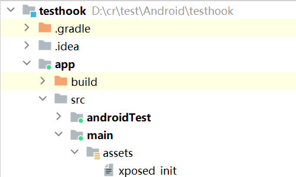

<!-- @import "[TOC]" {cmd="toc" depthFrom=1 depthTo=6 orderedList=false} -->

<!-- code_chunk_output -->

- [LSPosed](#lsposed)
  - [Android Studio 引入 xposed 接口模块](#android-studio-引入-xposed-接口模块)
  - [代码开发](#代码开发)
    - [一般方法](#一般方法)
    - [构造](#构造)
    - [静态方法](#静态方法)
    - [字段](#字段)
    - [使用xposed接口](#使用xposed接口)
    - [静态字段](#静态字段)
    - [内部类](#内部类)
    - [匿名内部类](#匿名内部类)
    - [JNI](#jni)
    - [主动调用](#主动调用)
  - [添加xposed的清单说明](#添加xposed的清单说明)
  - [安装模块](#安装模块)
  - [hook native](#hook-native)
    - [c/c++部分](#cc部分)
    - [java 部分](#java-部分)
    - [工程配置](#工程配置)
- [Pine](#pine)
  - [基础使用](#基础使用)

<!-- /code_chunk_output -->


# LSPosed

HOOK框架，支持参数和返回值的修改。

> [LSPosed安装](https://magiskcn.com/lsposed-install.html)

> https://github.com/LSPosed/LSPosed

## Android Studio 引入 xposed 接口模块

* 阿里的meven仓库，参照`gradle配置指南`
> https://developer.aliyun.com/mvn/guide?spm=a2c6h.13651104.mirror-free-trial.5.43586e1aJbOskB

* 在 settings.gradle 中添加如下代码

``` Groovy
dependencyResolutionManagement {
    repositoriesMode.set(RepositoriesMode.FAIL_ON_PROJECT_REPOS)
    repositories {
        google()
        mavenCentral()
        // 添加的代码
        maven {
            url 'https://maven.aliyun.com/repository/public/'
        }
        maven {
            url 'https://maven.aliyun.com/repository/central'
        }
    }
}
```

* 在 build.gradle 中添加如下依赖：

``` Groovy
dependencies {
    // 添加的代码
    compileOnly "de.robv.android.xposed:api:82"

    implementation libs.appcompat
    implementation libs.material
    implementation libs.activity
    implementation libs.constraintlayout
    testImplementation libs.junit
    androidTestImplementation libs.ext.junit
    androidTestImplementation libs.espresso.core
}
```

## 代码开发

* 在项目工程中新建文件和目录 `xposed_init`，并在文件中写入`包名.类名`，`com.cr49.testhook.MyMod`



> [Xposed API](https://api.xposed.info/reference/packages.html)

* 新建java类，实现xposed的接口

### 一般方法
``` Java
package com.cr49.testhook;

import android.util.Log;

import de.robv.android.xposed.IXposedHookLoadPackage;
import de.robv.android.xposed.XC_MethodHook;
import de.robv.android.xposed.XposedHelpers;
import de.robv.android.xposed.callbacks.XC_LoadPackage;

public class MyMod implements IXposedHookLoadPackage {
    @Override
    public void handleLoadPackage(XC_LoadPackage.LoadPackageParam lpparam) throws Throwable {
        Log.v("MyMod", lpparam.packageName);

        Class<?> cls = lpparam.classLoader.loadClass("com.cr49.test.MainActivity");

        XposedHelpers.findAndHookMethod(cls, "foo", String.class, int.class, float.class, new XC_MethodHook() {
            @Override
            protected void beforeHookedMethod(MethodHookParam param) throws Throwable {
                super.beforeHookedMethod(param);
                Log.v("MyMod", "arg0:" + (String)param.args[0] +
                        " arg1:" + (int)param.args[1] +
                        " arg2:" + (float)param.args[2]);
                param.args[0] = "world";
                param.args[1] = 9999;
                param.args[2] = 1.1111F;
            }

            @Override
            protected void afterHookedMethod(MethodHookParam param) throws Throwable {
                super.afterHookedMethod(param);
                Log.v("MyMod", "Res:" + param.getResult());
                param.setResult(8888);
            }
        });

    }
}
```

### 构造

``` Java
package com.example.myposed;
import android.util.Log;

import de.robv.android.xposed.IXposedHookLoadPackage;
import de.robv.android.xposed.XC_MethodHook;
import de.robv.android.xposed.XposedBridge;
import de.robv.android.xposed.XposedHelpers;
import de.robv.android.xposed.callbacks.XC_LoadPackage;
import de.robv.android.xposed.callbacks.XCallback;

public class MyModule implements IXposedHookLoadPackage{
    @Override
    public void handleLoadPackage(XC_LoadPackage.LoadPackageParam lpparam) throws Throwable {
        Log.v("xposed", lpparam.packageName);

        Class<?> clsTest = lpparam.classLoader.loadClass("com.example.testfrida.Test2");
        if (clsTest == null){
            Log.v("xposed", "failed to load class com.example.testfrida.Test2");
            return;
        }

        //方法一
        XposedHelpers.findAndHookConstructor(clsTest, new XC_MethodHook() {
            @Override
            protected void beforeHookedMethod(MethodHookParam param) throws Throwable {
                super.beforeHookedMethod(param);

                Log.v("xposed", "Tesst2() before");
            }

            @Override
            protected void afterHookedMethod(MethodHookParam param) throws Throwable {
                super.afterHookedMethod(param);
                Log.v("xposed", "Tesst2() after");
            }
        });

        XposedHelpers.findAndHookConstructor(clsTest,int.class, new XC_MethodHook() {
            @Override
            protected void beforeHookedMethod(MethodHookParam param) throws Throwable {
                super.beforeHookedMethod(param);
                Log.v("xposed", "Tesst2(int) before int:" + param.args[0]);

                param.args[0] = 12;
            }

            @Override
            protected void afterHookedMethod(MethodHookParam param) throws Throwable {
                super.afterHookedMethod(param);


                Log.v("xposed", "Tesst2(int) after int:" + param.args[0]);
            }
        });

        //方法二
        XposedHelpers.findAndHookConstructor("com.example.testfrida.Test2", lpparam.classLoader,
                float.class, int.class, new XC_MethodHook() {
                    @Override
                    protected void beforeHookedMethod(MethodHookParam param) throws Throwable {
                        super.beforeHookedMethod(param);
                        Log.v("xposed", "Tesst2(float, int) before int:" + param.args[1] + " float:" + param.args[0]);

                        param.args[0] = (float)3.6;
                        param.args[1] = 13;

                    }

                    @Override
                    protected void afterHookedMethod(MethodHookParam param) throws Throwable {
                        super.afterHookedMethod(param);
                        Log.v("xposed", "Tesst2(float, int) after int:" + param.args[1] + " float:" + param.args[0]);
                    }
                });
    }
}
```

### 静态方法

``` Java
    public void HookSaticMethod(XC_LoadPackage.LoadPackageParam param){
        XposedHelpers.findAndHookMethod("com.example.testposedhook.Foo", param.classLoader, "StaticTest", int.class, new XC_MethodHook() {
            @Override
            protected void beforeHookedMethod(MethodHookParam param) throws Throwable {
                super.beforeHookedMethod(param);
                XposedBridge.log("befor StaticTest(n) n:"+param.args[0]);
            }

            @Override
            protected void afterHookedMethod(MethodHookParam param) throws Throwable {
                super.afterHookedMethod(param);
                XposedBridge.log("after StaticTest(n) n:"+param.args[0]);
            }
        });
        XposedHelpers.findAndHookMethod("com.example.testposedhook.Foo", param.classLoader, "StaticTest", new XC_MethodHook() {
            @Override
            protected void beforeHookedMethod(MethodHookParam param) throws Throwable {
                super.beforeHookedMethod(param);
                XposedBridge.log("befor StaticTest():");
            }

            @Override
            protected void afterHookedMethod(MethodHookParam param) throws Throwable {
                super.afterHookedMethod(param);
                XposedBridge.log("after StaticTest():");
            }
        });
    }
```

### 字段

``` Java
    public void AccessField(XC_LoadPackage.LoadPackageParam param) {
        XposedHelpers.findAndHookConstructor("com.example.testposedhook.Foo", param.classLoader, new XC_MethodHook() {
            @Override
            protected void beforeHookedMethod(MethodHookParam param) throws Throwable {
                super.beforeHookedMethod(param);
                XposedBridge.log("befor Foo() ");
            }

            @Override
            protected void afterHookedMethod(MethodHookParam param) throws Throwable {
                super.afterHookedMethod(param);

                //获取class
                Class clsFoo = XposedHelpers.findClass("com.example.testposedhook.Foo", param.thisObject.getClass().getClassLoader());

                //获取字段
                Field fieldStr = clsFoo.getDeclaredField("mStr");
                fieldStr.setAccessible(true);
                fieldStr.set(param.thisObject, "string from xposed");

                Field fieldN = clsFoo.getDeclaredField("mN");
                fieldN.setAccessible(true);
                fieldN.setInt(param.thisObject, 12);

                XposedBridge.log("after Foo() ");
            }
        });
    }
```

### 使用xposed接口

``` Java
XposedHelpers.setObjectField(param.thisObject, "mStr", "string from xposed");
XposedHelpers.setIntField(param.thisObject, "mN", 13);
```

### 静态字段

``` Java
XposedHelpers.setStaticIntField(param.thisObject.getClass(), "mNSatic", 88);
XposedHelpers.setStaticObjectField(param.thisObject.getClass(), "mStrStatic", "string from xposed");
```

### 内部类

* 内部类的完整类名可以通过反编译工具查看


* 需要注意的是，内部类的构造中会多出一个参数

``` Java
    public void HookInner(XC_LoadPackage.LoadPackageParam param)throws Throwable {
        Class clsInner = param.classLoader.loadClass("com.example.testposedhook.Foo$Inner");
        if (clsInner == null){
            XposedBridge.log("找不到类 com.example.testposedhook.Foo$Inner");
            return;
        }

        XposedHelpers.findAndHookConstructor("com.example.testposedhook.Foo$Inner", param.classLoader,
                XposedHelpers.findClass("com.example.testposedhook.Foo", param.classLoader),
                new XC_MethodHook() {
            @Override
            protected void beforeHookedMethod(MethodHookParam param) throws Throwable {
                super.beforeHookedMethod(param);
                XposedBridge.log("befor Foo$Inner() ");
            }

            @Override
            protected void afterHookedMethod(MethodHookParam param) throws Throwable {
                super.afterHookedMethod(param);
                XposedBridge.log("after Foo$Inner() ");
            }
        });

        XposedHelpers.findAndHookConstructor("com.example.testposedhook.Foo$Inner", param.classLoader,
                XposedHelpers.findClass("com.example.testposedhook.Foo", param.classLoader),
                int.class, new XC_MethodHook() {
            @Override
            protected void beforeHookedMethod(MethodHookParam param) throws Throwable {
                super.beforeHookedMethod(param);
                XposedBridge.log("befor Foo$Inner(n) n:" + param.args[0]);
            }

            @Override
            protected void afterHookedMethod(MethodHookParam param) throws Throwable {
                super.afterHookedMethod(param);
                XposedBridge.log("after Foo$Inner(n) n:" + param.args[0]);
            }
        });

        XposedHelpers.findAndHookMethod("com.example.testposedhook.Foo$Inner", param.classLoader, "Test", String.class, new XC_MethodHook() {
            @Override
            protected void beforeHookedMethod(MethodHookParam param) throws Throwable {
                super.beforeHookedMethod(param);
                XposedBridge.log("befor Foo$Inner::Test() ");
            }

            @Override
            protected void afterHookedMethod(MethodHookParam param) throws Throwable {
                super.afterHookedMethod(param);
                XposedBridge.log("after Foo$Inner::Test() ");
            }
        });
    }
```

### 匿名内部类

* 匿名内部类的类名可以通过反编译工具查看，一般是`类名`+`数字`


``` Java
    public void HookNonameInner(XC_LoadPackage.LoadPackageParam param){
        XposedHelpers.findAndHookMethod("com.example.testposedhook.MainActivity$1", param.classLoader, "onClick", View.class, new XC_MethodHook() {
            @Override
            protected void beforeHookedMethod(MethodHookParam param) throws Throwable {
                super.beforeHookedMethod(param);
                XposedBridge.log("befor com.example.testposedhook.MainActivity$1 onClick");
            }

            @Override
            protected void afterHookedMethod(MethodHookParam param) throws Throwable {
                super.afterHookedMethod(param);
                XposedBridge.log("after com.example.testposedhook.MainActivity$1 onClick");
            }
        });

    }
```

### JNI

* 跟hook一般函数是一样的

``` Java
    public void HookJni(XC_LoadPackage.LoadPackageParam param){

        XposedHelpers.findAndHookMethod("com.example.testposedhook.Foo", param.classLoader, "FooJni", String.class, new XC_MethodHook() {
            @Override
            protected void beforeHookedMethod(MethodHookParam param) throws Throwable {
                super.beforeHookedMethod(param);
                XposedBridge.log("befor FooJni str:" + param.args[0]);
            }

            @Override
            protected void afterHookedMethod(MethodHookParam param) throws Throwable {
                super.afterHookedMethod(param);
                XposedBridge.log("after FooJni");
            }
        });
    }
```

### 主动调用

* 思路一 - 使用 java 反射的方式调用
* 思路二 - 使用 xposed 提供的 api

``` Java
XposedHelpers.callMethod(param.thisObject, "Test", 12);
```

## 添加xposed的清单说明

* 在`AndroidManifest.xml`添加如下代码：

``` XML
<?xml version="1.0" encoding="utf-8"?>
<manifest xmlns:android="http://schemas.android.com/apk/res/android"
    xmlns:tools="http://schemas.android.com/tools">

    <application
        android:allowBackup="true"
        android:dataExtractionRules="@xml/data_extraction_rules"
        android:fullBackupContent="@xml/backup_rules"
        android:icon="@mipmap/ic_launcher"
        android:label="@string/app_name"
        android:roundIcon="@mipmap/ic_launcher_round"
        android:supportsRtl="true"
        android:theme="@style/Theme.Testhook"
        tools:targetApi="31">
        <activity
            android:name=".MainActivity"
            android:exported="true">
            <intent-filter>
                <action android:name="android.intent.action.MAIN" />

                <category android:name="android.intent.category.LAUNCHER" />
            </intent-filter>
        </activity>

        <!-- 这里是xposde清单说明-->
        <meta-data
            android:name="xposedmodule"
            android:value="true" />
        <meta-data
            android:name="xposeddescription"
            android:value="this is test module" />
        <meta-data
            android:name="xposedminversion"
            android:value="93" />

        <!-- 如果不在代码中指定目标app，则不需要下面的代码-->
<!--        <meta-data-->
<!--            android:name="xposedscope"-->
<!--            android:resource="@array/xposed_scope" />-->
    </application>
</manifest>
```


## 安装模块

编译完后，安装到手机，lsposed会检测到模块，如果模块中没有指定xposed_scope，则模块会显示没有激活


## hook native

> 参考文档  https://github.com/LSPosed/LSPosed/wiki/Native-Hook

### c/c++部分

* 创建头文件，贴入以下代码
    * `HookFunType` - 有 lsposed 传入，用于 hook 目标函数
        * `func` - 目标函数地址
        * `replace` - 用于替换的函数地址
        * `backup` - 传出参数，用于调用原目标函数
    * `NativeOnModuleLoaded` - 回调函数，当目标app加载so时会调用此函数
        * `name` - 加载so的全路径
        * `handle` - 加载so的模块句柄
    * `NativeInit` - 导出，用于 lsposed 调用的回调函数，hook入口函数
        * `entries` - 有 lsposed 传入

``` C++

#ifndef MYNATIVEHOOK_HOOK_H
#define MYNATIVEHOOK_HOOK_H
#include <jni.h>
#include <string>
#include <android/log.h>

using namespace std;

typedef int (*HookFunType)(void *func, void *replace, void **backup);

typedef int (*UnhookFunType)(void *func);

typedef void (*NativeOnModuleLoaded)(const char *name, void *handle);

typedef struct {
    uint32_t version;
    HookFunType hook_func;
    UnhookFunType unhook_func;
} NativeAPIEntries;

typedef NativeOnModuleLoaded (*NativeInit)(const NativeAPIEntries *entries);

#endif //MYNATIVEHOOK_HOOK_H
```

* 创建实现文件

``` C++
//
// Created by jlw on 2023-07-12.
//

#include <dlfcn.h>
#include "Hook.h"

HookFunType g_hook_func = nullptr;

void (*g_pfnOldFoo)() = nullptr;
void NewFoo()
{
    __android_log_print(ANDROID_LOG_VERBOSE, "hook", "NewFoo()");
    return g_pfnOldFoo();
}

void(*g_pfnOldFoo1)(int) = nullptr;
void NewFoo1(int n)
{
    __android_log_print(ANDROID_LOG_VERBOSE, "hook", "NewFoo1(n) n:%d", n);
    return g_pfnOldFoo1(n);
}

void(*g_pfnOldFoo2)(string) = nullptr;
void NewFoo2(std::string str)
{
    __android_log_print(ANDROID_LOG_VERBOSE, "hook", "NewFoo2(str) str:%s", str.c_str());
    return g_pfnOldFoo2(str);
}

//此函数用于hook后续加载的的库函数(主要是目标apk自己的库函数)
void on_library_loaded(const char *name, void *handle) {
    __android_log_print(ANDROID_LOG_VERBOSE, "hook", "load library:%s", name);

    // hook 函数
    if (std::string(name).find("libtestposedhook.so") != string::npos) {

        //hook Foo
        void *target = dlsym(handle, "Foo");
        if (target == nullptr){
            __android_log_print(ANDROID_LOG_VERBOSE, "hook", "failed to find func:Foo from %s", name);
        }else{
            g_hook_func(target, (void *) NewFoo, (void **) &g_pfnOldFoo);
        }

        //hook Foo1
        target = dlsym(handle, "Foo1");
        if (target == nullptr){
            __android_log_print(ANDROID_LOG_VERBOSE, "hook", "failed to find func:Foo1 from %s", name);
        }else{
            g_hook_func(target,(void *)NewFoo1, (void **)&g_pfnOldFoo1);
        }

        //hook Foo2
        target = dlsym(handle, "Foo2");
        if (target == nullptr){
            __android_log_print(ANDROID_LOG_VERBOSE, "hook", "failed to find func:Foo2 from %s", name);
        }else{
            g_hook_func(target, (void *)NewFoo2, (void **)&g_pfnOldFoo2);
        }
    }
}

extern "C" [[gnu::visibility("default")]] [[gnu::used]]
NativeOnModuleLoaded native_init(const NativeAPIEntries *entries)
{
    g_hook_func = entries->hook_func;

    //此处可以hook系统库函数（主要是已经加载的库的函数）

    return on_library_loaded;
}
```

* cmake

``` CMake
add_library(hook SHARED Hook.cpp)
find_library(log-lib log)
target_link_libraries(hook ${log-lib})
```

* 目标so

``` CMake
add_library(nativehook SHARED testhook.cpp)
find_library(log-lib log)
target_link_libraries(nativehook ${log-lib})
```

``` C++
extern "C" JNIEXPORT void Foo(){
    __android_log_write(ANDROID_LOG_VERBOSE, "Foo", "native Foo()");
}

extern "C" JNIEXPORT void Foo1(int n){
    __android_log_print(ANDROID_LOG_VERBOSE, "Foo", "native Foo1(n) n:%d", n);
}

extern "C" JNIEXPORT void Foo2(std::string str){
    __android_log_print(ANDROID_LOG_VERBOSE, "Foo", "native Foo2(str) str:%s", str.c_str());
}
```

### java 部分

* 需要在 xposed 接口回调中加载 hook so

``` Java
public class HookNativeModule implements IXposedHookLoadPackage {
    @Override
    public void handleLoadPackage(XC_LoadPackage.LoadPackageParam lpparam) throws Throwable {
        XposedBridge.log("native hook module");
        System.loadLibrary("hook");
    }
}
```

### 工程配置

* 在原 xposed 配置基础上添加后面配置
* 创建文件`assets/native_init`，添加 hook 实现代码的库名


* 在`AndroidMenifest.xml`添加代码

``` XML
<application
        <!--     ....  其他  .....       -->
  
        android:multiArch="true"
        android:extractNativeLibs="false"
  
        <!--     ....  其他  .....       -->
    </application>
```

# Pine

> Pine 是一个在虚拟机层面、以Java方法为粒度的运行时动态 hook 框架，它可以拦截本进程内几乎所有的 java 方法调用。

> https://github.com/canyie/pine/blob/master/README_cn.md

## 基础使用

在 build.gradle 中添加以下依赖:

``` Groovy
dependencies {
    implementation 'top.canyie.pine:core:0.3.0'
}
```

在 MainActivity.java 中添加如下代码：

``` Java
PineConfig.debug = true; // 是否debug，true会输出较详细log
PineConfig.debuggable = true; // 该应用是否可调试，建议和配置文件中的值保持一致，否则会出现问题
```

使用:

``` Java
package com.cr49.testhook;

import android.app.Activity;
import android.os.Bundle;
import android.util.Log;
import android.view.View;
import android.widget.Button;

import androidx.activity.EdgeToEdge;
import androidx.appcompat.app.AppCompatActivity;
import androidx.core.graphics.Insets;
import androidx.core.view.ViewCompat;
import androidx.core.view.WindowInsetsCompat;

import top.canyie.pine.Pine;
import top.canyie.pine.PineConfig;
import top.canyie.pine.callback.MethodHook;

public class MainActivity extends AppCompatActivity {

    static {
        PineConfig.debug = true; // 是否debug，true会输出较详细log
        PineConfig.debuggable = true; // 该应用是否可调试，建议和配置文件中的值保持一致，否则会出现问题
    }

    @Override
    protected void onCreate(Bundle savedInstanceState) {
        super.onCreate(savedInstanceState);
        EdgeToEdge.enable(this);
        setContentView(R.layout.activity_main);
        ViewCompat.setOnApplyWindowInsetsListener(findViewById(R.id.main), (v, insets) -> {
            Insets systemBars = insets.getInsets(WindowInsetsCompat.Type.systemBars());
            v.setPadding(systemBars.left, systemBars.top, systemBars.right, systemBars.bottom);
            return insets;
        });


        findViewById(R.id.btn).setOnClickListener(new View.OnClickListener() {
            @Override
            public void onClick(View view) {
                int a = 1;
                int b = 2;
                Log.v("test", "Add Res:" + Add(a, b));
            }
        });

        try {
            Pine.hook(getClass().getMethod("Add", int.class, int.class), new MethodHook() {
                @Override
                public void beforeCall(Pine.CallFrame callFrame) throws Throwable {
                    super.beforeCall(callFrame);
                    Log.v("test", "arg0:" + callFrame.args[0] + "arg1:" + callFrame.args[1]);
                    callFrame.args[0] = 555;
                    callFrame.args[1] = 333;
                }

                @Override
                public void afterCall(Pine.CallFrame callFrame) throws Throwable {
                    super.afterCall(callFrame);
                    Log.v("test", "Add Ret:" + callFrame.getResult());
                }
            });
        } catch (NoSuchMethodException e) {
            throw new RuntimeException(e);
        }
    }

    public int Add(int a, int b){
        Log.v("test", "a=" + a + " b=" + b);
        return a+b;
    }
}
```