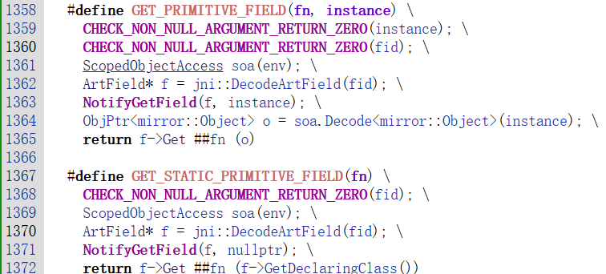
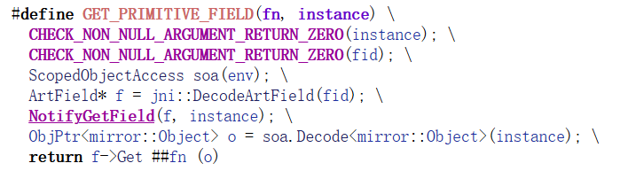

<!-- @import "[TOC]" {cmd="toc" depthFrom=1 depthTo=6 orderedList=false} -->

<!-- code_chunk_output -->

- [Android源码 - 类链接器](#android源码---类链接器)
  - [`DefineClass`](#defineclass)
  - [`RegisterDexFile`](#registerdexfile)
  - [`SetupClass`](#setupclass)
  - [`InsertClass`](#insertclass)
  - [`LoadClass`](#loadclass)
    - [`LoadClassMembers`](#loadclassmembers)
    - [`art_field`](#art_field)
    - [`LoadField`](#loadfield)
    - [将字段存入类](#将字段存入类)
  - [`LinkClass`](#linkclass)
    - [字段数据的存储位置](#字段数据的存储位置)
    - [字段顺序](#字段顺序)
      - [`LinkFields`](#linkfields)
  - [`GetStaticByteField`](#getstaticbytefield)
    - [`GET_STATIC_PRIMITIVE_FIELD`](#get_static_primitive_field)
    - [`PrettyField`](#prettyfield)
    - [`GetField64`](#getfield64)
    - [jid转ArtField*](#jid转artfield)
    - [将jni对象转换成Object*](#将jni对象转换成object)

<!-- /code_chunk_output -->

# Android源码 - 类链接器

## `DefineClass`

> https://xrefandroid.com/android-8.1.0_r81/xref/art/runtime/class_linker.cc#DefineClass

* 可以从这个函数拿到原始`dex`文件
* 也可以将原始`dex`文件替换和修补

## `RegisterDexFile`

> https://xrefandroid.com/android-8.1.0_r81/xref/art/runtime/class_linker.cc#RegisterDexFile

* 分析这个函数可以知道`dex`文件的加载位置，从而在`maps`中将`dex`文件dump下来

## `SetupClass`

> https://xrefandroid.com/android-8.1.0_r81/xref/art/runtime/class_linker.cc#SetupClass

* 将单个类的信息从`dex`文件中解析出来

## `InsertClass`

> https://xrefandroid.com/android-8.1.0_r81/xref/art/runtime/class_linker.cc#InsertClass

* 将类插入虚拟机的`hash表`中，这个`hash表`中有所有的类的信息
* 通过类的`hash`值和`类的描述符`在`hash表`中查找对应的类的所有信息，方法和字段

## `LoadClass`

> https://xrefandroid.com/android-8.1.0_r81/xref/art/runtime/class_linker.cc#LoadClass

* 从`dex`文件中获取`class_data`
* 调用`LoadClassMembers`

### `LoadClassMembers`

> https://xrefandroid.com/android-8.1.0_r81/xref/art/runtime/class_linker.cc#LoadClassMembers

* 从`class_data`解析出类的`static_fields`、`instance_fields`、`direct_methods`和`virtual_methods`

### `art_field`

> https://xrefandroid.com/android-8.1.0_r81/xref/art/runtime/art_field.h#42

* 静态字段和实例字段在虚拟机中都是`art_field`对象

### `LoadField`

> https://xrefandroid.com/android-8.1.0_r81/xref/art/runtime/class_linker.cc#LoadField

* 将`field_idx`、`klass`、`AccessFlags`存到`art_field`中
* 但是`art_field`对象的`offset`没有填入

### 将字段存入类

## `LinkClass`

> https://xrefandroid.com/android-8.1.0_r81/xref/art/runtime/class_linker.cc#LinkClass

### 字段数据的存储位置

* 内部调用`LinkFields`
* 设置`art_field`对象的存储位置`offset`
* 实例字段在静态字段的下面

### 字段顺序

1）所有对象引用字段，按字母顺序排序。
2）所有 Java long（64 位）整型字段，按字母顺序排序。
3）所有 Java double（64 位）浮点字段，按字母顺序排序。
4）所有 Java int（32 位）整型字段，按字母顺序排序。
5）所有 Java float（32 位）浮点字段，按字母顺序排序。
6）所有 Java char（16 位）整型字段，按字母顺序排序。
7）所有 Java short（16 位）整型字段，按字母顺序排序。
8）所有 Java boolean（8 位）整型字段，按字母顺序排序。
9）所有 Java byte（8 位）整型字段，按字母顺序排序。

#### `LinkFields`

> https://xrefandroid.com/android-8.1.0_r81/xref/art/runtime/class_linker.cc#LinkFields

* `field_offset`在这里计算

## `GetStaticByteField`

> https://xrefandroid.com/android-8.1.0_r81/xref/art/runtime/jni_internal.cc#GetStaticByteField

* 获取静态字段

### `GET_STATIC_PRIMITIVE_FIELD`

> https://xrefandroid.com/android-8.1.0_r81/xref/art/runtime/jni_internal.cc#GET_STATIC_PRIMITIVE_FIELD

* 传入的值不一样
    * 静态字段传入`klass`
    * 实例字段传入`对象地址`

### `PrettyField`

> https://xrefandroid.com/android-8.1.0_r81/xref/art/runtime/art_field.cc#PrettyField

* 我们可以使用该函数拿到名字

### `GetField64`

> https://xrefandroid.com/android-8.1.0_r81/xref/art/runtime/mirror/object.h?fi=GetField64#515

* 传入字段偏移调用`GetField`函数，获取值

### jid转ArtField*

> https://xrefandroid.com/android-8.1.0_r81/xref/art/runtime/jni_internal.h?fi=DecodeArtField#DecodeArtField

* 在8.1中可以使用`jni::DecodeArtField`函数拿到`Art_field*`

### 将jni对象转换成Object*

> https://xrefandroid.com/android-8.1.0_r81/xref/art/runtime/thread.h#486

* 将`JNIEnv`强转为`JNIEnvExt`可以拿到`Thread`
* 然后`Thread::DecodeJObject`函数将jni对象转换成`Object*`
