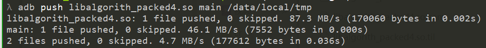
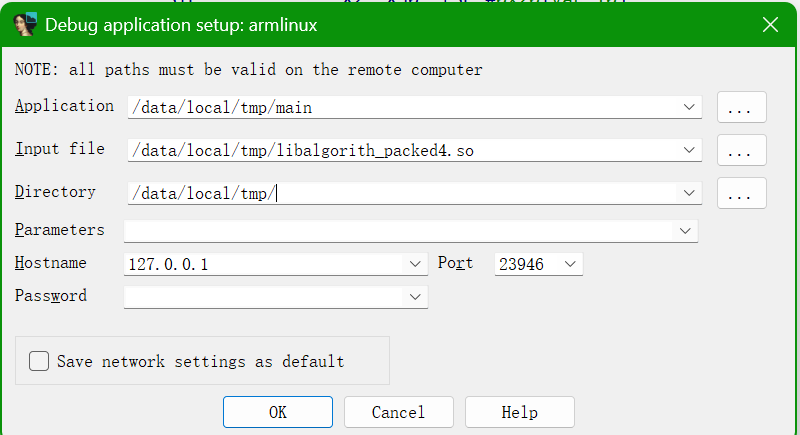
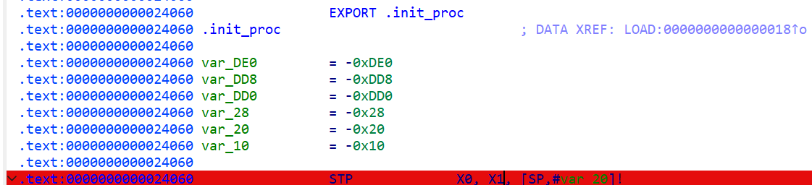
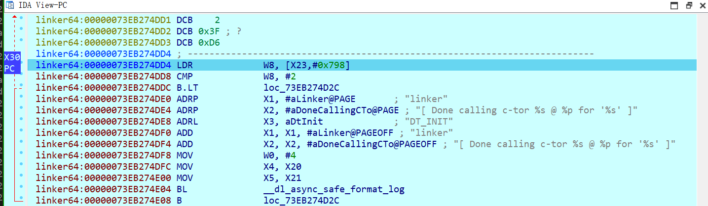
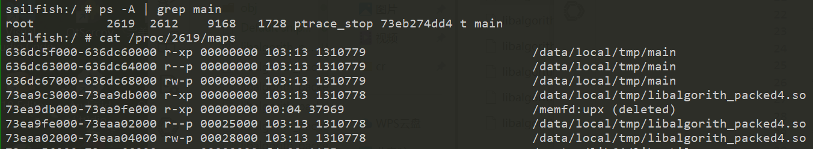
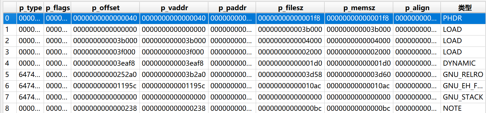

<!-- @import "[TOC]" {cmd="toc" depthFrom=1 depthTo=6 orderedList=false} -->

<!-- code_chunk_output -->

- [脱壳](#脱壳)

<!-- /code_chunk_output -->


# 脱壳

> 样本目录: ./packed/libalgorith_packed4.so

* 写一个so加载器

``` C++
#include <stdio.h>
#include <dlfcn.h>

int main(){
    void* handle = dlopen("/data/local/tmp/libalgorith_packed4.so", RTLD_NOW);
    printf("handle %p %s\n", handle, dlerror());
    dlclose(handle);
    return 0;
}
```

* 将加载器和so文件发送到手机


* 设置进程选项调试so


* 在so入口下断点，并调试


* 入口是壳的解压缩代码，一路调试到壳调用linker64的函数


* 根据模块映射的内存进行dump


    * 可以看到该so被映射了四块内存，其中第二块没有名字，所以我们将该内存dump时加到第一块内存

> dump脚本

``` idc
#include <idc.idc>
/*
 * 往指定文件追加或覆盖写入二进制数据
 * @param start_addr 起始地址
 * @param end_addr 结束地址
 * @param filename 输出文件路径
 * @param append 是否追加模式，1=追加，0=覆盖
 * @return 成功返回1，失败返回0
 */
static dump_memory(start_addr, end_addr, filename, append) {
    auto size, mem;
    
    if (start_addr >= end_addr) {
        Warning("起始地址必须小于结束地址");
        return 0;
    }
    
    size = end_addr - start_addr;
    mem = GetManyBytes(start_addr, size, 0);
    
    if (mem == 0) {
        Warning("无法读取内存 0x%x - 0x%x", start_addr, end_addr);
        return 0;
    }
    
    auto file = fopen(filename, append ? "ab" : "wb"); // "ab"模式表示追加二进制写入
    if (file == 0) {
        Warning("无法打开文件: %s", filename);
        return 0;
    }
    
    auto bytes_written = 0;
    auto current_ea = start_addr;
    while (current_ea < end_addr) 
    {
        auto byte_val = Byte(current_ea);
        if (byte_val == -1) break;  // 读取失败
        
        fputc(byte_val, file);
        bytes_written++;
        current_ea++;
        
        // 每1MB打印进度
        if (bytes_written % 0x100000 == 0) {
            Message("已写入 0x%X bytes @ 0x%08X...\n", bytes_written, current_ea);
        }
    }

    fclose(file);
    return 1;
}

static main() {
    auto outfile = "C:\\combined_dump"; // 最终的文件路径
    
    // 第一次写入，如果文件存在则先覆盖（append=0）
    dump_memory(0x73ea9c3000, 0x73ea9fe000, outfile, 0);
    
    // 后续写入，追加模式（append=1）
    dump_memory(0x73ea9fe000, 0x73eaa02000, outfile, 1);  // 追加第2个区域
    dump_memory(0x73eaa02000, 0x73eaa04000, outfile, 1);  // 追加第3个区域
    
    Message("成功将所有块写入 %s\n", outfile);
}
```

* 手动修复elf文件中的PT_LOAD段以及符号表偏移
    * 三个LOAD段根据刚刚dump的内存位置进行修正
    * DYNAMIC根据内存偏移，查看落在哪个LOAD段中，再修改所在的文件偏移


* dump完成