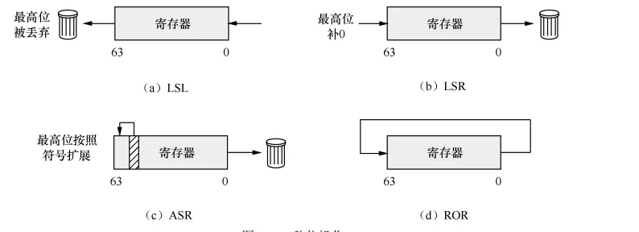

<!-- @import "[TOC]" {cmd="toc" depthFrom=1 depthTo=6 orderedList=false} -->

<!-- code_chunk_output -->

- [内存加载和存储指令](#内存加载和存储指令)
  - [寻址方式](#寻址方式)
    - [立即数偏移(immediate offset)](#立即数偏移immediate-offset)
    - [PC相对偏移(PC-relative literal)](#pc相对偏移pc-relative-literal)
    - [寄存器偏移(registers offset)](#寄存器偏移registers-offset)
  - [存储指令](#存储指令)
  - [不可扩展的存储和加载](#不可扩展的存储和加载)
  - [寄存器对](#寄存器对)
- [MOV指令](#mov指令)
- [算术指令](#算术指令)
  - [加法](#加法)
  - [减法](#减法)
- [位操作指令](#位操作指令)
  - [移位指令](#移位指令)
  - [逻辑操作](#逻辑操作)
  - [位段操作](#位段操作)

<!-- /code_chunk_output -->


# 内存加载和存储指令

> 从内存中读取数据到寄存器，或者将寄存器中的数据写入内存。

## 寻址方式

### 立即数偏移(immediate offset)

| 指令 | 寻址方式 | 字节数 | 说明
| --- | --- | --- | --- |
| `ldr` | 立即数偏移 <br> 寄存器偏移 <br> PC相对偏移 | 4 <br> 8 | 从内存加载字或双字到寄存器 |
| `ldrb` | 立即数偏移 <br> 寄存器偏移 | 1 | 无符号 |
| `ldrsb` | 立即数偏移 <br> 寄存器偏移 | 1 | 有符号 |
| `ldrh` | 立即数偏移 <br> 寄存器偏移 | 2 | 无符号 |
| `ldrsh` | 立即数偏移 <br> 寄存器偏移 | 2 | 有符号 |
| `ldrsw` | 立即数偏移 <br> 寄存器偏移 <br> PC相对偏移 | 4 | 有符号 |

``` arm
LDR Wt, [Xn|SP{, #pimm}] ; 32-bit general registers
LDR Xt, [Xn|SP{, #pimm}] ; 64-bit general registers

LDR Wt, [Xn|SP, #simm]! ; 32-bit general registers, Pre-index
LDR Xt, [Xn|SP, #simm]! ; 64-bit general registers, Pre-index

LDR Wt, [Xn|SP], #simm ; 32-bit general registers, Post-index
LDR Xt, [Xn|SP], #simm ; 64-bit general registers, Post-index
```

* `Wt`: 32位寄存器编号从0到31
* `Xt`: 64位寄存器编号从0到31
* `Xn|SP`: 通用寄存器或栈指针
* `simm`: 立即数，范围为-256到255
* `pimm`: 立即数，32位必须是4的倍数范围为0到16380，64位必须是8的倍数范围为0到32760

**直接偏移**
* `ldr 目标寄存器, [源寄存器{, #pimm}]
* 将`源寄存器+#pimm`地址的值加载到`目标寄存器`


**前变址**
* `ldr 目标寄存器, [源寄存器{, #simm}]!`
* 先计算`源寄存器+#simm`放入`源寄存器`，再将`源寄存器`地址的值加载到`目标寄存器`


**后变址**
* `ldr 目标寄存器, [源寄存器], #simm`
* 先将`源寄存器`地址的值加载到`目标寄存器`，再计算`源寄存器+#simm`放入`源寄存器`


### PC相对偏移(PC-relative literal)

``` arm
LDR Wt, label ; 32-bit general registers
LDR Xt, label ; 64-bit general registers
```

* `ldr 目标寄存器, 标号`
* 将`label`地址的值加载到`目标寄存器`
* `label` - 范围为正负1M

### 寄存器偏移(registers offset)

``` arm
LDR Wt, [Xn|SP, Rm{, extend {amount}}] ; 32-bit general registers
LDR Xt, [Xn|SP, Rm{, extend {amount}}] ; 64-bit general registers

mov w1, -4
ldr w2, [x0, w1, sxtw] // w1 有符号扩展为64位，再和x0相加，再加载到w2

mov x1, 1
ldr w2, [x0, x1, lsl 2] // x1 左移 2 位，再和x0相加，再加载到w2
```

* `R`: `w|x`寄存器
* `m`: 寄存器编号0到30或ZR(31)
* `amount`: 当扩展方式为`LSL`时
    * 目标为32位寄存器可以用0或2
    * 目标为64位寄存器可以用0或3
* `extend`: 扩展或者逻辑左移

| R | extend |
|---|--------|
| W | SXTW(有符号32位扩展到64位) / UXTW(无符号32位扩展到64位) |
| X | LSL(逻辑左移) / SXTX(有符号64位扩展到64位) |

## 存储指令

| 指令 | 寻址方式 | 字节数 | 说明 |
| --- | --- | --- | --- |
| `str` | 立即数偏移 <br> 寄存器偏移 | 4 <br> 8 | 将寄存器中的数据写入内存 |
| `strb` | 立即数偏移 <br> 寄存器偏移 | 1 | 将寄存器中的数据写入内存 |
| `strh` | 立即数偏移 <br> 寄存器偏移 | 2 | 将寄存器中的数据写入内存 |

## 不可扩展的存储和加载

> 不可扩展指只能使用`立即数偏移`的加载存储指令


| 指令 | 字节数 | 说明 |
| --- | --- | --- |
| `ldur` | 4 <br> 8 | 从内存加载到寄存器 |
| `ldurb` | 1 | 无符号 |
| `ldrusb` | 1 | 有符号 |
| `ldrh` | 2 | 无符号 |
| `ldrsh` | 2 | 有符号 |
| `ldursw` | 4 | 有符号 |
| `stur` | 4 <br> 8 | 将寄存器中的数据写入内存 |
| `sturb` | 1 | 无符号 |
| `sturh` | 2 | 无符号 |

## 寄存器对

* `LDP`: 加载数据到两个寄存器
    * `ldp x0, x1, [sp]` 将sp地址的值加载到x0，将sp+8地址的值加载到x1
* `STP`: 存储数据到两个寄存器
    * `stp x0, x1, [sp]` 将x0和x1中的值分别存储到sp和sp+8

# MOV指令

**寄存器到寄存器**
``` arm
MOV Wd, Wm ; 32-bit general registers
MOV Xd, Xm ; 64-bit general registers
```

**立即数到寄存器**

* `mov 寄存器, 立即数`
    * `立即数`不能超过16位
    * `立即数`可以是位掩码立即数

**掩码立即数构造**
1. 将立即数分组，所有组具有相同的数据
    * 2位一组、4位一组、8位一组、16位一组、32位一组、64位一组
2. 组内数据从低到高连续为1，不允许全0或全1
    * 4位一组：`0001, 0011, 0111`
    * 8位一组：`00000001, 00000011, 00000111, 00001111, 00011111, 00111111, 01111111`
3. 组内数据可以循环右移
    * 移位次数不可超过组内位数，即8位时最多循环右移7次
    * `00001111` 循环右移 2 次为 `11000011`


* `N`: `0` 是低于64位， `1` 是64位分组
* `immr`: 循环右移的位数
* `imms`: 记录分组位数和连续1的个数

| N | imms | 分组位数 | 连续1的数量(x通配符，0或1) |
|:---:|:---:|:---:|:---:|
| 0 | 1 1 1 1 0 x | 2 | x + 1 |
| 0 | 1 1 1 0 x x | 4 | xx + 1 |
| 0 | 1 1 0 x x x | 8 | xxx + 1 |
| 0 | 1 0 x x x x | 16 | xxxx + 1 |
| 0 | 0 x x x x x | 32 | xxxxx + 1 |
| 1 | x x x x x x | 64 | xxxxxx + 1 |

**赋值超过16位的立即数**
1. 内存加载
2. 使用其他`movk`指令

``` arm
// 0x123456789abcdef0
movk x0, 0xdef0
movk x0, 0x9abc, lsl 16 // 将立即数左移16位放入x0，其他位不变
movk x0, 0x5678, lsl 32 // 将立即数左移32位放入x0，其他位不变
movk x0, 0x1234, lsl 48 // 将立即数左移48位放入x0，其他位不变
```

**movz**

``` arm
MOVZ Wd, #imm{, LSL #shift} ; 32-bit general registers
MOVZ Xd, #imm{, LSL #shift} ; 64-bit general registers
```

* 将`立即数`左移`shift`位放入`Wd`，其他位清零

# 算术指令

## 加法

``` arm
// 立即数加法
ADD Wd|WSP, Wn|WSP, #imm{, shift} ; 32-bit general registers
ADD Xd|SP, Xn|SP, #imm{, shift} ; 64-bit general registers

// 寄存器加法
ADD Wd|WSP, Wn|WSP, Wm{, extend {#amount}} ; 32-bit general registers
ADD Xd|SP, Xn|SP, Rm{, extend {#amount}} ; 64-bit general registers

// 寄存器位移的加法
ADD Wd, Wn, Wm{, shift #amount} ; 32-bit general registers
ADD Xd, Xn, Xm{, shift #amount} ; 64-bit general registers

/*
影响 NZCV 标志位的加法 ADDS
和 ADD 的寻址方式一样
*/

// ADC 带进位的加法
ADC Wd, Wn, Wm ; 32-bit general registers
ADC Xd, Xn, Xm ; 64-bit general registers
```

## 减法

* `SUB` - 寻址方式与 `ADD` 相同
* `SUBS` - 影响标志位的剑法
* `SBC` - 带借位减法，和 `ADC` 一样

# 位操作指令

## 移位指令

* `LSL` : 逻辑左移，最高位丢弃，最低位补0
* `LSR` : 逻辑右移，最高位补0，最低位丢弃
* `ASR` : 带符号的逻辑右移，最高位补符号位，最低位丢弃
* `ROR` : 循环右移，最低位移到最高位



``` arm
LSL Wd, Wn, Wm ; 32-bit general registers
LSL Xd, Xn, Xm ; 64-bit general registers
LSL Wd, Wn, #shift ; 32-bit general registers
LSL Xd, Xn, #shift ; 64-bit general registers
```

## 逻辑操作

* `AND` : 与
* `ANDS` : 与，影响标志位`Z`
* `ORR` : 或
* `EOR` : 异或
* `BIC` : 清除位
* `BICS` : 清除位，影响标志位
* `CLZ` : 计算自高到低第一个1前0的个数
* `CLS` : 计算符号位1的个数

``` arm
AND Wd|WSP, Wn, #imm ; 32-bit general registers
AND Xd|SP, Xn, #imm ; 64-bit general registers
AND Wd, Wn, Wm{, shift #amount} ; 32-bit general registers
AND Xd, Xn, Xm{, shift #amount} ; 64-bit general registers
```

## 位段操作

* `BFI` : 位段插入

``` arm
BFI Wd, Wn, #lsb, #width ; 32-bit general registers
BFI Xd, Xn, #lsb, #width ; 64-bit general registers
```


* `UBFX | SBFX` : 位段提取

``` arm
UBFX Wd, Wn, #lsb, #width ; 32-bit general registers
UBFX Xd, Xn, #lsb, #width ; 64-bit general registers
SBFX Wd, Wn, #lsb, #width ; 32-bit general registers
SBFX Xd, Xn, #lsb, #width ; 64-bit general registers
```


