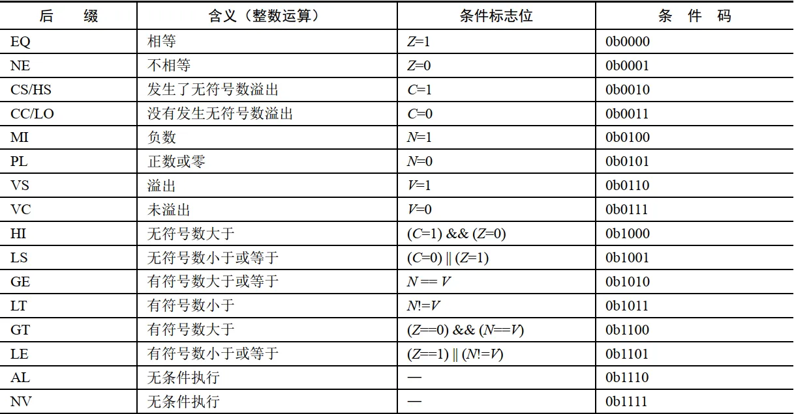
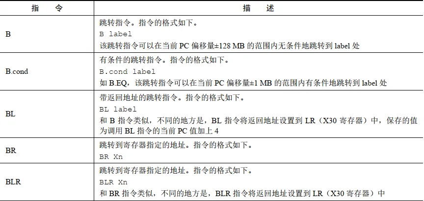
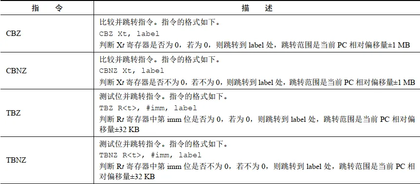
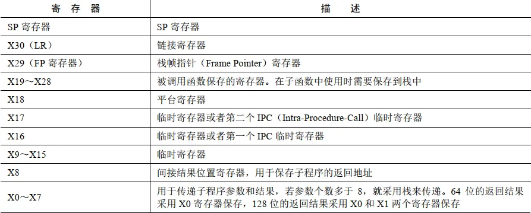
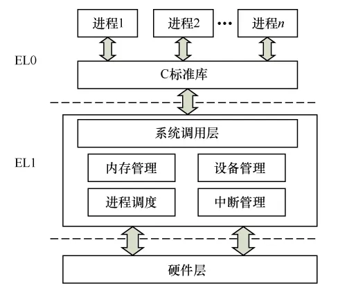
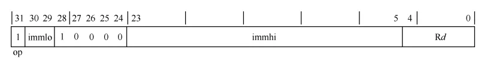
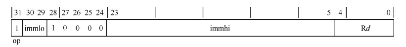

<!-- @import "[TOC]" {cmd="toc" depthFrom=1 depthTo=6 orderedList=false} -->

<!-- code_chunk_output -->

- [比较指令](#比较指令)
  - [`cmp` - 比较](#cmp---比较)
  - [`cmn` - 与相反数比较](#cmn---与相反数比较)
  - [`csel` - 比较选择](#csel---比较选择)
  - [`csinc` - 比较+1](#csinc---比较1)
  - [`cset` - 比较置0或1](#cset---比较置0或1)
- [跳转指令](#跳转指令)
  - [无条件跳转](#无条件跳转)
  - [比较跳转](#比较跳转)
  - [返回指令](#返回指令)
- [函数](#函数)
- [系统调用](#系统调用)
  - [Android 系统调用查询](#android-系统调用查询)
  - [使用系统调用](#使用系统调用)
- [其它指令](#其它指令)
  - [PC相对地址加载指令](#pc相对地址加载指令)
    - [`ADR` - 取地址](#adr---取地址)
    - [`ADRP` - 获取label所在页基地址](#adrp---获取label所在页基地址)

<!-- /code_chunk_output -->


# 比较指令

* `cmp` - 比较
* `cmn` - 与相反数比较
* `csel` - 比较选择
* `csinc` - 比较+1
* `cset` - 比较置0或1

## `cmp` - 比较

``` arm
CMN Wn|WSP, #imm{, shift} ; 32-bit general registers
CMN Xn|SP, #imm{, shift} ; 64-bit general registers
CMP Wn|WSP, Wm{, extend {#amount}} ; 32-bit general registers
CMP Xn|SP, Rm{, extend {#amount}} ; 64-bit general registers
CMP Wn, Wm{, shift #amount} ; 32-bit general registers
CMP Xn, Xm{, shift #amount} ; 64-bit general registers
```

## `cmn` - 与相反数比较

* 第一个数与第二个数做加法，设置标志位，内部使用`ADDS`指令

## `csel` - 比较选择

``` arm
CSEL Wd, Wn, Wm, cond ; 32-bit general registers
CSEL Xd, Xn, Xm, cond ; 64-bit general registers
```

* 根据`cond`条件选择`Xn`或`Xm`，`Xd = cond ? Xn : Xm`



## `csinc` - 比较+1

``` arm
CSINC Wd, Wn, Wm, cond ; 32-bit general registers
CSINC Xd, Xn, Xm, cond ; 64-bit general registers
```

* 根据`cond`条件选择`Xn`或`Xm + 1`，`Xd = cond ? Xn : Xm + 1`

## `cset` - 比较置0或1

``` arm
CSET Wd, cond ; 32-bit general registers
CSET Xd, cond ; 64-bit general registers
```

* 根据`cond`条件设置`1`或`0`，`Xd = cond ? 1 : 0`

# 跳转指令

## 无条件跳转



## 比较跳转



## 返回指令

* `ret` - 从`LR(x30)`中取出地址并跳转

# 函数

* 参数传递
    * 前8个参数使用`X0-X7`寄存器
    * 多的参数使用栈传递
* 返回值
    * `X0`寄存器
    * 返回地址保存在`LR(x30)`中



# 系统调用



* `write`的调用系统服务表
* http://androidxref.com/8.1.0_r33/xref/bionic/libc/arch-arm64/syscalls/write.S

## Android 系统调用查询

* `man syscall`
* [Android系统调用](https://www.chromium.org/chromium-os/developer-library/reference/linux-constants/syscalls/)

## 使用系统调用

``` arm
.arch  armv8-a //处理器架构
.global main
.data 
    g_sz: .string "hello world\n"
.text
main:
    mov x0, 0    // 标准输出
    adr x1, g_sz // 字符串
    mov x2, 11   // 字符串长度
    mov x8, 64   // 系统调用号
    svc 0        // 系统调用
    ret
```

# 其它指令

## PC相对地址加载指令

### `ADR` - 取地址

* `adr Xd, label`
* 加载当前`PC`值`±1MB`范围内的`label`地址到`Xd`



### `ADRP` - 获取label所在页基地址

* `adrp Xd, label`
* 加载当前`PC`值`±4GB`范围内`label`的页基地址到`Xd`


