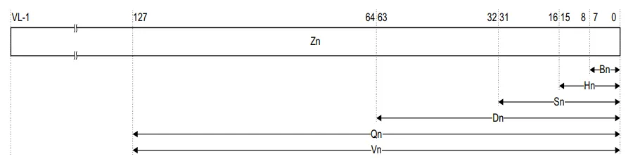
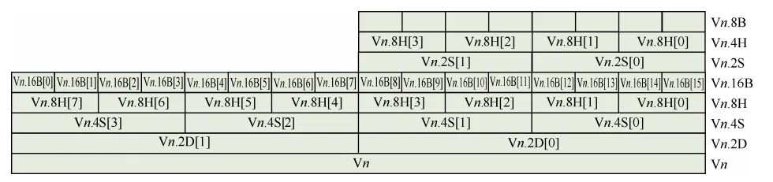
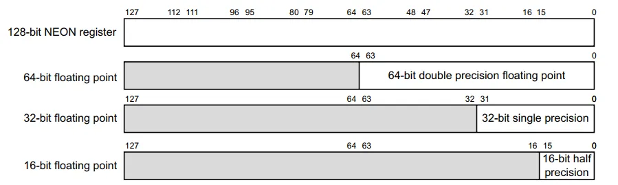

<!-- @import "[TOC]" {cmd="toc" depthFrom=1 depthTo=6 orderedList=false} -->

<!-- code_chunk_output -->

- [arm64指令浮点和NEON](#arm64指令浮点和neon)
  - [寄存器](#寄存器)
  - [浮点寄存器](#浮点寄存器)
  - [SIMD指令](#simd指令)

<!-- /code_chunk_output -->

# arm64指令浮点和NEON

* `SISD` : 单指令单数据，一条指令只处理一个数据，数据可以是字节、半字、字、双字
* `SIMD` : 单指令多数据，一条指令同时处理多个数据，数据可以是字节、半字、字、双字
* `NEON` : ARM处理器中`SIMD`的实现，比如X86中的`XMM`、`SSE`

## 寄存器

* `NEON`提供了32个`128-bit`的寄存器，每个寄存器可以分组
    * 16个`8-bit`的通道
    * 8个`16-bit`的通道
    * 4个`32-bit`的通道
    * 2个`64-bit`的通道



**寄存器访问方式**

* 低半组访问
    * `Vn.8b`
    * `Vn.4h`
    * `Vn.2s`
    * `Vn.1d`
* 整组访问
    * `Vn.16b`
    * `Vn.8h`
    * `Vn.4s`
    * `Vn.2d`
* 组内索引访问
    * `Vn.16b[0] ~ Vn.16b[15]`
    * `Vn.8h[0] ~ Vn.8h[7]`
    * `Vn.4s[0] ~ Vn.4s[3]`
    * `Vn.2d[0] ~ Vn.2d[1]`



## 浮点寄存器

> ARM没有提供专门的浮点寄存器，借用了`NEON`寄存器的低位
* 双精度浮点借用`V0 ~ V31`的低64位，命名为`D0 ~ D31`
* 单精度浮点借用`V0 ~ V31`的低32位，命名为`S0 ~ S31`



**其他寄存器命名**
* 整个128位命名为`Q0 ~ Q31`
* 低16位命名为`H0 ~ H31`
* 低8位命名为`B0 ~ B31`

**浮点指令**

* `FMOV` : 浮点数的移动
* `FADD` : 加法
* `FSUB` : 减法
* `FMUL` : 乘法
* `FMLA` : 乘加法
* `FDIV` : 除法
* `FMADI` : 指数乘法
* `FABS` : 绝对值
* `FCVTAS` : 浮点到整型的转换
* `SCVTF` : 整型到浮点的转换

## SIMD指令

**运算**
* 矢量(vector)运算: 对矢量寄存器中所有通道的数据同时运算
* 标量(scalar)运算: 只对矢量寄存器中某个通道的数据进行运算

**矢量指令**

* LD1 : 将一个数据加载到多个寄存器中
``` arm
LD1 { Vt.T }, [Xn|SP] ; One register
ld1 { v0.8b, v2.4h, v3.2s, v5.1d }, [x0]
```

* LD2 : 将多个两个元素的数据加载到两个寄存器中
* LD1R : 将一个数据加载到一个寄存器的所有通道