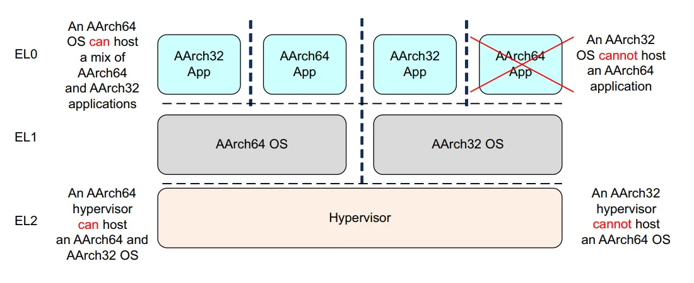

<!-- @import "[TOC]" {cmd="toc" depthFrom=1 depthTo=6 orderedList=false} -->

<!-- code_chunk_output -->

- [armv8-a 指令基础](#armv8-a-指令基础)
  - [arm汇编](#arm汇编)
  - [寄存器](#寄存器)

<!-- /code_chunk_output -->


# armv8-a 指令基础

## arm汇编

> [arm开发者文档](https://developer.arm.com/documentation/)

**执行状态**
`armv8` 架构提供两种执行状态，`AArch64` 和 `AArch32`。
* `AArch64`: 64位的执行状态
    * 提供31个64位的通用寄存器
    * 提供64位的程序计数(Program Counter, PC)指针寄存器、堆栈指针寄存器(Stack Pointer, SP)以及异常链接寄存器(Exception Link Register, ELR)
    * 提供`A64`指令集
    * 定义`ARMv8`异常模型，支持4个异常等级（EL0-EL3）
    * `PSTATE`状态寄存器
* `AArch32`: 32位的执行状态
    * 提供13个32位通用寄存器，`PC`指针寄存器、`SP`和`ELR`
    * 支持两套指令集，`A32`和`T32`
    * 定义`ARMv7`异常模型，支持4个异常等级（EL0-EL3）

`A64`和`A32`指令集不兼容。



**异常等级**
这里的`异常等级`就是`特权等级`。
* EL0: 用户模式
* EL1: 系统模式（内核模式）
* EL2: 虚拟化监控模式（Hypervisor mode）
* EL3: 安全监控模式（Secure Monitor Mode）


**数据宽度**
ARMv8支持如下几种数据宽度：
* `byte`: 字节（8位）
* `halfword`: 半字（16位）
* `word`: 字（32位）
* `doubleword`: 双字（64位）
* `quadword`: 四字（128位）

## 寄存器
**通用寄存器**
`AArch64`提供了31个64位的通用寄存器
* `X0` ~ `X30` 64位
* `W0` ~ `W30` 低32位


**状态寄存器**
`PSTATE` - `AArch64`提供了状态寄存器，没有提供直接访问指令。


**特殊寄存器**
`NZCV`寄存器访问`PSTATE`中的`N`、`Z`、`C`和`V`位。这些位分别表示负数、零、进位和溢出状态。


**Hello World**

``` Arm
.arch armv8-a // 处理器架构
.global main
.data
    g_sz: .string "hello world\n"
.text
main: // 定义标号
    adr x0, g_sz
    bl printf
    ret
```
