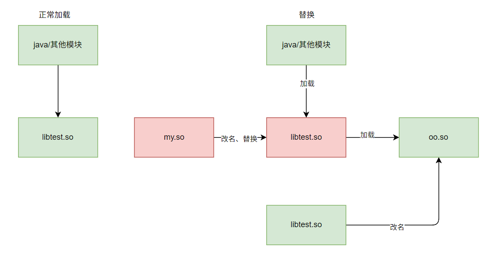

# find_libraries

> 加载so文件

> https://xrefandroid.com/android-8.1.0_r81/xref/bionic/linker/linker.cpp#1497

* 1608行，将文件加载到内存
* 1616行，解析动态段

* `soinfo` 结构体里面有当前程序所有的so信息
* 程序的soinfo通过链表的方式存储在内存
* 可以通过 `solist_get_somain()` 函数拿到主模块的结构体地址
* 由此可知，如果我们替换掉链表中的某个so文件的信息为我们自己的so信息，那样就可以使用我们自己的so

