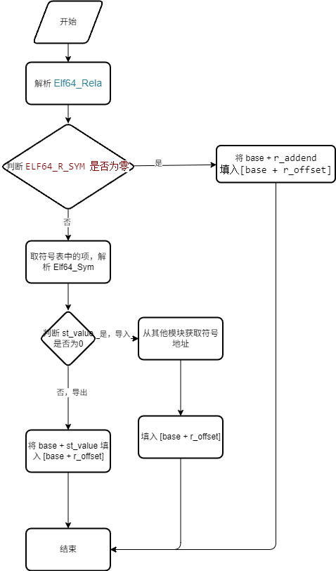
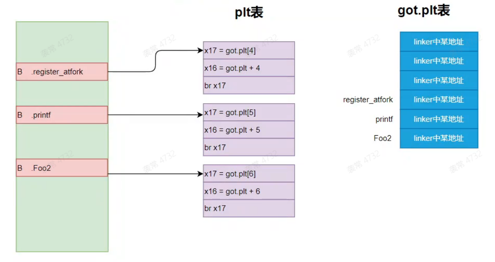

# 重定位表

## got 和 plt

* `got` - global offset table 全局偏移表，全局变量的重定位表
* `plt` - procedure linkage table 函数过程链接表
    * 是函数在重定位中的中转函数。起到延时加载的作用，在加载时会调用到`linker`链接器里面的函数，找到函数地址，并且填入到`got.plt`表中，后面再次取用时就不会再次调用了。
* `got.plt` 全局函数的重定位表

* `static` 静态变量，不导出，全局变量不会有重定位。
* 正常的全局变量和函数会重定位。

``` C++
typedef struct {
    Elf64_Addr r_offset;
    Elf64_Xword r_info;
    Elf64_Sxword r_addend;
} Elf64_Rela;
```

* `r_offset` 需要重定位的地址
* `r_info` 信息
    * `#define ELF64_R_SYM(info) ((info)>>32)` 符号表索引
    * `#define ELF64_R_TYPE(info) ((Elf64_Word)(info))` 类型
* `r_addend` 符号地址的RVA，导入的符号这个值没有意义





## 示例程序

``` C++
#include <android/log.h>
#include <stdio.h>

static int g_n1 =  11111;
int g_n2 = 22222;
int g_n3 = 22222;
int g_n4 = 22222;
int g_n5 = 22222;
int g_n6 = 22222;
int g_n7 = 22222;
int g_n8 = 22222;

__attribute__((noinline)) static void Foo1()
{
    printf("foo1");
}

__attribute__((noinline)) void Foo2()
{
    printf("foo2");
}

int Add(int n1, int n2)
{
    return n1+n2;
}

void CallHide()
{
    printf("%d ", g_n1);
    Foo1();
}

void CallExport()
{
    printf("%d ", g_n2);
    printf("%d ", g_n3);
    printf("%d ", g_n4);
    printf("%d ", g_n5);
    printf("%d ", g_n6);
    printf("%d ", g_n7);
    printf("%d ", g_n8);
    Foo2();
}

__attribute__((constructor)) void Init1()
{
    __android_log_print(ANDROID_LOG_VERBOSE, "kr", "你被hook了");
}

/*
__attribute__((constructor)) void Init1()
{
    __android_log_print(ANDROID_LOG_VERBOSE, "kr", "你被hook了");
}

__attribute__((constructor)) void init1()
{
    printf("init1 \n");
}
__attribute__((constructor)) void init2()
{
    printf("init2 \n");
}

__attribute__((constructor)) void init3()
{
    printf("init3 \n");
}
__attribute__((destructor)) void deinit1()
{
    printf("init1 \n");
}
__attribute__((destructor)) void deinit2()
{
    printf("deinit2 \n");
}

__attribute__((destructor)) void deinit3()
{
    printf("deinit3 \n");
}

extern "C"
void _init()
{
    printf("_init \n");   
}

int Add(int n1, int n2)
{
    return n1+n2;
}*/
```