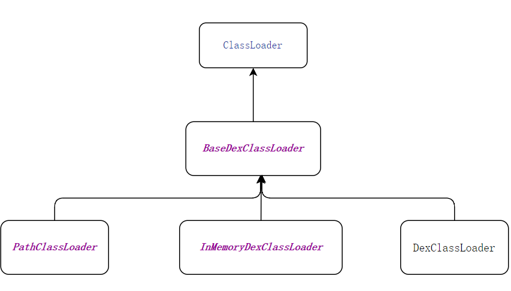
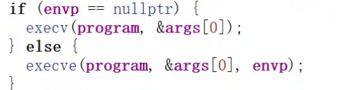

# 加固

* 一代壳 - 整体壳
* 二代壳 - 抽取壳
    * 加载还原
    * 执行还原
    * 自解密还原
* 三代壳 - 字节码native化
* 四代壳 - vm化

# 一代壳

> 将程序打包成一个文件，然后通过加载器加载到内存中。

# AOT机制

> 在安装时会编译成 odex 文件，如果存在 odex 文件，则不会再加载 dex 文件。
> 由此我们需要禁用 AOT 机制。

* hook 这两个函数，禁止执行`Dex2Oat`