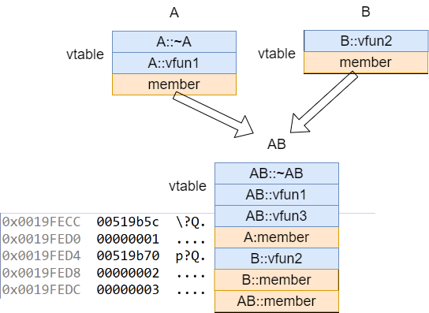

<!-- @import "[TOC]" {cmd="toc" depthFrom=1 depthTo=6 orderedList=false} -->

<!-- code_chunk_output -->

- [类](#类)
  - [常见UML建模工具](#常见uml建模工具)
  - [局部对象](#局部对象)
  - [全局对象](#全局对象)
  - [堆对象](#堆对象)
    - [堆对象数组](#堆对象数组)
  - [静态对象](#静态对象)
  - [参数对象和返回对象](#参数对象和返回对象)
  - [虚函数](#虚函数)
  - [继承](#继承)
    - [RTTI (Run-Time Type Information) 运行时类型信息](#rtti-run-time-type-information-运行时类型信息)
  - [纯虚函数 (抽象类或接口类)](#纯虚函数-抽象类或接口类)
  - [多重继承](#多重继承)
  - [虚继承](#虚继承)

<!-- /code_chunk_output -->


# 类

## 常见UML建模工具

* SAP PowerDesigner
* Visual 扩展
* StarUML
* Rational Rose
* EclipseUML

## 局部对象

**识别构造函数的特征：**
1. 调用约定 __thiscall
  * 参数1 ecx(this)
  * 参数2 入栈
  * ...
2. 作用域内第一个被调用的函数
3. 返回值是this指针

**识别析构函数的特征：**
1. 调用约定 __thiscall
  * 参数1 ecx(this)
2. 作用域内最后一个被调用的函数
3. 没有返回值
4. 析构代码函数，通过参数决定是否释放内存

**析构代理**
* 析构代理有传入一个标志参数
  * 0：显示调用析构
  * 1：delete调用析构
  * 2：delete[]调用析构

## 全局对象

* 对象的数据在全局数据区
* 构造函数在main函数之前调用，注册__initterm()函数调用
* 析构函数在main之后，程序结束之前，在构造函数之后注册atexit(destructor_proxy)函数调用

## 堆对象

* 在调用构造函数之前申请内存，返回值是this指针
* 析构时先析构，再释放内存

### 堆对象数组

在32位程序中，编译器使用堆空间的前4个字节保存对象的总个数。并且会有专门的构造迭代器和析构迭代器。
``` masm
0041229F                 push    offset sub_411127 ; void (__thiscall *)(void *) ; 析构函数
004122A4                 push    offset sub_4114B0 ; void (__thiscall *)(void *) ; 构造函数
004122A9                 push    0Ah             ; unsigned int ; 数组个数
004122AB                 push    8               ; unsigned int ; 对象大小
004122AD                 lea     eax, [ebp+var_58]              
004122B0                 push    eax             ; void *       ; 数组首地址
004122B1                 call    j_??_L@YGXPAXIIP6EX0@Z1@Z ; `eh vector constructor iterator'(void *,uint,uint,void (*)(void *),void (*)(void *))
004122B6                 mov     [ebp+var_124], 0
004122C0                 push    offset sub_411127 ; void (__thiscall *)(void *) ; 析构函数
004122C5                 push    0Ah             ; unsigned int ; 数组个数
004122C7                 push    8               ; unsigned int ; 对象大小
004122C9                 lea     eax, [ebp+var_58]
004122CC                 push    eax             ; void *       ; 数组首地址
004122CD                 call    j_??_M@YGXPAXIIP6EX0@Z@Z ; `eh vector destructor iterator'(void *,uint,uint,void (*)(void *))
```

* eh vector constructor iterator
  1. 数组首地址
  2. 类大小
  3. 元素数量
  4. 构造函数的地址
  5. 析构函数的地址
* eh vector destructor iterator
  1. 数组首地址
  2. 类大小
  3. 元素数量
  4. 析构函数的地址

## 静态对象

* 先判断标志，再调用构造函数，数据在全局数据区
* 使用atexit(destructor_proxy)函数调用析构函数

## 参数对象和返回对象

* **参数对象**
  1. 函数外构造
  2. 函数内析构
* **返回对象**
  1. 函数内构造
  2. 函数外析构

**无名对象**
``` C++
Point ShowPoint(){
  return Point(1,2);
}
int main(){
  Point pt = ShowPoint();
}
```
* 直接使用1,2构造返回对象，没有局部对象

**临时对象**
``` C++
Point ShowPoint(){
  Point pt(1,2);
  return pt;
}
int main(){
  Point pt = ShowPoint();
}
```
* 先构造局部对象，再构造返回对象，最后析构局部对象

**引用对象**
``` C++
void ShowPoint(const Point &pt){
  printf("%d %d\n",pt.x,pt.y);
}
int main(){
  ShowPoint(Point(1,2));
  ShowPoint(1);
}
```
* 直接使用1,2构造返回对象，没有局部对象
* 1在外部构造对象，在外部析构，作用域在main函数

## 虚函数

在c++代码中，只有在使用对象的指针或引用调用虚函数，才会使用虚表间接调用虚函数，否则对象会直接调用虚函数。使用 virtual 关键字声明函数为虚函数，编译器会将该类所有虚函数地址保存在一张虚表中，同时会在类对象首地址处保存虚表地址。

* 虚表地址在构造函数中初始化
* 虚函数在调用时，通过虚表地址找到虚函数地址，再调用虚函数
* 在析构时也会填虚表指针，所以我们可以通过填充虚表指针确定是否为构造函数或析构函数

虚函数识别：
1. 类中隐式定义了一个数据成员，指向虚表的指针
2. 该成员在首地址处，占一个指针大小
3. 构造函数会将此数据成员初始化为某个数组(虚表)的首地址
4. 这个地址属于全局数据区，是相对固定的地址
5. 这个数组内，每个元素都是函数指针
6. 这些函数在被调用时，第一个参数必然是 this 指针
7. 这些函数内部，很可能对 this 指针使用相对间接的访问方式

## 继承

* 在C++的继承关系中，子类具备父类所有成员数据和成员函数。
* 子类对象在构造时，会先调用父类的构造函数，再调用子类的构造函数。
* 当不存在虚表时，继承和第一个成员是父类对象的内存结构是相同的，构造和析构也是相同的。
* 存在虚表时，子类对象在构造时，会先调用父类的构造函数构造虚表，在调用子类的构造函数覆盖虚表；析构时，会先调用子类的析构填虚表，再调用父类的析构填虚表。
  * 构造：基类->基类的派生类->······->当前类
  * 析构：当前类->基类的派生类->······->基类

### RTTI (Run-Time Type Information) 运行时类型信息

* RTTI 是一种在运行时识别对象类型的能力，它允许程序在运行时确定对象的类型。
* 我们可以通过 RTTI 获取对象的继承关系。
* 是链接选项可以关闭，关闭后无法使用 typeid 和 dynamic_cast

``` masm
004021C4                 dd offset ??_R4HumanPlayer@@6B@ ; const HumanPlayer::`RTTI Complete Object Locator'
004021C8 ; const HumanPlayer::`vftable'
004021C8 ??_7HumanPlayer@@6B@ dd offset HumanPlayer_fun1
004021CC                 dd offset Player_destructor
004021D0                 dd offset ??_R4ComputerPlayer@@6B@ ; const ComputerPlayer::`RTTI Complete Object Locator'
004021D4 ; const ComputerPlayer::`vftable'
004021D4 ??_7ComputerPlayer@@6B@ dd offset ComputerPlayer_fun1
004021D8                 dd offset Player_destructor
004021DC                 dd offset ??_R4Player@@6B@ ; const Player::`RTTI Complete Object Locator'
004021E0 ; const Player::`vftable'
004021E0 ??_7Player@@6B@ dd offset _purecall     ; 纯虚函数
004021E4                 dd offset Player_destructor ; 虚析构函数
```

上面 RTTI 地址指向 RTTI 结构体
``` masm
004023F4 ; const HumanPlayer::`RTTI Complete Object Locator'
004023F4 ??_R4HumanPlayer@@6B@ dd 0              ; DATA XREF: .rdata:004021C4↑o
004023F4                                         ; signature 特征
004023F8                 dd 0                    ; offset of this vtable in complete class (from top) 虚表在哪个位置
004023FC                 dd 0                    ; offset of constructor displacement 构造函数偏移
00402400                 dd offset ??_R0?AVHumanPlayer@@@8 ; reference to type description 类型信息 RTTI
00402404                 dd offset ??_R3HumanPlayer@@8 ; reference to hierarchy description 继承信息
```

类型信息：
``` masm
00403068 ; public class HumanPlayer /* mdisp:0 */ : ; IDA解析的继承信息
00403068 ;   public class Player /* mdisp:0 */      ; 基类
00403068 ; class HumanPlayer `RTTI Type Descriptor'
00403068 ??_R0?AVHumanPlayer@@@8 dd offset ??_7type_info@@6B@
00403068                                         ; reference to RTTI's vftable
0040306C                 dd 0                    ; internal runtime reference
00403070 aAvhumanplayer  db '.?AVHumanPlayer@@',0 ; type descriptor name
```

继承信息：
``` masm
00402448 ; HumanPlayer::`RTTI Class Hierarchy Descriptor'
00402448 ??_R3HumanPlayer@@8 dd 0                ; DATA XREF: .rdata:004023A0↑o
00402448                                         ; .rdata:00402404↑o
00402448                                         ; signature
0040244C                 dd 0                    ; attributes 继承属性
00402450                 dd 2                    ; # of items in the array of base classes 基类数量
00402454                 dd offset ??_R2HumanPlayer@@8 ; reference to the array of base classes 基类数组
```

基类数组：
``` masm
004023C8 ; HumanPlayer::`RTTI Base Class Array'
004023C8 ??_R2HumanPlayer@@8 dd offset ??_R1A@?0A@EA@HumanPlayer@@8 ; reference to base class decription 1
004023CC                     dd offset ??_R1A@?0A@EA@Player@@8 ; reference to base class decription 2
```

## 纯虚函数 (抽象类或接口类)

* 纯虚函数没有函数体，只有函数声明，其函数体在派生类中实现。
* 纯虚函数的声明格式为：`virtual 返回类型 函数名(参数列表) = 0;`
* 纯虚函数的派生类必须实现纯虚函数，否则派生类也是抽象类。

抽象类的特征：
``` masm
004021E0 ; const Player::`vftable'
004021E0 ??_7Player@@6B@ dd offset _purecall     ; 纯虚函数
004021E0 ??_7Player@@6B@ dd offset _purecall     ; 纯虚函数
004021E0 ??_7Player@@6B@ dd offset _purecall     ; 纯虚函数
; 如果调用到纯虚函数会调用abort()终止程序
; 看到 0x40000015 错误码，可以知道是纯虚函数抛异常
; vc6 的错误码是 0x19
```

## 多重继承

* 内存结构
  * 按继承顺序拷贝虚表和成员
  * 如果子类有实现的虚函数，则覆盖虚表中的函数地址
  * 如果有增加的虚函数，则放到第一个虚表的最后一项

``` C++
#include <stdio.h>
class A{
public:
    A() { m_A = 1; }
    virtual ~A(){}
    virtual void vfun1() = 0 {
        printf("A::vfun1\n");
    }
private:
    int m_A;
};

class B{
public:
    B() { m_B = 2; }
    ~B(){}
    virtual void vfun2(){
        printf("B::vfun2\n");
    }
private:
    int m_B;
};

class AB : public A, public B{
public:
    AB() { m_AB = 3; }
    ~AB(){
        printf("AB::~AB\n");
    }
    virtual void vfun1(){
        printf("AB::vfun1\n");
    }
    virtual void vfun3(){
        printf("AB::vfun3\n");
    }
private:
    int m_AB;
};

int main(){
    AB theAB;
    return 0;
}
```



* 由此可知多重继承会造成虚表覆盖
* 反之如果不是继承是成员则不会覆盖
* 如果没有虚函数，则还原成继承或者成员都可以

## 虚继承

* 虚继承的目的是解决多重继承中的菱形继承问题，在多重继承的基础上添加 virtual 关键字即可
* 虚继承的内存结构
  * 虚基类的虚表指针和成员在派生类中只会出现一次，并且在派生类的最后
  * 除虚基类外的所有基类按照多重继承的内存结构
  * 除虚基类的所有基类虚表指针后会添加一张虚基类偏移表，偏移表记录了虚基类距离当前偏移表的偏移量

``` C++
#include <stdio.h>
class A {
public:
    A() { m_A = 1; }
    virtual ~A() {}
    virtual void vfun1() = 0 {
        printf("A::vfun1\n");
    }
private:
    int m_A;
};

class B : virtual public A {
public:
    B() { m_B = 2; }
    ~B() {}
    virtual void vfun2() {
        printf("B::vfun2\n");
    }
private:
    int m_B;
};

class C : virtual public A {
public:
    C() { m_C = 3; }
    ~C() {}
    virtual void vfun3() {
        printf("C::vfun3\n");
    }
private:
    int m_C;
};

class BC : public B, public C {
public:
    BC() { m_BC = 4; }
    ~BC() {}
    virtual void vfun1() {
        printf("BC::vfun1\n");
    }
    virtual void vfun4() {
        printf("BC::vfun4\n");
    }
private:
    int m_BC;
};

int main() {
    BC obj;
    return 0;
}
```


* 虚基类只能构造一次，所以构造时会传参
  * 0，表示不构造虚基类
  * 1，表示构造虚基类

``` masm
00415AAF                 push    1
00415AB1                 lea     ecx, [ebp+obj]  ; this
00415AB4                 call    j_??0BC@@QAE@XZ ; BC::BC(void) ; 构造函数
```

* 并且在虚基类构造前先填充虚基类偏移表

``` masm
00412059                 mov     eax, [ebp+this]
0041205C                 mov     dword ptr [eax+4], offset ??_8BC@@7BB@@@ ; const BC::`vbtable'{for `B'} ; 虚基类偏移表
00412063                 mov     eax, [ebp+this]
00412066                 mov     dword ptr [eax+10h], offset ??_8BC@@7BC@@@ ; const BC::`vbtable'{for `C'} ; 虚基类偏移表
```