<!-- @import "[TOC]" {cmd="toc" depthFrom=1 depthTo=6 orderedList=false} -->

<!-- code_chunk_output -->

- [保护模式下的内存管理](#保护模式下的内存管理)
  - [分段管理](#分段管理)

<!-- /code_chunk_output -->


# 保护模式下的内存管理

> 逻辑地址 ==> 分段机制 ==> 线性地址 ==> 分页机制 ==> 物理地址

> CPU可以对所有物理内存进行操作，但是无法区分内存属性，所以需要由系统来进行内存管理，系统告诉CPU内存的属性，所以需要有一套内存管理机制，让CPU和系统通讯。

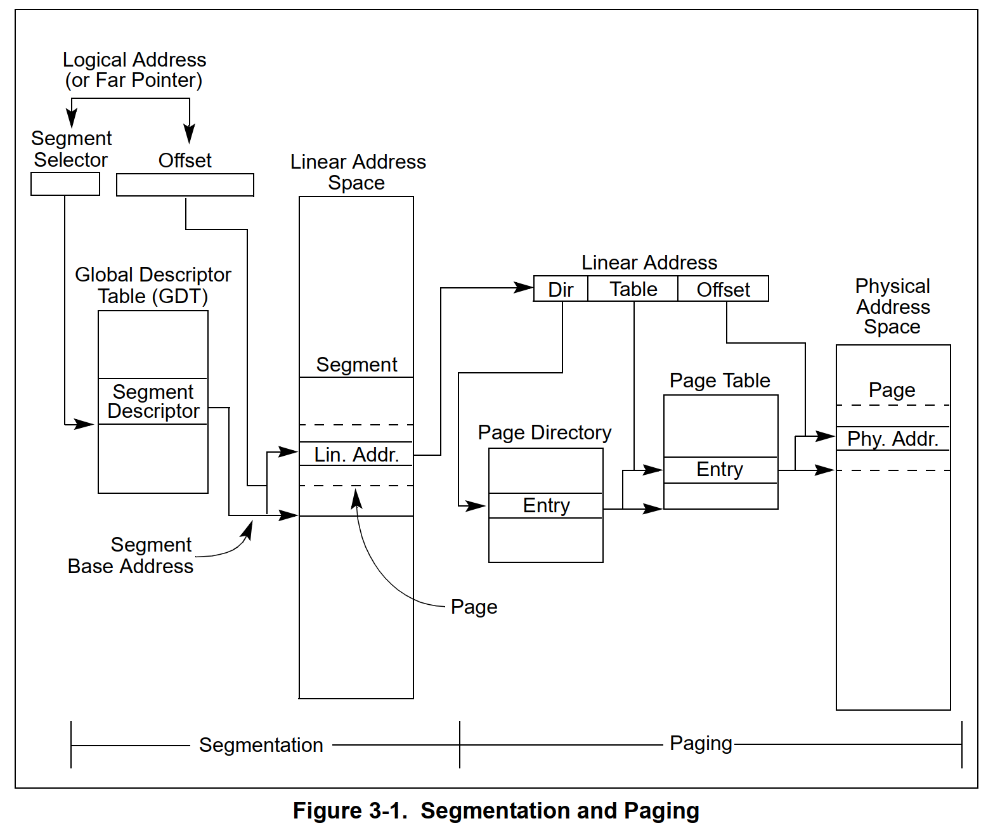

## 分段管理

> 在16位中，分段是为了访问地址，在32位中，分段是为了保护内存，区分内存属性。
> 分段可以为每个程序或者任务提供单独的代码、数据和栈模块，保证进程隔离。

* 可以通过段基址加偏移(进程的虚拟地址)的方式访问真实的内存。

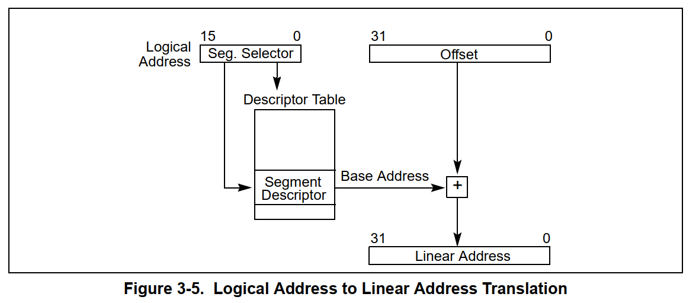

* 其中32位的Offset是进程的虚拟地址(0X00401000)。
* 16位是段选择器(Segmentation Selector)，其中高13位是段描述符表索引，第3位0表示全局描述符表，1表示局部描述符表，低2位是RPL(请求特权级)。


* 全局描述符表(Global Descriptor Table) 所有进程共享，通过GDTR寄存器来访问。
* 局部描述符表(Local Descriptor Table)  每个进程独有，通过LDTR寄存器来访问。

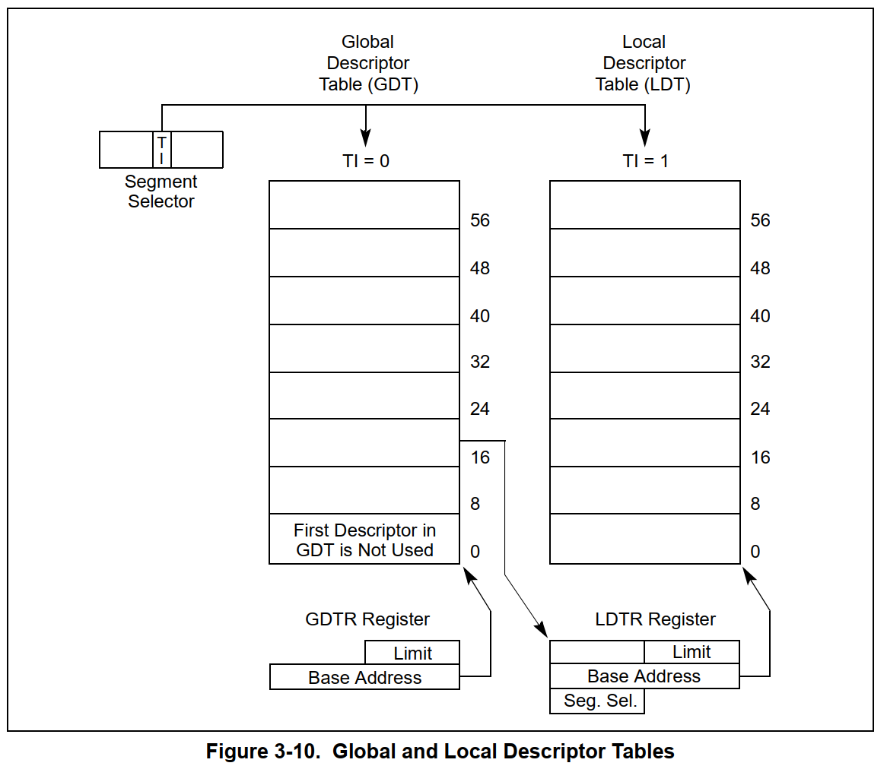

* 寄存器中包含了段描述符表基地址(Base Address)和界限(Limit)。
    * Base Address: 32位
    * Limit: 16位
* `SGDT m`: 获取GDTR寄存器的值。
* `SLDT m`: 获取LDTR寄存器的值。
* `LGDT m`: 设置GDTR寄存器的值。
* `LLDT m`: 设置LDTR寄存器的值。


* 段描述符表为64位

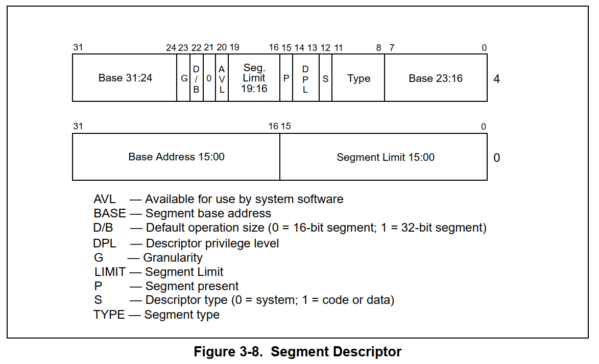

``` C++
struct SegmentDescriptors {
	unsigned long long  limit:16;	//段界限
	unsigned long long  base:24;	//段基址
	unsigned long long  type:4;		//段类型
	unsigned long long  s:1;		//描述符类型 0=系统段 1=存储段
	unsigned long long  dpl:2;		//描述符特权级 ring0~ring3  r  r/w  r/e
	unsigned long long  p:1;		//存在位, 删除标志, 0=释放 1=存在
	unsigned long long  limitHei:4;	//段界限
	unsigned long long  avl:1;		//软件可利用位, 可用作操作系统扩展
	unsigned long long  res:1;		//保留位
	unsigned long long  db:1;		//0 16位段  1 32位段	
	unsigned long long  g:1;		//粒度位 0=byte=limit*1  1=4K=limit*4K+0xfff 
	unsigned long long  baseHei:8;  //段基址
};
```

* `type`字段 段类型

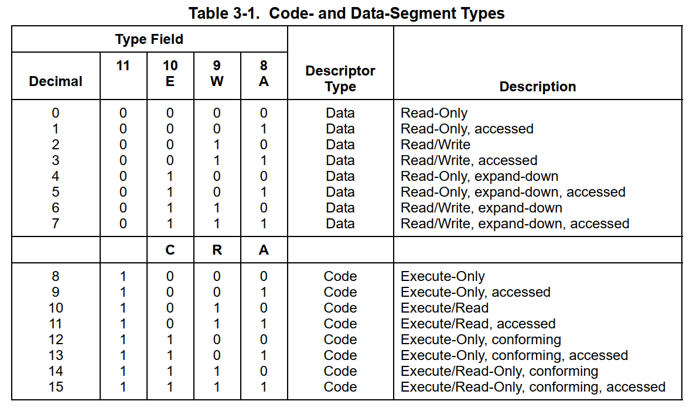

* `dg [Selector]` 解析选择子，获取段描述符。

## 分页管理

**虚拟内存**
* 当我们的内存不够用时，将硬盘的一部分作为内存使用，这部分内存称为虚拟内存。
* 这会导致段描述符表不够用，所以需要分页机制。

> 为了管理这些机制，微软推出了Control Registers控制寄存器(cr0 cr2 cr3 cr4)。

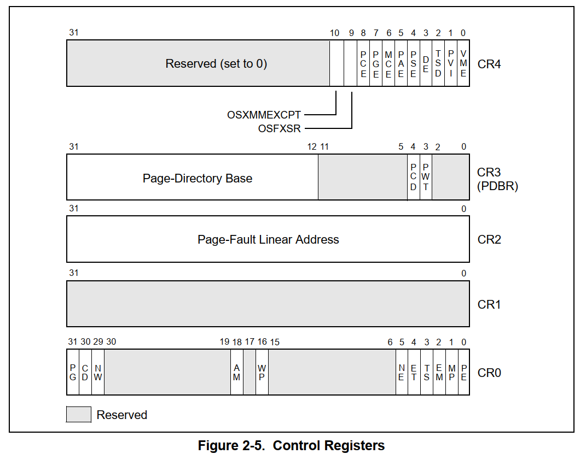

* PE: Protection Enable 保护模式 0=关闭 1=开启
* PG: Paging Enable 分页机制 0=关闭 1=开启
* WP: Write Protect 写保护 0=不允许写 1=允许写
* CD: Cache Disable 缓存 0=开启 1=关闭
* VME: Virtual 8086 Mode 虚拟8086模式 0=关闭 1=开启

**页选项**
* PG: 分页机制 0=关闭 1=开启
* PSE: Page Size Enable 页大小扩展 0=4K 1=4M
* PAE: Page Address Extension 页地址扩展 0=32位 1=64位

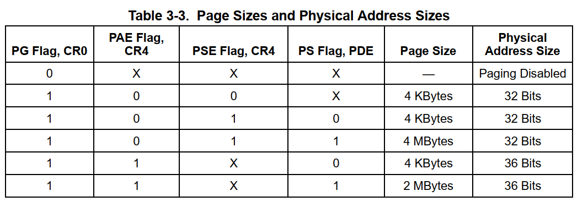

**线性地址转换4KB**

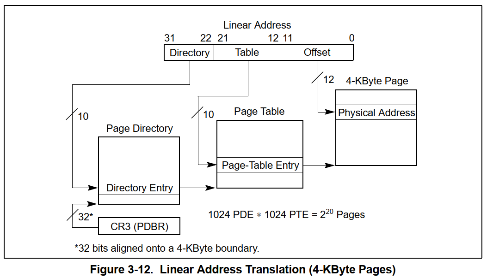

**线性地址转换4M**

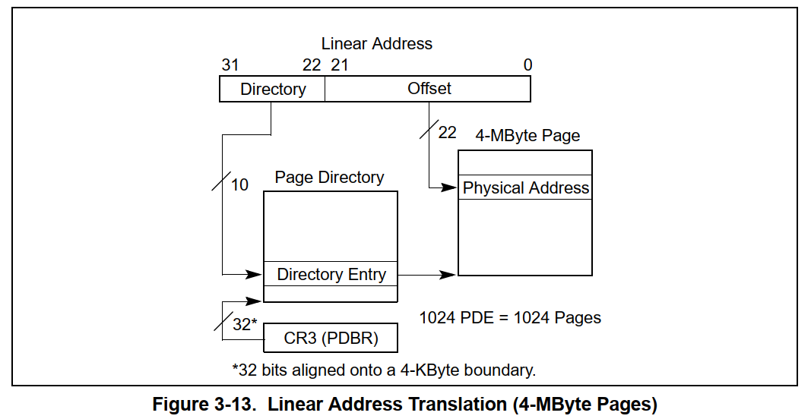

**页目录表**
> 在地址转换中，低12位页内偏移可以直接得到，所以在表中存储的基地址没有低12位，这里要默认补0。

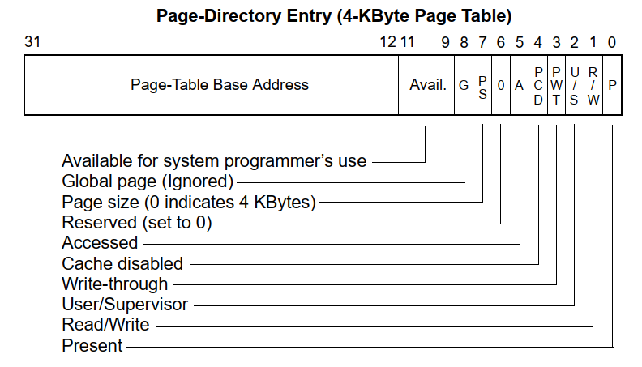

* P: 存在位 0=无效 1=有效
* R/W: 读/写位 0=RE 1=RWE
* U/S: ring3/(ring0/ring1/ring2) 0=特权 1=用户
* PWT/PCD: 缓存控制 
* A: 访问位 0=未访问 1=已访问
* PS: 页大小 0=4K 1=4M
* G: 全局页 0=非全局 1=全局

**页表**

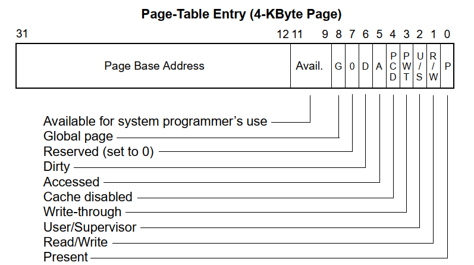

* D: 脏数据 0=未修改 1=已修改

**页目录表4M**

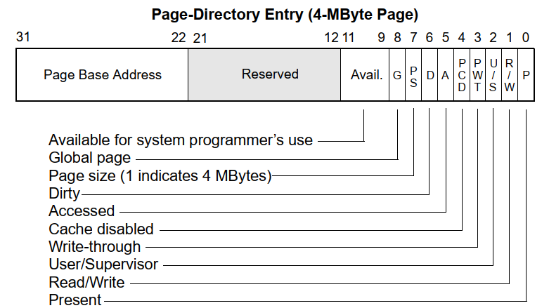

* PDT: Page-Directory Table 页目录表
* PDPE: Page-Directory Entry 页目录项
* PT: Page-Table 页表
* PTE: Page-Table Entry 页表项

**关闭PAE**

> https://learn.microsoft.com/zh-cn/previous-versions/windows/drivers/devtest/boot-options-in-a-boot-ini-file

```
multi(0)disk(0)rdisk(0)partition(1)\WINDOWS="Debug Entry NOPAE" /execute /debug /debugport:com /baudrate=115200
```

**WinDbg**
* `!dd` 查看物理地址
* `r gdtr` 查看GDTR寄存器
* `!pte VirtualAddress` 查看当前进程虚拟地址转物理地址
* `!vtop PDTAddress VirtualAddress` 查看虚拟地址对应的物理地址
* `.formats 0x12345678` 地址转换

**手动地址转换**

* 页目录表 cr3=00039000
* gdtr=8003f000 ==> Binary:  1000000000 0000111111 000000000000
* offset = 0x000
* PDE index: 0x200
* PTE index: 0x3f
* 页目录表查表取内容得到页表地址
* 00039000 + 0x200 * 4 = 00039800 ==> 0003b163
* 页表查表取内容得到物理地址高20位
* 0003b000 + 0x3f * 4 = 0003b0fc ==> 0003f163
* 物理地址高20位加低12位得到物理地址
* 0003f000 + 0x000 = 0003f000

**大页地址转换4M**

* 在页目录表中找到地址 3980c 取内容得到 010009e3
* PDE index: 0x80c / 4 = 0x203
* 由此可知线性地址高10位为 10 0000 0011 低22位补0
* 由此可知线性地址 1000 0000 1100 0000 0000 0000 0000 0000 => 0x80c00000
* 将 0x80c00000 ==> 10000000 11000000 00000000 00000000 转换为物理地址
* 页目录表 cr3=00039000
* PDE index: 0x203
* 00039000 + 203 * 4 = 0003980c ==> 010009e3 ==> 00000001 00000000 00001001 11100011
* 解析低3位属性 1001 11100011 PS位(从0开始第7位)为1 是4M大页不用再查页表
* 线性地址低22位偏移加页目录表项高10位得到物理地址
* 00000001 00000000 00000000 00000000 ==> 0x01000000

----

* 将 804e3a42 => 10 0000 0001 001110 00111010 01000010 转换为物理地址
* 页目录表地址 39000
* PDE index: 0x201
* 页目录表项 39000 + 0x201 * 4 = 39804 ==> 004009e3 ==> 00000000 01000000 00001001 11100011
* 解析低3位属性 1001 11100011 PS位(从0开始第7位)为1 是4M大页不用再查页表
* 线性地址低22位偏移加页目录表项高10位得到物理地址
* 00000000 01001110 00111010 01000010 ==> 0x004e3a42
* 虚拟地址 804e3a42 => 物理地址 004e3a42