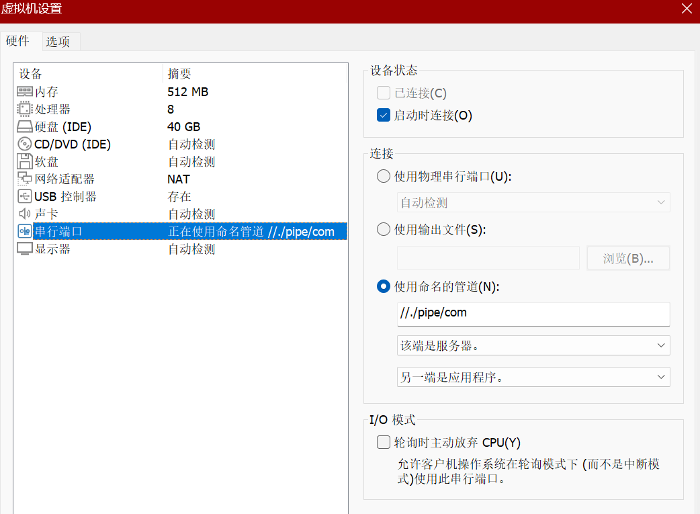
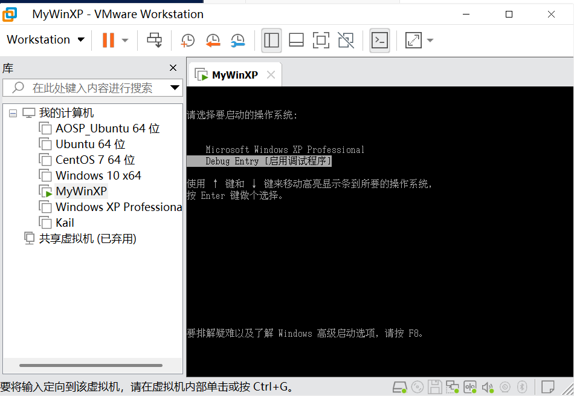
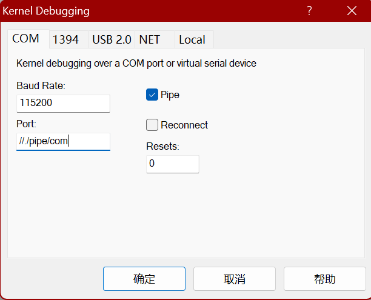
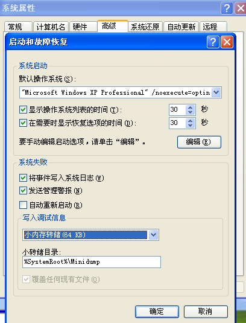

<!-- @import "[TOC]" {cmd="toc" depthFrom=1 depthTo=6 orderedList=false} -->

<!-- code_chunk_output -->

- [双机调试](#双机调试)
  - [WinXP 启动调试模式](#winxp-启动调试模式)
  - [WinXP 以上操作系统启动调试模式](#winxp-以上操作系统启动调试模式)
- [WinDbg使用](#windbg使用)
- [蓝屏日志收集](#蓝屏日志收集)

<!-- /code_chunk_output -->


# 双机调试

> 通过WinDbg调试windows内核

* 网络
* 管道

## WinXP 启动调试模式
* 修改  C:\boot.ini 文件
```
multi(0)disk(0)rdisk(0)partition(1)\WINDOWS="Debug Entry" /noexecute=optin /fastdetect /debug /debugport:com /baudrate=115200
```
* 关机
* 连接串口线设置管道 `//./pipe/` 符号链接加 `com` 名

* 启动时，选择调试模式


使用WinDbg连接串口


## WinXP 以上操作系统启动调试模式

> https://learn.microsoft.com/zh-cn/windows-hardware/drivers/devtest/bcd-boot-options-reference

* 使用管理员模式启动CMD
* `bcdedit /copy {current} /d "Debug Entry"` 复制当前启动项
* `bcdedit /debug {[GUID]} on` 开启调试模式
* `bcdedit /dbgsettings serial debugport:1 baudrate:115200` 设置串口
* 重启系统

> 可以新建WinDbg快捷方式，连接调试
> C:\WinDDK\7600.16385.1\Debuggers\windbg.exe -b -k com:port=//./pipe/com,baud=115200,pipe

# WinDbg使用

**符号命令**
> https://learn.microsoft.com/zh-cn/windows-hardware/drivers/debugger/using-a-symbol-server
* `.reload` 加载符号
* `.reload /f *` 强制加载符号
* `x nt!*` 查看符号表

**进程**
* `.attach pid` 附加进程
* `.detach` 分离进程
* `!process 0 0` 查看所有进程信息
* `!process 0 7` 查看所有进程所有详细信息
* `!process EPROCESS 7` 查看进程详细信息
* `.process /p EPROCESS` 切换进程

**线程**
* `~*` 显示所有线程
* `~.` 显示引起异常的线程
* `~* kb` 显示所有线程的堆栈
* `.thread ETHREAD` 切换线程
* `!thread ETHREAD` 查看线程信息

**断点**
* `bp address` 设置断点
* `bp mode!func` 符号断点
* `bu mode!func` 符号断点
* `bm mode!f*nc` 正则符号断点
* `ba w4/r4/e4/i4 address` 硬件断点
* `bp /p EPROCESS address/func` 进程断点
* `bp /t ETHREAD address/func` 线程断点
* `ba /p /t EPROCESS ETHREAD address/func` 进程线程断点
* `bl` 查看断点
* `bc 1` 清除断点
* `be` 启用断点
* `bd` 禁用断点
* 日志断点
* `bp mode!func "r eax;g"` 断点命中后，执行命令

**内存**
* `db` 以一个字节显示值和ASSCII字符
* `dw` 以两个字节显示值
* `dd` 以四个字节显示值
* `dq` 以八个字节显示值
* `dp` 以指针显示值
* `dD` 显示double实数(8字节)的值
* `df` 显示float实数(4字节)的值
* `da` 以ASSCII字符显示值
* `du` 以Unicode字符显示值
* `ds` 显示ANSI_STRING值
* `dS` 显示UNICODE_STRING值
* 多层显示
* `dxy` 以多种格式显示值
* x: d:4字节; q: 8字节; p:指针
* y: p:指针; a:ASSCII; u:Unicode; s:函数名

**修改内存**
* `eb/ed/eD/ef/ep/eq/ew` 
* `ed address value`
* `ea/eu`
* `eza/ezu`

**堆栈命令**
* `kv`
* `kb`
* `kp`

**搜索**
* S指令对内存进行查找数字、字符串，不支持模糊查找

**蓝屏命令**
* `!analyze -v` 查看蓝屏原因

# 蓝屏日志收集



将日志文件拷贝到本地，使用WinDbg分析日志文件
