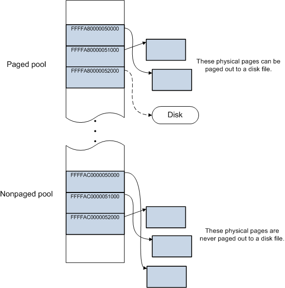

<!-- @import "[TOC]" {cmd="toc" depthFrom=1 depthTo=6 orderedList=false} -->

<!-- code_chunk_output -->

- [驱动开发](#驱动开发)
  - [驱动程序入口点](#驱动程序入口点)
    - [驱动程序入口点函数的必要职责](#驱动程序入口点函数的必要职责)
  - [一些概念](#一些概念)
    - [虚拟地址空间](#虚拟地址空间)
    - [I/O 请求数据包（IRP）](#io-请求数据包irp)
    - [内核API](#内核api)
  - [完整代码](#完整代码)

<!-- /code_chunk_output -->


# 驱动开发

> https://learn.microsoft.com/zh-cn/windows-hardware/drivers/kernel/driverentry-s-required-responsibilities

## 驱动程序入口点

驱动程序入口点函数是驱动程序的核心，负责初始化驱动程序并注册驱动程序对象。驱动程序入口点函数必须具有以下特征：

- 必须命名为 `DriverEntry`。
- 必须返回 `NTSTATUS` 值。
- 必须具有 `PDRIVER_OBJECT` 和 `PUNICODE_STRING` 参数。

``` c++
extern "C" NTSTATUS DriverEntry(PDRIVER_OBJECT DriverObject,PUNICODE_STRING RegistryPath);
NTSTATUS DriverEntry(
    _In_ PDRIVER_OBJECT DriverObject,
    _In_ PUNICODE_STRING RegistryPath
);
```

### 驱动程序入口点函数的必要职责

为驱动程序的标准例程提供入口点。
``` C++
// 注册回调函数
    DriverObject->MajorFunction[IRP_MJ_CREATE] = DriverCreate;
    DriverObject->MajorFunction[IRP_MJ_CLOSE] = DriverClose;
    DriverObject->MajorFunction[IRP_MJ_READ] = DriverRead;
    DriverObject->MajorFunction[IRP_MJ_WRITE] = DriverWrite;
    DriverObject->MajorFunction[IRP_MJ_DEVICE_CONTROL] = DriverControl;
```

## 一些概念

### 虚拟地址空间

> https://learn.microsoft.com/zh-cn/windows-hardware/drivers/gettingstarted/virtual-address-spaces

* 处理器在读取或写入内存位置时使用虚拟地址。 在这些操作期间，处理器将虚拟地址转换为物理地址。
* 诸如 Notepad.exe 和 MyApp.exe 的进程在用户模式下运行。 核心操作系统组件和多个驱动程序在更有特权的内核模式下运行。
* 每个用户模式进程都有其各自的专用虚拟地址空间，但在内核模式下运行的所有代码都共享称为“系统空间” 的单个虚拟地址空间。 用户模式进程的虚拟地址空间称为“用户空间” 。
* 32位可用虚拟地址空间2^32 = 4 GB，64位可用虚拟地址空间2^64 = 16 EB。
* 高一半地址用于系统空间，低一半地址用于用户空间。


**分页缓冲池和非分页缓冲池**
* 在用户空间中，所有物理内存页面都可以根据需要调出到磁盘文件。 
* 在系统空间中，某些物理页面可以分页，而其他物理页面则无法分页。
* 分页缓冲池中分配的内存可以根据需要调出到磁盘文件。 非分页缓冲池中分配的内存永远无法调出到磁盘文件。


### I/O 请求数据包（IRP）

> https://learn.microsoft.com/zh-cn/windows-hardware/drivers/gettingstarted/i-o-request-packets

### 内核API

> https://learn.microsoft.com/zh-cn/windows-hardware/drivers/ddi/_kernel/

## 完整代码

``` C++
// 驱动代码
#include <ntddk.h>

extern "C" NTSTATUS DriverEntry(
     PDRIVER_OBJECT  DriverObject,
     PUNICODE_STRING RegistryPath
);
#include "Demo.h"

void DriverUnload(struct _DRIVER_OBJECT* DriverObject) {
    KdPrint(("[driver] DriverEntry DriverObject:%p\n", DriverObject));
    
    // 删除设备对象
    if (DriverObject->DeviceObject != NULL) {
        IoDeleteDevice(DriverObject->DeviceObject);
    }

    // 删除符号链接
    _UNICODE_STRING ustrSymbolName;
    RtlInitUnicodeString(&ustrSymbolName, L"\\??\\demo");
    IoDeleteSymbolicLink(&ustrSymbolName);
}

NTSTATUS DriverCreate(
     _DEVICE_OBJECT* DeviceObject,
    _IRP* Irp
)
{
    UNREFERENCED_PARAMETER(DeviceObject);
    UNREFERENCED_PARAMETER(Irp);
    KdPrint(("[driver] DriverCreate\n"));
    return STATUS_SUCCESS;
}

NTSTATUS DriverClose(
     _DEVICE_OBJECT* DeviceObject,
    _IRP* Irp
)
{
    UNREFERENCED_PARAMETER(DeviceObject);
    UNREFERENCED_PARAMETER(Irp);
    KdPrint(("[driver] DriverClose\n"));
    return STATUS_SUCCESS;
}

NTSTATUS DriverRead(
     _DEVICE_OBJECT* DeviceObject,
     _IRP* Irp
)
{
    UNREFERENCED_PARAMETER(DeviceObject);
    UNREFERENCED_PARAMETER(Irp);
    KdPrint(("[driver] DriverRead\n"));
    return STATUS_SUCCESS;
}

NTSTATUS DriverWrite(
     _DEVICE_OBJECT* DeviceObject,
     _IRP* Irp
)
{
    UNREFERENCED_PARAMETER(DeviceObject);
    UNREFERENCED_PARAMETER(Irp);
    KdPrint(("[driver] DriverWrite\n"));
    return STATUS_SUCCESS;
}

NTSTATUS DriverControl(
     _DEVICE_OBJECT* DeviceObject,
     _IRP* Irp
)
{
    UNREFERENCED_PARAMETER(DeviceObject);
    UNREFERENCED_PARAMETER(Irp);
    KdPrint(("[driver] DriverControl\n"));

    PIO_STACK_LOCATION pIrp = IoGetCurrentIrpStackLocation(Irp);
    if (pIrp->Parameters.DeviceIoControl.IoControlCode == IOCTL_READ_MEMORY) {
        MYMSG msg = { 0 };
        RtlCopyMemory(&msg, Irp->AssociatedIrp.SystemBuffer, sizeof(msg));

        KdPrint(("[driver]msg %p %d %d %s", msg.Address, msg.Status, msg.dwLen, msg.buf));

        if (msg.Status == 0) {
            RtlCopyMemory(Irp->AssociatedIrp.SystemBuffer,
                msg.Address,
                msg.dwLen);

            KdPrint(("读取"));
            char* p = (char*)msg.Address;
            for (int i = 0; i < msg.dwLen; i++)
            {
                KdPrint(("%c ", p[i]));
            }
            KdPrint(("\n"));
        }
        else if (msg.Status == 1) {
            char* p = (char*)msg.Address;
            KdPrint(("写入"));
            for (int i = 0; i < msg.dwLen; i++)
            {
                KdPrint(("%c ", p[i]));
            }
            KdPrint(("\n"));
            RtlCopyMemory(msg.Address,
                msg.buf,
                msg.dwLen);
        }

        Irp->IoStatus.Status = STATUS_SUCCESS;
        Irp->IoStatus.Information = msg.dwLen;
    }
    IoCompleteRequest(Irp, IO_NO_INCREMENT);
    return STATUS_SUCCESS;
}

NTSTATUS DriverEntry(
     PDRIVER_OBJECT  DriverObject,
     PUNICODE_STRING RegistryPath
)
{
    KdPrint(("[driver] DriverEntry RegisterPath:%wZ\n", RegistryPath));
    DriverObject->DriverUnload = DriverUnload;

    // 注册派遣函数
    DriverObject->MajorFunction[IRP_MJ_CREATE] = DriverCreate;
    DriverObject->MajorFunction[IRP_MJ_CLOSE] = DriverClose;
    DriverObject->MajorFunction[IRP_MJ_READ] = DriverRead;
    DriverObject->MajorFunction[IRP_MJ_WRITE] = DriverWrite;
    DriverObject->MajorFunction[IRP_MJ_DEVICE_CONTROL] = DriverControl;

    // 创建设备对象
    PDEVICE_OBJECT pDevObj = NULL;
    _UNICODE_STRING ustrDevName;
    RtlInitUnicodeString(&ustrDevName, L"\\Device\\Demo");
    NTSTATUS Status = IoCreateDevice(DriverObject,
        0,
        &ustrDevName,
        FILE_DEVICE_UNKNOWN,
        FILE_DEVICE_SECURE_OPEN,
        FALSE,
        &pDevObj);
    if (!NT_SUCCESS(Status)) {
        KdPrint(("[driver] DriverEntry RegisterPath:%08X\n", Status));
        return Status;
    }

    KdPrint(("[driver] DriverEntry IoCreateDevice:%p\n", pDevObj));

    _UNICODE_STRING ustrSymbolName;
    RtlInitUnicodeString(&ustrSymbolName, L"\\??\\Demo");
    Status = IoCreateSymbolicLink(&ustrSymbolName, &ustrDevName);
    if (!NT_SUCCESS(Status)) {
        KdPrint(("[driver] DriverEntry IoCreateSymbolicLink Failed\n"));
        return Status;
    }

    KdPrint(("[driver] DriverEntry IoCreateSymbolicLink:%wZ\n", ustrSymbolName));

    return STATUS_SUCCESS;
}
```

``` C++
// 驱动加载器
#include <windows.h>
#include <stdio.h>

struct MYMSG {
	char* Address;
	int Status;
	int dwLen;
	char buf[MAXBYTE];
};

#define IOCTL_READ_MEMORY CTL_CODE(FILE_DEVICE_UNKNOWN, 0x800, METHOD_BUFFERED, FILE_ANY_ACCESS)

void ShowError(const char* szName) {
	DWORD dwErrorCode = GetLastError();
	LPVOID lpMsgBuf;
	FormatMessage(
		FORMAT_MESSAGE_ALLOCATE_BUFFER |
		FORMAT_MESSAGE_FROM_SYSTEM |
		FORMAT_MESSAGE_IGNORE_INSERTS,
		NULL,
		dwErrorCode,
		MAKELANGID(LANG_NEUTRAL, SUBLANG_DEFAULT), // Default language
		(LPTSTR)&lpMsgBuf,
		0,
		NULL
	);
	printf("[%-10s] ErrorCode:%08X ErrorMsg:%s\n", szName, dwErrorCode, (LPTSTR)lpMsgBuf);
	LocalFree(lpMsgBuf);
}

int LoadDriver(const char* szPath, const char* svcName) {
	int Result = -1;
	SC_HANDLE schSCManager = OpenSCManager(
		NULL,                    // local computer
		NULL,                    // ServicesActive database 
		SC_MANAGER_ALL_ACCESS);  // full access rights 
	if (schSCManager == NULL) {
		ShowError("OpenSCManager");
		return Result;
	}
	printf("szPath:%s\n", szPath);
	printf("ServiceName:%s\n", svcName);
	printf("OpenSCManager schSCManager:%p\n", schSCManager);

	SC_HANDLE schService = CreateService(
		schSCManager,              // SCM database 
		svcName,                   // name of service 
		svcName,                   // service name to display 
		SERVICE_ALL_ACCESS,        // desired access 
		SERVICE_KERNEL_DRIVER, // service type 
		SERVICE_DEMAND_START,      // start type 
		SERVICE_ERROR_NORMAL,      // error control type 
		szPath,                    // path to service's binary 
		NULL,                      // no load ordering group 
		NULL,                      // no tag identifier 
		NULL,                      // no dependencies 
		NULL,                      // LocalSystem account 
		NULL);                     // no password 

	if (schService == NULL) {
		if (GetLastError() != ERROR_SERVICE_EXISTS) {
			// 服务创建失败
			ShowError("CreateService");
			CloseServiceHandle(schSCManager);
			return Result;
		}
		// 服务已存在
		schService = OpenService(schSCManager, svcName, SERVICE_ALL_ACCESS);
		if (schService == NULL) {
			// 服务打开失败
			ShowError("OpenService");
			CloseServiceHandle(schSCManager);
			return Result;
		}
	}

	SERVICE_STATUS Status;
	ControlService(schService, SERVICE_CONTROL_STOP, &Status);
	
	if (!StartService(schService, 0, NULL)) {
		// 服务启动失败
		ShowError("StartService");
	}
	else {
		Result = 0;
	}

	CloseServiceHandle(schService);
	CloseServiceHandle(schSCManager);
	return Result;
}

int UnLoadDriver(const char* name) {
	int Result = -1;
	SC_HANDLE schSCManager = OpenSCManager(
		NULL,                    // local computer
		NULL,                    // ServicesActive database 
		SC_MANAGER_ALL_ACCESS);  // full access rights 
	if (schSCManager == NULL) {
		ShowError("OpenSCManager");
		return Result;
	}

	SC_HANDLE schService = OpenService(schSCManager, name, SERVICE_ALL_ACCESS);
	if (schService == NULL) {
		// 服务打开失败
		ShowError("OpenService");
		CloseServiceHandle(schSCManager);
		return Result;
	}

	SERVICE_STATUS Status;
	ControlService(schService, SERVICE_CONTROL_STOP, &Status);

	if (!DeleteService(schService)) {
		// 删除服务失败
		ShowError("DeleteService");
	}
	else {
		Result = 0;
	}

	CloseServiceHandle(schService);
	CloseServiceHandle(schSCManager);
	return Result;
}

int main()
{
	char szPath[MAX_PATH];
	GetCurrentDirectory(MAX_PATH, szPath);
	lstrcat(szPath, "\\DriverReadWrite.sys");
	if (LoadDriver(szPath, "DriverReadWrite") != 0) {
		printf("Service install failed\n");
	}
	else {
		printf("Service install successfully\n");
	}

	// 打开驱动文件标识符，读写驱动数据
	HANDLE hFile = CreateFile("\\\\.\\demo",
		GENERIC_READ | GENERIC_WRITE,
		0,
		NULL,
		OPEN_EXISTING,
		0,
		NULL);
	if (hFile != INVALID_HANDLE_VALUE) {
		DWORD dwBytesReturned = 0;
		MYMSG msg;
		
		while (true) {
			printf("地址 0(读)/1(写) 长度 内容(地址输入0退出):");
			char input[MAXBYTE] = { 0 };
			scanf_s("%p %d %d %s", &msg.Address, &msg.Status,
				&msg.dwLen, msg.buf, sizeof(msg));
			if (msg.Address == 0)
				break;

			if (!DeviceIoControl(hFile, IOCTL_READ_MEMORY,
				&msg, sizeof(msg),
				msg.buf, MAXBYTE,
				&dwBytesReturned, NULL)) {
				ShowError("DeviceIoControl");
			}

			for (SIZE_T i = 0; i < dwBytesReturned; i++) {
				printf("%x ", msg.buf[i]);
				if ((dwBytesReturned + 1) % 8 == 0) {
					printf("\n");
				}
			}
		}
		CloseHandle(hFile);
	}
	else {
		ShowError("CreateFile");
	}

	system("pause");
	if (UnLoadDriver("DriverReadWrite") != 0) {
		printf("Service uninstall failed\n");
	}
	else {
		printf("Service uninstall successfully\n");
	}
	system("pause");
	return 0;
}
```