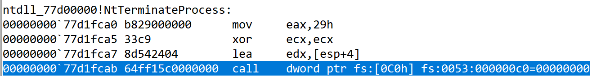
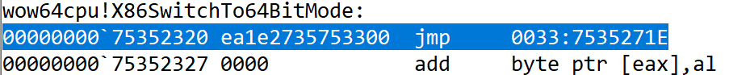

<!-- @import "[TOC]" {cmd="toc" depthFrom=1 depthTo=6 orderedList=false} -->

<!-- code_chunk_output -->

- [模式切换](#模式切换)
- [保护](#保护)

<!-- /code_chunk_output -->


# 模式切换

* 在64位操作系统中，32位程序需要切换到64位模式可以执行64位指令，在微软中叫`WOW64子系统`。
    * 64位： CS = 0010
    * 32位： CS = 0020
* 切换到64位模式就可以调用64位API

* 在Windows操作系统中调用API，系统会自动进行模式切换
* `jmp 33:0x00000000`，模式切换为64位，跳转到`0x00000000`代码段执行64asm



* API编号0x29
* edx 是参数地址
* `call    dword ptr fs:[0C0h]` 是WOW32的子系统



* 切换ring3的64位模式，跳转到`0x7535271E`执行代码64位汇编

**应用**
1. 解决32位程序无法注入64位程序
2. 解决64位程序无法注入32位程序
3. 解决32位程序执行内核ShellCode

**模仿WOW64子系统，在ring3中切换到64位模式执行64位汇编指令**
``` C++
#include <stdio.h>
#include <stdlib.h>

__declspec(naked) int __fastcall fun1(long n1,  long n2) {
	__asm {
		_emit 49h    //mov r8, rcx
		_emit 089h 
		_emit 0c8h

		_emit 49h    //add r8, rdx
		_emit 01h
		_emit 0d0h

		_emit 4ch    //mov rax, r8
		_emit 89h
		_emit 0c0h
		
		_emit 0b8h    //mov eax, 3
		_emit 03h
		_emit 00h
		_emit 00h
		_emit 00h

		_emit 0cbh	 //retf
	}
}

int main()
{
	int result = 0;
	__asm {
		//int 3
		push 23h
		push offset label1
		push 33h
		push offset fun1
		retf  //[ESP+0] = EIP  [ESP+0] = CS
	label1:
		mov result, eax
	}
	printf("1+2=%d", result);
	system("pause");
	return 0;
}
```

# 保护

**CR4控制寄存器**
* 21 SMAP Supervisor Mode Access Protection R/W
* 20 SMEP Supervisor Mode Execution Prevention R/W

**SMAP**
* ring0禁止访问ring3的内存
* `STAC` 修改AC位
**SMEP**
* ring0禁止执行ring3的代码