<!-- @import "[TOC]" {cmd="toc" depthFrom=1 depthTo=6 orderedList=false} -->

<!-- code_chunk_output -->

- [64位内核](#64位内核)
  - [模式](#模式)
  - [内存管理](#内存管理)
  - [系统调用](#系统调用)

<!-- /code_chunk_output -->


# 64位内核

**WIN7 DebugView 调试信息开启**
* 修改注册表
```
[HKEY_LOCAL_MACHINE\SYSTEM\CurrentControlSet\Control\Session Manager\Debug Print Filter]
"DEFAULT"=dword:0000000f
```

**联合编译**
* 在64位中无法内联汇编

1. 使用内部函数
2. 使用联合编译
    1. 新建`test.asm`文件
    2. 右键项目->生成依赖项->生成自定义，选择masm(.targets,.props)
    3. 右键`.asm`文件->属性，选择不排除
    4. 在头文件中 `extern "C"` 声明函数

``` masm
.code 
MyAdd proc
    mov rax, rcx
    add rax, rdx
    ret
MyAdd endp
end
```

## 模式

* 64位内核使用`long mode`，即64位模式
* 32位内核使用`compatibility mode`，即兼容模式

**虚拟地址**
* 64模式虚拟地址48位有效，高位为符号扩展
* ring3: 0x0000000000000000~0x00007FFFFFFFFFFFF
* ring0: 0xFFFF800000000000~0xFFFFFFFFFFFFFFFF
* 0x00008000000000000 无编码地址

**描述符**
* 保护模式系统软件必须创建一个全局描述符表（GDT）。
* GDT包含可以被所有人共享的段的代码段和数据段。还可以保存门描述符和其他系统描述符。

* `dg 0 90` 查看所有全局段描述符表

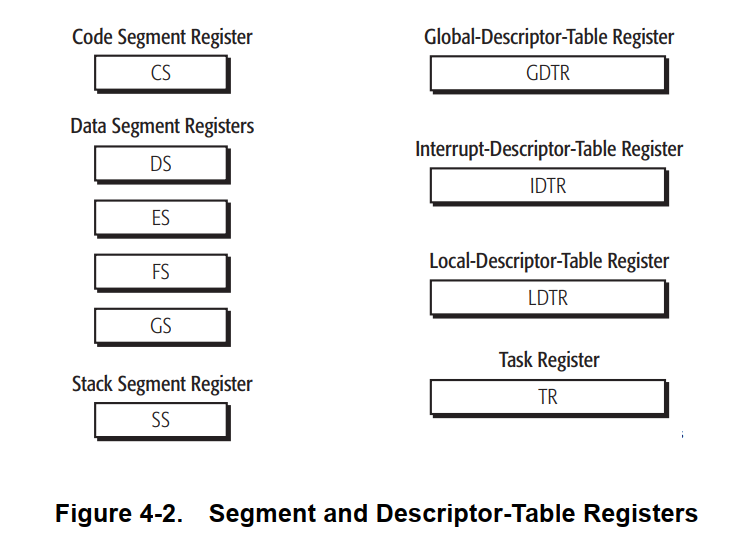

**全局描述符表寄存器**

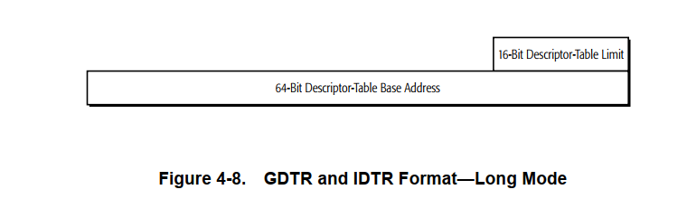

**代码段描述符**

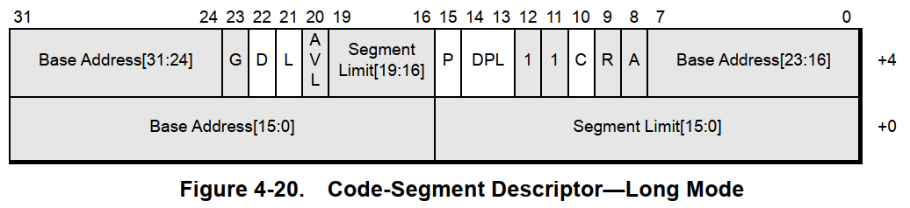

* 灰色表示不使用，保留
* 使用 `L` 标志位，1表示64位模式，0表示32位模式

**数据段描述符**

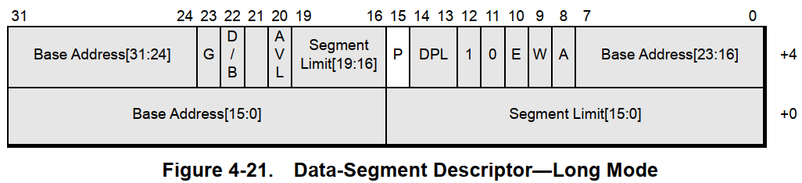

**系统描述符**

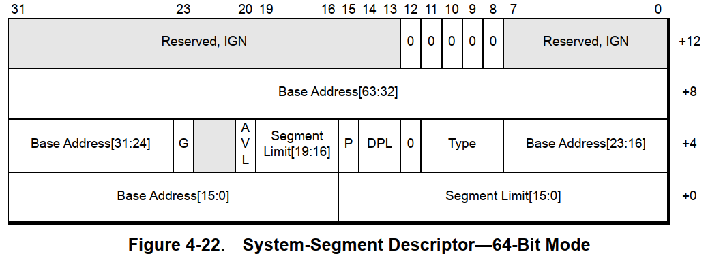

**门描述符**

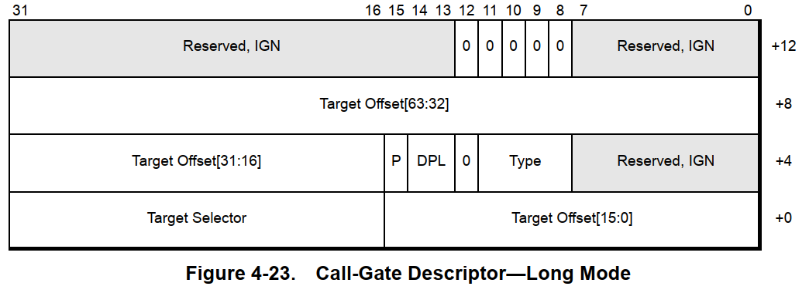

`r idtr` 查看中断描述符表寄存器

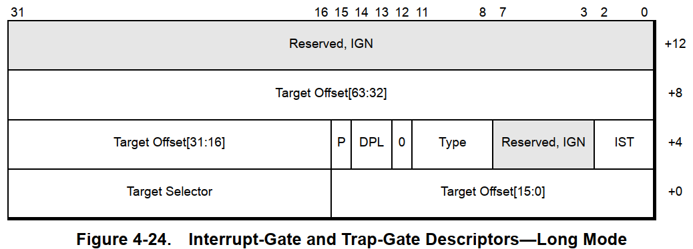

* IST 标志 表示是否使用栈表，TSS中的IST栈索引，让中断门和陷阱门使用不同的栈

## 内存管理

**地址转换**
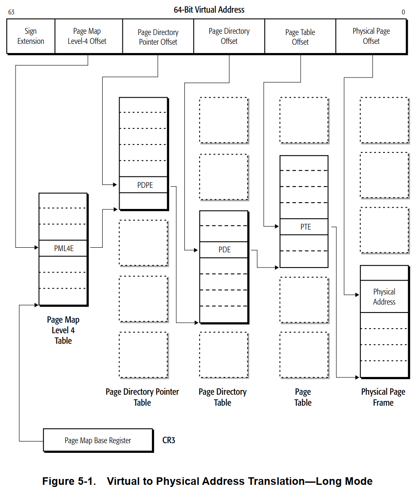

**页转换选项**
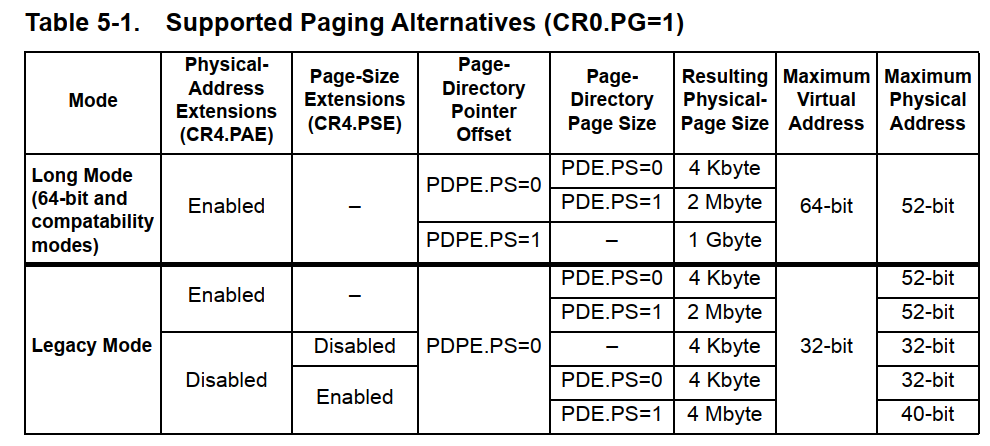

**CR3寄存器**
* 指向最高级转换表的基址


**4K页表**
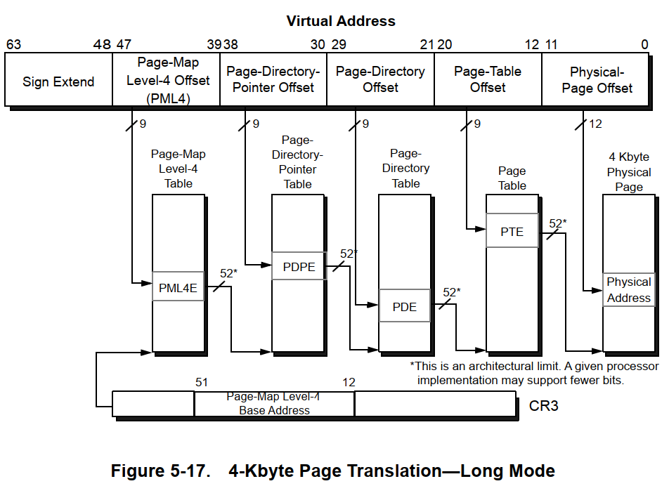

**表格式**
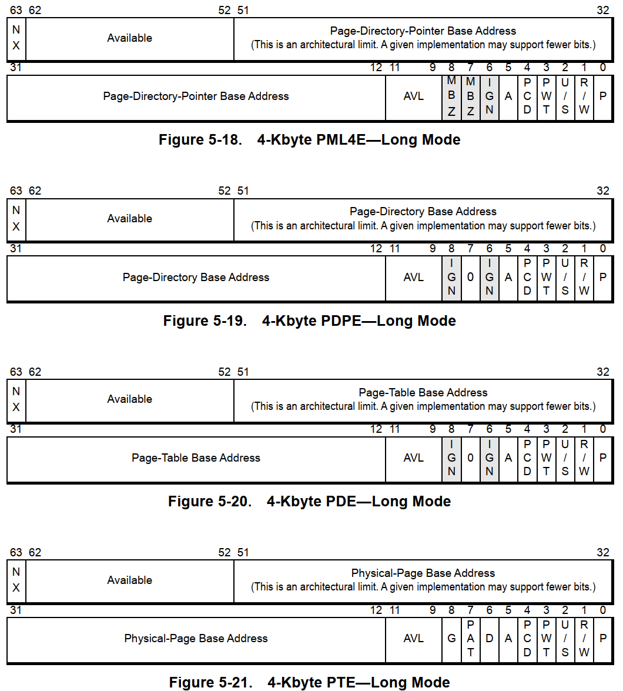

* `NX` 标志位，1表示禁止执行，0表示允许执行 硬件DEP

## 系统调用

**MSRs(model-specific registers)**
* MSRs寄存器用于保存 `SYSCALL` 目标RIP地以及被调用和返回的 CS 和 SS 寄存器

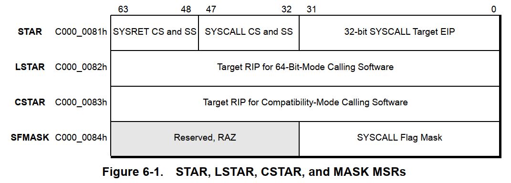

* `rdmsr c0000081` 查看MSR寄存器
* `LSTAR` 保存被调用函数的RIP地址 `KiSystemCall64`

**System-Linkage Registers**

> 用来允许应用程序和操作系统之间快速传输

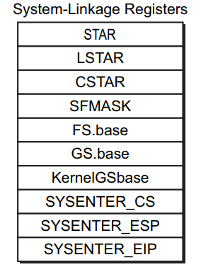

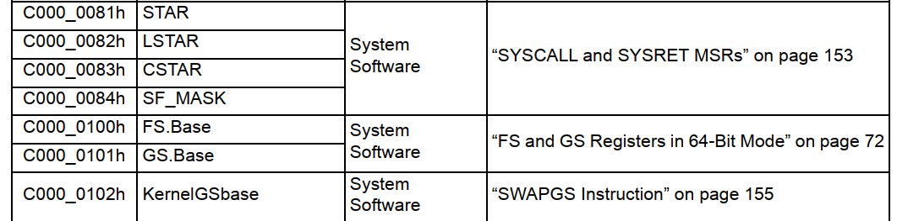

* STAR， LSTAR， CSTAR和SFMASK寄存器。
    * 这些寄存器用于为SYSCALL和SYSRET指令提供与模式相关的链接信息。
    * STAR用于遗留模式，LSTAR用于64位模式，CSTAR用于兼容模式。
    * SFMASK由sycall指令用于RFLAGS的长模式。

* KernelGSbase 寄存器 用于`SWAPGS`指令，快速切换`GS.base 寄存器` 和 `KernelGSbase 寄存器`
* 在64位中 KPCR 结构体在 `KernelGSbase` 中
* TEB 在 `GS.base` 中

**SSDT表**
* 在64位中，SSDT表中记录的地址是相对于表基址的偏移量，`函数地址=SSDT表基址+表项值`

**PG Patch Gurad 补丁保护**
* KPP Kernel Patch Protection
> 实时检测保护代码，保护代码段不被修改
