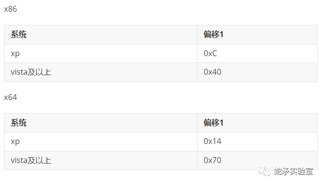
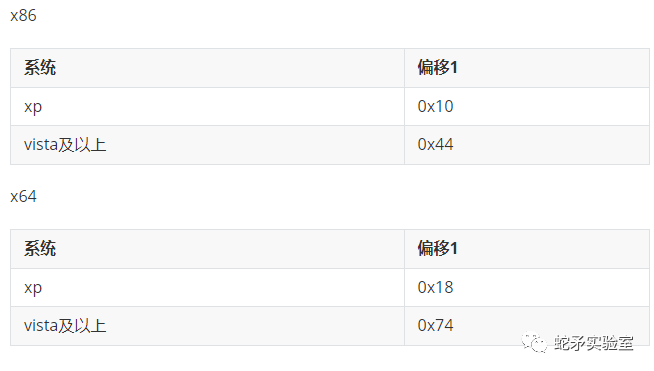

<!-- @import "[TOC]" {cmd="toc" depthFrom=1 depthTo=6 orderedList=false} -->

<!-- code_chunk_output -->

- [反调试分类](#反调试分类)

<!-- /code_chunk_output -->

# 反调试分类

1. 检测断点（软件断点，硬件断点，内存断点）
    1. TLS函数检测入口
2. 各种标记检测（单步标记，内存标记，内核对象，调试端口等）
3. 进程名字，窗口及其类名检测
4. 文件完整性检测（文件哈希值）

1. IsDebuggerPresent
    > 检测调试器是否存在，返回值为TRUE则存在，FALSE则不存在。
2. CheckRemoteDebuggerPresent
    > 检测远程进程是否存在调试器，返回值为TRUE则存在，FALSE则不存在。
3. 硬件断点和软件断点检测
4. PEB
    1. BeingDebugged
        > PEB结构中的BeingDebugged成员，用于标识进程是否正在被调试。
    2. NtGlobalFlag
        > NtGlobalFlag成员，用于标识进程是否正在被调试。
5. ProcessHeap
    1. HeapFlags
        > HeapFlags 大于 2 时，进程被调试。
    
    2. ForceFlags
        > ForceFlags 大于 0 时，进程被调试。
    
6. INT 2D
    > 正常运行时int 2d触发异常，进入程序的异常处理函数。而当调试运行时，OD会处理该异常，将eip+1继续运行，因此可以在异常处理函数中添加一些操作，如果没有执行这些代码，说明被调试。这种只能检测原版Ollydbg，x64dbg和一些带有反检测插件的调试器无效。
7. 进程列表
    > 进程列表中包含了一些调试器的进程名，如：Ollydbg，x64dbg，IDA Pro等。
8. NtQueryInformationProcess
    > 查询 ProcessInformationClass
    1. ProcessDbgPort
        > ProcessDbgPort成员，调试端口
    2. ProcessDebugObjectHandle
        > ProcessDebugObjectHandle成员，调试对象句柄
    3. ProcessDebugFlags
        > ProcessDebugFlags成员，为EPROCESS的NoDebugInherit成员，为0说明被调试
9. WUDFPIatform.dll 模块
    1. WudfIsAnyDebuggerPresent
        > WudfIsAnyDebuggerPresent 任何调试器存在时返回TRUE，否则返回FALSE。
    2. WudfIsKernelDebuggerPresent
        > WudfIsKernelDebuggerPresent 内核调试器存在时返回TRUE，否则返回FALSE。
    3. WudfIsUserDebuggerPresent
        > WudfIsUserDebuggerPresent 用户调试器存在时返回TRUE，否则返回FALSE。