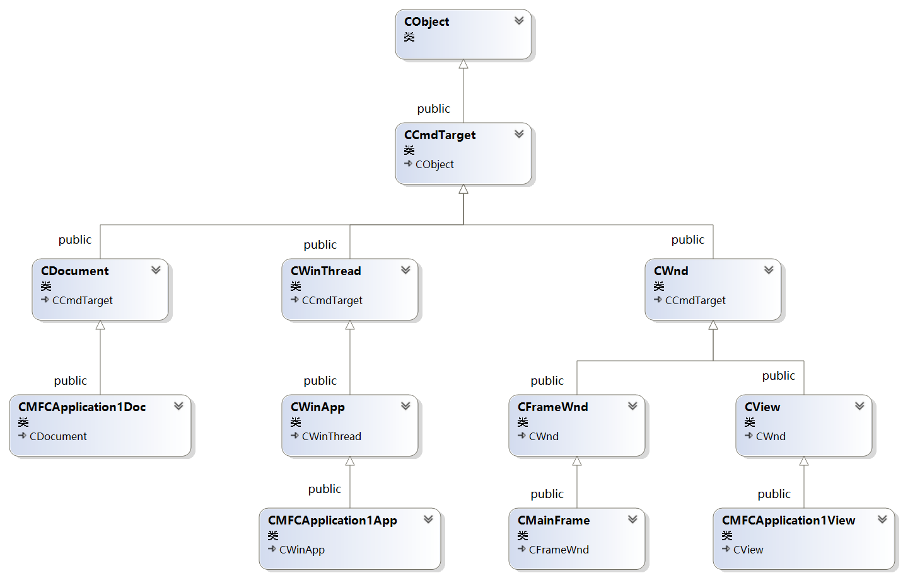

<!-- @import "[TOC]" {cmd="toc" depthFrom=1 depthTo=6 orderedList=false} -->

<!-- code_chunk_output -->

- [框架逆向](#框架逆向)
- [MFC 框架模拟实现](#mfc-框架模拟实现)
  - [动态类型识别](#动态类型识别)

<!-- /code_chunk_output -->

# 框架逆向

> 在逆向框架时，用户代码一般嵌在框架代码中。所以我们需要区分用户代码和框架代码。
1. 利用内存搜索工具，找到核心代码和调用堆栈
2. 研究框架源码，阅读源码，模拟实现框架
3. 框架逆向分析工具
    1. 静态分析工具
    2. 动态分析工具

# MFC 框架模拟实现

> https://learn.microsoft.com/zh-cn/cpp/mfc/mfc-application-architecture-classes?view=msvc-170

**文档/视图框架**
* 一个派生自 CWinApp 的应用程序对象和某个（一般间接）派生自 CWnd 的主窗口对象。 （通常来说，主窗口派生自 CFrameWnd、CMDIFrameWnd 或 CDialog，这些均派生自 CWnd。）
* 一个或多个派生自 CDocument 类的文档类对象。文档类对象负责视图中操作的数据的内部表示。 它们可能与数据文件关联。
* 一个或多个派生自 CView 类的视图对象。 每个视图都是附加到文档并与框架窗口关联的一个窗口。 视图显示和操作文档类对象中包含的数据。



## 动态类型识别

> 运行时类型识别，通过对象名创建和获取对象

``` C++
// Base.h
#pragma once
#include <Windows.h>
#include <stdio.h>

class Base;

struct CRuntimeClass {
	const char* m_szClassName;
	CRuntimeClass* m_pBaseClass;
	Base* (*m_pfnCreateObject)();
	Base* CreateObject() {
		return m_pfnCreateObject();
	}
};

#define RUNTIME_CLASS(class_name) ((CRuntimeClass*)(&class_name::class##class_name))

class Base
{
public:
	Base();
	~Base();

public:
	static const CRuntimeClass classBase;
	virtual CRuntimeClass* GetRunTimeClass() const {
		return RUNTIME_CLASS(Base);
	}
};
```

``` C++
// Base.cpp
#include "Base.h"

const CRuntimeClass Base::classBase = 
{"Base", NULL, NULL};

Base::Base()
{
}

Base::~Base()
{
}
```

``` C++
// Derived1.h
#pragma once
#include "Base.h"
class Derived1 :
    public Base
{
public:
    Derived1();
    ~Derived1();

public:
	static const CRuntimeClass classDerived1;
	virtual CRuntimeClass* GetRunTimeClass() const {
		return RUNTIME_CLASS(Derived1);
	}
	static Base* CreateObject();
};
```

``` C++
// Derived1.cpp
#include "Derived1.h"

const CRuntimeClass Derived1::classDerived1 = 
{ "Derived1", RUNTIME_CLASS(Base), Derived1::CreateObject};


Derived1::Derived1()
{
}

Derived1::~Derived1()
{
}

Base* Derived1::CreateObject()
{
	return new Derived1;
}
```

``` C++
// Derived2.h
#pragma once
#include "Base.h"
class Derived2 :
    public Base
{
public:
	Derived2();
	~Derived2();

public:
	static const CRuntimeClass classDerived2;
	virtual CRuntimeClass* GetRunTimeClass() const {
		return RUNTIME_CLASS(Derived2);
	}
	static Base* CreateObject();
};
```

``` C++
// Derived2.cpp
#include "Derived2.h"

const CRuntimeClass Derived2::classDerived2 =
{ "Derived2", RUNTIME_CLASS(Base), Derived2::CreateObject };


Derived2::Derived2()
{
}

Derived2::~Derived2()
{
}

Base* Derived2::CreateObject()
{
	return new Derived2;
}
```

``` C++
// main.cpp
#include "Base.h"
#include "Derived1.h"
#include "Derived2.h"

void ShowClass(Base* obj) {
	printf("%s", obj->GetRunTimeClass()->m_szClassName);
}

int main() {
	Base* base = RUNTIME_CLASS(Derived2)->CreateObject();
	ShowClass(base);

	return 0;
}
```