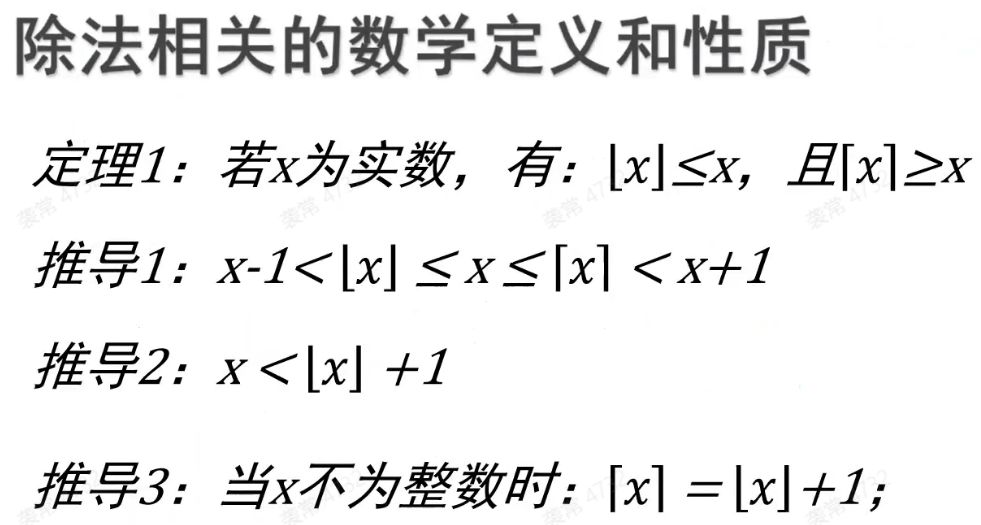
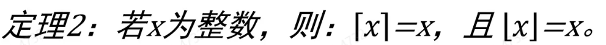
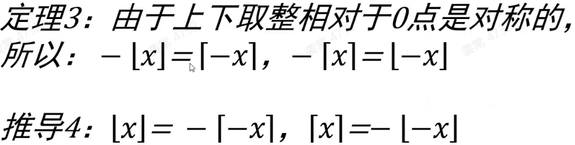
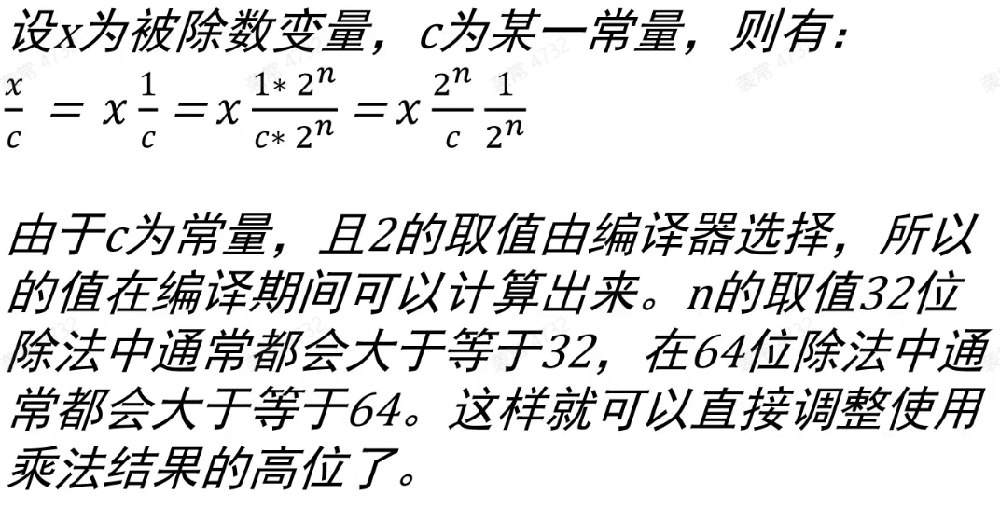
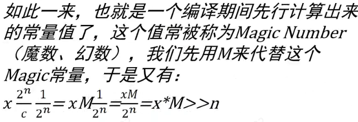
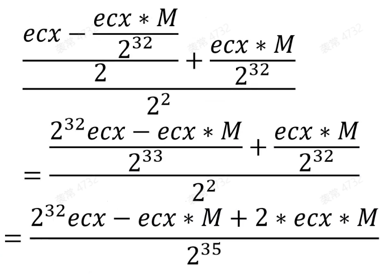
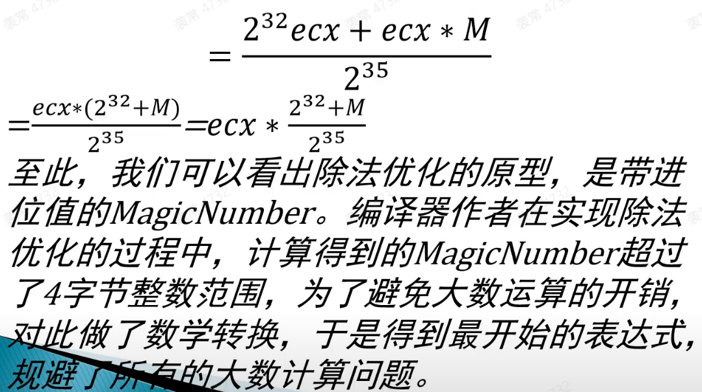
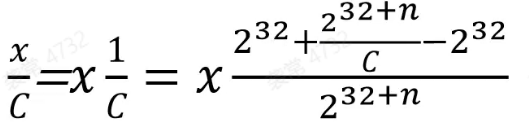
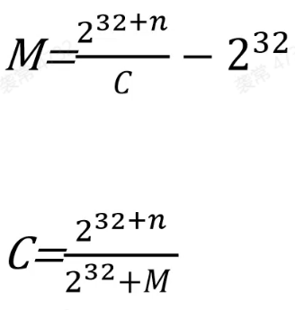
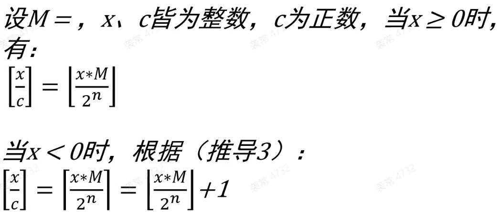

- [四则运算](#四则运算)
  - [除法](#除法)
    - [除数为无符号2的幂](#除数为无符号2的幂)
    - [除数为有符号2的幂](#除数为有符号2的幂)
    - [除数为有符号-2的幂](#除数为有符号-2的幂)
    - [除数为无符号非2的幂](#除数为无符号非2的幂)
    - [除数为有符号非2的幂](#除数为有符号非2的幂)

# 四则运算

编译器： 
* cl vs编译器
* gcc 
* clang

Release 优化：
* 常量传播，将已知的变量值替换到表达式中
* 常量折叠，将常量表达式在编译时计算出来
* 加法 add
  * lea
* 减法 sub
  * lea
* 乘法 mul 变量 * 常量
  * mul => imul + cdq
  * mul => imul
  * lea [eax + ebx * 8] // lea比例因子最大为8
  * shl + add(sub)
* 除法 div

``` C++
#include <stdio.h>
int main() {
    int n = 1;
    int m = 2;
    printf("%d\n", n + m); // printf("%d\n", 3);
    return 0;
}
```

逆向分析 =》 还原 =》 等价源码(二进制一致)

## 除法
* 有符号 / 有符号 = 有符号 idiv
* 无符号 / 无符号 = 无符号 div
* 混合运算 = 无符号 div

**取整**
* 向下取整 floor
* 向上取整 ceil
* 向零取整 trunc

**C语言取整**
* C语言除法使用的是向零取整 trunc
* C语言的右移使用向下取整 floor
* 正数的除法可以使用右移
* 负数的除法不能使用右移






### 除数为无符号2的幂

直接右移

``` masm
mov eax, esi
shr eax, n
```

### 除数为有符号2的幂



负数要加 2^n - 1

``` C++
if (x >= 0){
  x / 2^n = (x + 0) >> n
}
if (x < 0){
  x / 2^n = (x + 2^n - 1) >> n
}
```

cl 优化：
``` masm
mov eax, esi
cdq
and edx, imm(2^n-1)
add eax, edx
sar eax, n
```

其他优化：
``` masm
mov eax, esi
sar eax, 31
and eax, imm(2^n-1)
add eax, esi
sar eax, n
```

### 除数为有符号-2的幂

``` C++
x / -2^n => -(x / 2^n) => -((x + 2^n - 1) >> n)
```

``` masm
mov eax, esi
cdq
and edx, imm(2^n-1)
add eax, edx
sar eax, n
neg eax
```

### 除数为无符号非2的幂

``` C++
x / c => (x * M) >> n
```





* M 又称为魔数在编译器编译时会被计算， M = 2^n / c
* c = 2^n / M

``` masm
mov eax, M
mul argc
shr edx, (n - 32)
```

当除数为7的倍数时，魔数会溢出，此时需要分多次计算

``` C++
x / c => (((argc - (argc * M >> 32)) >> 1) + (argc * M >> 32)) >> 2
```






``` masm
mov esi, argc
mov eax, M
mul esi
sub esi, edx
shr esi, 1
add esi, edx
shr esi, 2
```

### 除数为有符号非2的幂

当除数为负数时，需要将向下取整转为向上取整

* M = 2^n / c
* c = 2^n / M



``` C++
x >= 0
    x / c => (x * M >> n) + 0
x < 0
    x / c => (x * M >> n) + 1
```

``` masm
mov eax, M
imul argc
shr edx, (n - 32)
mov ecx, edx
shr ecx, 31
add edx, ecx
```

当除数为有符号7时，魔数为负数
* M = 2^n / c
* c = 2^n / M

``` C++
// M < 0
x >= 0
    x / c = (((x * M >> 32) + x) >> (n - 32)) + 0
x < 0
    x / c = (((x * M >> 32) + x) >> (n - 32)) + 1
```

``` masm
mov eax, M
imul argc
add edx, esi
sar edx, (n - 32)
mov ecx, edx
shr ecx, 31
add edx, ecx
```