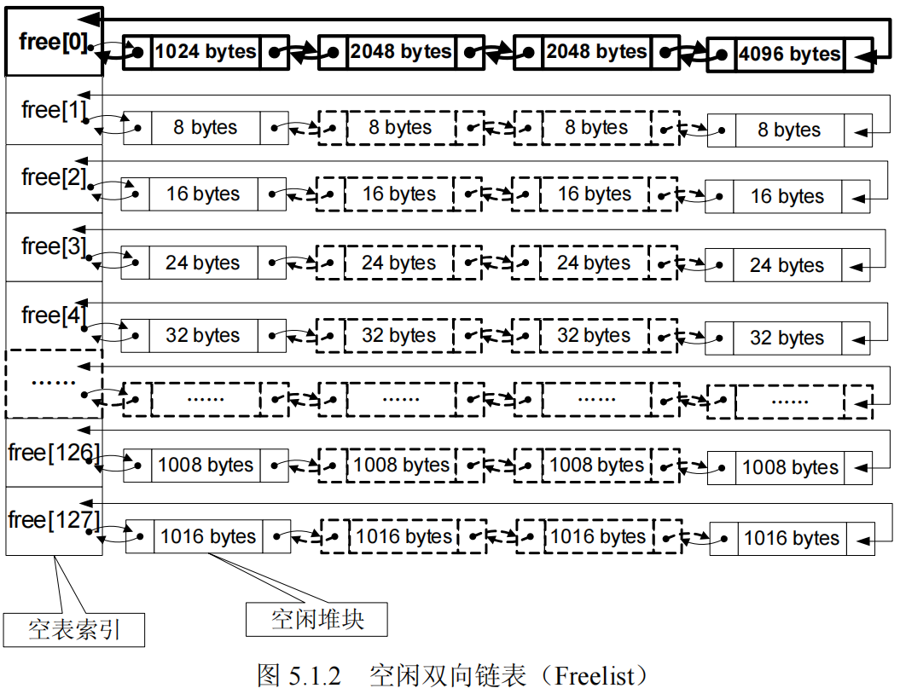

- [堆溢出漏洞](#堆溢出漏洞)
  - [堆的创建和销毁](#堆的创建和销毁)
    - [进程的默认堆](#进程的默认堆)
    - [创建堆](#创建堆)
    - [堆列表](#堆列表)
    - [销毁堆](#销毁堆)
  - [分配和释放堆块](#分配和释放堆块)
    - [分配堆块](#分配堆块)
    - [释放堆块](#释放堆块)
  - [堆的结构](#堆的结构)
  - [漏洞原理](#漏洞原理)
    - [漏洞成因](#漏洞成因)
    - [漏洞利用](#漏洞利用)

# 堆溢出漏洞

参考： https://bbs.kanxue.com/thread-271213.htm

## 堆的创建和销毁

### 进程的默认堆

Windows 在创建进程时，会调用`RtlCreateHeap`创建默认堆，`PEB`中描述了默认堆的信息：

``` c
0:000> dt _PEB
ntdll!_PEB
    +0x018 ProcessHeap      : Ptr32 Void
    +0x078 HeapSegmentReserve : Uint4B
    +0x07c HeapSegmentCommit : Uint4B
```

| 成员 | 含义 |
| ---- | ----- |
| ProcessHeap | 默认堆的句柄 |
| HeapSegmentReserve | 默认堆的保留大小 |
| HeapSegmentCommit | 默认堆的提交大小 |

Windows 提供以下函数获取进程堆句柄，该函数找到`PEB`结构，读出`ProcessHeap`成员的值：

``` C++
HANDLE WINAPI GetProcessHeap();
```

### 创建堆

调用以下函数创建其他堆，称为私有堆：

``` C++
HANDLE WINAPI HeapCreate(
  DWORD  flOptions,
  SIZE_T dwInitialSize,
  SIZE_T dwMaximumSize
);
```

| 参数 | 含义 |
| ---- | ----- |
| flOptions | 堆的选项，可以是以下值之一：HEAP_NO_SERIALIZE：堆操作不需要同步，HEAP_GROWABLE：堆可以增长，HEAP_GENERATE_EXCEPTIONS：堆操作失败时抛出异常 |
| dwInitialSize | 堆的初始大小 |
| dwMaximumSize | 堆的最大大小，如果为0，则创建的堆可以自动增加 |

`HeapCreate`内部主要调用`RtlCreateHeap`函数创建堆，`RtlCreateHeap`内部会调用`ZwAllocateMemory`系统服务从内存管理器申请内存，堆的句柄保存在`PEB`结构的堆列表中。

### 堆列表

每个进程的`PEB`结构以列表的形式记录了当前进程的所有堆句柄，包括进程的默认堆。堆列表的定义如下：

``` C++
0:000> dt _PEB
ntdll!_PEB
   +0x018 ProcessHeap      : Ptr32 Void
   +0x088 NumberOfHeaps    : Uint4B
   +0x08c MaximumNumberOfHeaps : Uint4B
   +0x090 ProcessHeaps     : Ptr32 Ptr32 Void
```

| 成员 | 含义 |
| ---- | ----- |
| ProcessHeap | 默认堆句柄 |
| NumberOfHeaps | 堆列表中堆的数量 |
| MaximumNumberOfHeaps | 指定ProcessHeaps数组最大个数，当NumberOfHeaps达到该值的大小，那么堆管理器就会增大MaximumNumberOfHeaps的值，并重新分配ProcessHeaps数组 |
| ProcessHeaps | 记录每个堆的句柄，是一个数组，这个数组可以容纳的句柄数记录在MaximumNumberOfHeaps中 |

### 销毁堆

应用程序可以调用`HeapDestroy`函数销毁私有堆。该函数内部调用`NTDLL`中的`RtlDestroyHeap`函数，`RtlDestroyHeap`函数会调用`ZwFreeVirtualMemory`系统服务释放堆占用的内存，并从`PEB`的堆列表中删除堆句柄。

``` C++
BOOL WINAPI HeapDestroy(__in  HANDLE hHeap);
```

## 分配和释放堆块

当应用程序调用堆管理器的分配函数向堆管理器申请内存时，对管理器会从自己维护的内存区中分割一个满足用户指定大小的内存块，然后把这个块中允许用户访问部分的起始地址返回给应用程序，堆管理器把这样的块叫Chunk，也叫“堆块”。应用程序使用完后调用堆管理器的释放函数归还堆块。

### 分配堆块

Windows 系统中堆中分配空间调用`HeapAlloc`函数，不过该函数只是`RtlAllocateHeap`函数的别名：

``` C++
#define HeapAlloc RtlAllocateHeap
PVOID RtlAllocateHeap(IN PVOID HeapHandle, IN ULONG Flags, IN SIZE_T Size);
```

* HeapHandle：堆句柄，可以是默认堆句柄，也可以是其他堆句柄
* Flags: 堆分配选项
  * HEAP_GENERATE_EXCEPTIONS(0x00000004)：使用异常来报告失败情况，如果没有此标志，则使用NULL返回值来报告错误。异常代码可能是STATUS_ACCESS_VIOLATION或STATUS_NO_MEMORY
  * HEAP_ZERO_MEMORY(0x00000008)：将所分配的内存区初始化为0
  * HEAP_NO_SERIALIZE(0x00000001)：不需要堆盖茨分配实施串行控制（加锁）。如果希望堆该堆的所有分配调用都不需要串行化控制，那么可以创建堆时指定HEAP_NO_SERIALIZE选项。对于进程堆，调用HeapAlloc时用于不应该指定HEAP_NO_SERIALIZE标志，因为系统代码可能随时会调用堆函数访问进程堆
* Size：要分配的内存大小，以字节为单位

使用`HeapReAlloc`函数可以重新分配堆块，该函数内部调用`RtlReAllocateHeap`函数：

``` C++
#define HeapReAlloc RtlReAllocateHeap
LPVOID WINAPI HeapReAlloc(
  __in  HANDLE hHeap,
  __in  DWORD dwFlags,
  __in  LPVOID lpMem,
  __in  SIZE_T dwBytes);
```

* hHeap：堆句柄
* dwFlags：堆分配选项多了 HEAP_REALLOC_IN_PLACE_ONLY(0x00000010)：不改变原来内存块的位置
* lpMem：要重新分配的内存块
* dwBytes：新的内存块大小

### 释放堆块

应用程序调用`HeapFree`函数释放堆块，该函数内部调用`RtlFreeHeap`函数：

``` C++
#define HeapFree RtlFreeHeap
BOOL WINAPI HeapFree(
  __in  HANDLE hHeap,
  __in  DWORD dwFlags,
  __in  LPVOID lpMem);
```

* hHeap：堆句柄
* dwFlags：堆分配选项 HEAP_NO_SERIALIZE(0x00000001)标志，用来告诉堆管理器不需要堆该次调用进行防止并发的串行化操作以提高速度
* lpMem：要释放的内存块

## 堆的结构

Windows 通过`HEAP`结构来记录和维护堆的管理信息，该结构位于堆的开始处。当使用`HeapCreate`函数创建堆时，该函数返回堆句柄，该句柄指向堆的`HEAP`结构：

``` C++
0:000> dt _HEAP
ntdll!_HEAP
   +0x000 Entry            : _HEAP_ENTRY
   +0x008 Signature        : Uint4B
   +0x00c Flags            : Uint4B
   +0x010 ForceFlags       : Uint4B
   +0x014 VirtualMemoryThreshold : Uint4B
   +0x018 SegmentReserve   : Uint4B
   +0x01c SegmentCommit    : Uint4B
   +0x020 DeCommitFreeBlockThreshold : Uint4B
   +0x024 DeCommitTotalFreeThreshold : Uint4B
   +0x028 TotalFreeSize    : Uint4B
   +0x02c MaximumAllocationSize : Uint4B
   +0x030 ProcessHeapsListIndex : Uint2B
   +0x032 HeaderValidateLength : Uint2B
   +0x034 HeaderValidateCopy : Ptr32 Void
   +0x038 NextAvailableTagIndex : Uint2B
   +0x03a MaximumTagIndex  : Uint2B
   +0x03c TagEntries       : Ptr32 _HEAP_TAG_ENTRY
   +0x040 UCRSegments      : Ptr32 _HEAP_UCR_SEGMENT
   +0x044 UnusedUnCommittedRanges : Ptr32 _HEAP_UNCOMMMTTED_RANGE
   +0x048 AlignRound       : Uint4B
   +0x04c AlignMask        : Uint4B
   +0x050 VirtualAllocdBlocks : _LIST_ENTRY
   +0x058 Segments         : [64] Ptr32 _HEAP_SEGMENT
   +0x158 u                : __unnamed
   +0x168 u2               : __unnamed
   +0x16a AllocatorBackTraceIndex : Uint2B
   +0x16c NonDedicatedListLength : Uint4B
   +0x170 LargeBlocksIndex : Ptr32 Void
   +0x174 PseudoTagEntries : Ptr32 _HEAP_PSEUDO_TAG_ENTRY
   +0x178 FreeLists        : [128] _LIST_ENTRY
   +0x578 LockVariable     : Ptr32 _HEAP_LOCK
   +0x57c CommitRoutine    : Ptr32     long 
   +0x580 FrontEndHeap     : Ptr32 Void
   +0x584 FrontHeapLockCount : Uint2B
   +0x586 FrontEndHeapType : UChar
   +0x587 LastSegmentIndex : UChar
```

    其中偏移0x178的FreeLists是一个包含128个元素的双向链表数组，用来记录堆中空闲堆块链表的表头。当有新的分配请求时，堆管理器会遍历这个链表寻找可以满足请求大小的最接近堆块。如果找到了，便将这个块分配出去；否则，便要考虑为这次请求提交新的内存页和简历新的堆块。当释放一个堆块的时候，除非这个堆块满足解除提交的条件，要直接释放给内存管理器，大多数情况下对其修改属性并加入空闲链表中。

    FreeLists双向链表结构如下图所示，可以看到，从一号链表(FreeLists[1])开始，链表所指向的堆块的大小从8开始，随着索引的增加，每次增加八个字节，最大的堆块的1016个字节。大于等于1024字节的堆块，则按顺序从小到大链入零号链表(FreeLists[0])中。



这些链表所指向的堆块面临着被频繁使用的处境，因此，需要有相关的字段来标识它们的状态。Windows使用八字节的HEAP_ENTRY结构来标识这些堆块的状态，该结构定义如下：

``` C++
0:000> dt _HEAP_ENTRY
ntdll!_HEAP_ENTRY
   +0x000 Size             : Uint2B
   +0x002 PreviousSize     : Uint2B
   +0x004 SmallTagIndex    : UChar
   +0x005 Flags            : UChar
   +0x006 UnusedBytes      : UChar
   +0x007 SegmentIndex     : UChar
```

* Size：堆块的大小
* PreviousSize：前一个堆块的大小
* SmallTagIndex：用于检查堆溢出的Cookie
* Flags：堆块的状态
  * HEAP_ENTRY_BUSY(0x1)：该块处于占用状态
  * HEAP_ENTRY_EXTRA_PRESENT(0x2)：这个块存在额外描述
  * HEAP_ENTRY_FILL_PATTERN(0x4)：使用固定模式填充堆块
  * HEAP_ENTRY_VIRTUAL_ALLOC(0x8)：虚拟分配
  * HEAP_ENTRY_LAST_ENTRY(0x10)：该段的最后一个块
* UnusedBytes：为了对齐而多分配的字节数
* SegmentIndex：该块所属的段索引

HEAP_ENTRY 结构位于每个堆块的起始，用于描述相应堆块的状态，该结构之后保存的就是堆块的用户数据。所以FreeLists双向链表所指向的堆块大小要算上8字节的HEAP_ENTRY。FreeLists[1]链表所指向的堆块用户可用大小为0，而FreeLists[2]链表所指向的堆块用户可用大小为8，以此类推。

函数`HeapAlloc`获取的堆块用户数据的地址，减去8字节就是该堆块的HEAP_ENTRY结构的地址。

当某个堆块处于释放的状态的时候，需要把这个堆块链接到FreeLists数组中的某一个链表中，所以堆块中还应该有一个双向链表用来连接。该链表其实就保存在HEAP_ENTRY结构随后的八个字节中，也就是说，当堆块处于未被使用的状态的时候，此时位于堆块真实的结构其实是HEAP_FREE_ENTRY，该结构的定义如下：

``` C++
0:000> dt _HEAP_FREE_ENTRY
ntdll!_HEAP_FREE_ENTRY
   +0x000 Size             : Uint2B
   +0x002 PreviousSize     : Uint2B
   +0x000 SubSegmentCode   : Ptr32 Void
   +0x004 SmallTagIndex    : UChar
   +0x005 Flags            : UChar
   +0x006 UnusedBytes      : UChar
   +0x007 SegmentIndex     : UChar
   +0x008 FreeList         : _LIST_ENTRY
```

该结构就是在HEAP_ENTRY结构后面增加一个双向链表，该链表用于连接到FreeLists数组中，以供程序使用。这也就能解释，为什么FreeLists数组里面连接的链表的堆块大小至少是8个字节，因为当这个堆块不用的时候，它需要八个字节来连入FreeLists数组中去。

## 漏洞原理

### 漏洞成因

``` C++
#include <cstdio>
#include <windows.h>
 
int main()
{
    HANDLE hHeap = NULL;
    PVOID h1 = NULL, h2 = NULL, h3 = NULL;
 
    printf("Create\n");
    system("pause");
    hHeap = HeapCreate(NULL, 0x1000, 0x10000);
    h1 = HeapAlloc(hHeap, HEAP_ZERO_MEMORY, 0x8);
    h2 = HeapAlloc(hHeap, HEAP_ZERO_MEMORY, 0x8);
    h3 = HeapAlloc(hHeap, HEAP_ZERO_MEMORY, 0x8);
 
    printf("Free\n");
    HeapFree(hHeap, 0, h2);       // 为了防止合并，释放第二个
 
    printf("Allocate again\n");
    h2 = HeapAlloc(hHeap, HEAP_ZERO_MEMORY, 0x8);
 
    system("pause");
 
    return 0;
}
```

这里从堆中申请了3块八字节的堆块，然后释放第二个堆块，让它连接进FreeLists[1]中，然后再从FreeLists[1]中将其取出。之所以要这样，是为了防止堆块合并。堆块合并的原理是当你释放该堆块的时候，它会通过Size和PreviousSize来找到它前一个堆块和后一个堆块，再查看找到的堆块的Flags是否处于占用状态，如果不是占用状态，就会发生堆块合并。而此时在释放h2的时候，因此h1和h3都在被使用，所以它检查的时候不会发生堆块的合并。

由于处于调试模式下的堆机制有不同的表现，所以这里通过暂停程序的方式调试程序。当程序处于暂停状态的时候，在将调试器附加到进程上。在HeapCreate函数后下断点，此时eax保存的就是创建的堆句柄，也就是堆地址，该地址偏移0x178处保存的就是FreeLists双向链表数组。此时除了FreeLists[0]，也就是零号链表以外的链表都指向了自己，所以刚创建的堆，只有一个大的堆块挂在了0号链表中。

参考： https://bbs.kanxue.com/thread-271213.htm

### 漏洞利用

要利用这个漏洞需要明白程序是怎样将堆块从FreeLists数组中摘除的。