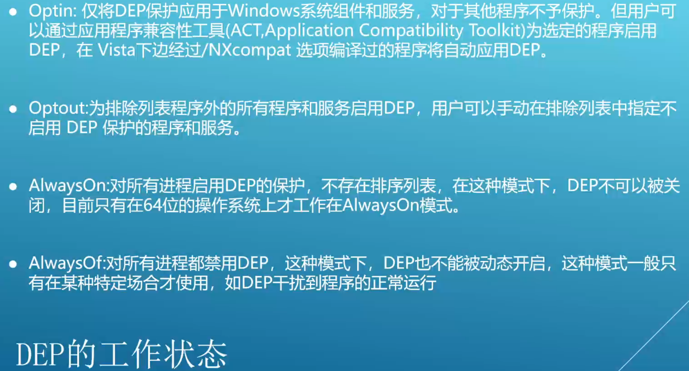

- [ShellCode的概念](#shellcode的概念)
  - [ShellCode 在内存中的代码组织方式](#shellcode-在内存中的代码组织方式)
  - [通用 ShellCode ， 解决API移位问题](#通用-shellcode--解决api移位问题)
  - [ShellCode 的编写](#shellcode-的编写)
  - [ShellCode 的编码和解码](#shellcode-的编码和解码)
- [栈溢出漏洞](#栈溢出漏洞)
  - [程序内存结构](#程序内存结构)
  - [函数调用内存结构](#函数调用内存结构)
  - [跳板技术](#跳板技术)
- [GS 保护](#gs-保护)
- [数据执行保护（DEP -  Data Excution Prevention）](#数据执行保护dep----data-excution-prevention)
  - [工作状态](#工作状态)
  - [利用 ROP 技术突破 DEP](#利用-rop-技术突破-dep)
  - [如何快速寻找小部件](#如何快速寻找小部件)

# ShellCode的概念

1996年， Aleph One 在 Underground 发表了著名论文 《Snshing the Stack for Fun and Profit》， 栈的缓冲区溢出。该论文详细描述了Linux系统中栈的结构和如何利用栈溢出漏洞执行任意代码。并在论文中称这段被植入进程的代码为“ShellCode”。

## ShellCode 在内存中的代码组织方式

* 代码在缓冲区中
* 代码在返回地址之后
* 前两种混合（jmp esp - xxxx）

## 通用 ShellCode ， 解决API移位问题

比较API名称的Hash值，找到API地址。

``` C
DWORD GetHash(char *name){
    DWORD digest = 0;
    while(*name){
        digest = ((digest << 25) - digest) + (*name++);
    }
    return digest;
}
```

## ShellCode 的编写

* 指令
  * xchg eax, ebx 交换eax和ebx寄存器的值
  * lodsd 将esi指向的值加载到eax，并将esi加4
  * lodsb 将esi指向的值加载到al，并将esi加1
  * stosd 将eax的值存储到edi指向的地址，并将edi加4
  * stosb 将al的值存储到edi指向的地址，并将edi加1
  * pushad/popad 将所有通用寄存器压栈/出栈
  * cdq 将eax的符号位复制到edx
  * cld 清除方向标志，确保从低地址到高地址存储
  * jecxz 跳转，如果ecx为0则跳转

## ShellCode 的编码和解码


在编码时需要注意以下几点：
* 用于异或的字符不能在ShellCode中，否则会被异或成0
* 密钥分别对 ShellCode 的不同部分进行异或，但会增加解码的复杂度
* 可以对 ShellCode 进行多轮编码

# 栈溢出漏洞

* 利用溢出修改返回值。

## 程序内存结构


## 函数调用内存结构


## 跳板技术


# GS 保护

GS 保护是微软在 Windows Vista 中引入的一种保护机制，用于防止栈溢出攻击。GS 保护通过在栈上插入一个安全cookie，并在函数返回时检查该cookie的值是否被修改，从而判断栈是否被溢出。

* 利用未被保护的内存突破GS
* 覆盖虚函数突破GS
* 攻击异常处理突破GS，用的最多，检测handler指向的是否是栈地址，这样可以缓解这种攻击手段
* 同时替换栈中和.data中的cookie突破GS

不开启GS保护的情况。
* 函数不包含缓冲区
* 函数被定义为具有变量参数列表
* 函数使用无保护的关键字标记
* 函数在第一个语句中包含内嵌汇编代码
* 缓冲区不是8字节类型且大小不大于4个字节


# 数据执行保护（DEP -  Data Excution Prevention）

* DEP 主要作用是阻止数据页（如默认堆页、以及内存池页）执行代码
* 微软从 Windows XP SP2 开始引入 DEP ，根据实现机制分为：
  * 软件DEP（Software DEP）
  * 硬件DEP（Hardware-enforced DEP）

## 工作状态



## 利用 ROP 技术突破 DEP

* NtSetImformationProcess(SetProcessDEPPolicy) - 关闭DEP
* VirtualProtected - 修改执行权限
* VirtualAllocEx - 分配可执行内存

技术
* 小部件(gadget)：内存中一个个以ret指令结尾的指令序列
* ret 指令：返回指令，将栈顶的地址弹入eip寄存器，实现跳转
* ROP(Return-oriented programming - 面向返回编程)：将一个个小部件在栈上进行有序排列，每个小部件末尾的ret会使这些小部件依次得到执行

## 如何快速寻找小部件

* 下载安装 Immunity
* Debugger(https://www.immunityinc.com/products/debugger/)
* 下载 mona 插件(https://github.com/corelan/mona)
* !mona jmp -r esp -m *.dll - 查找小部件指令
* !mona rop -m *.dll - ROP链