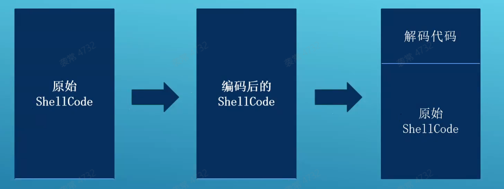
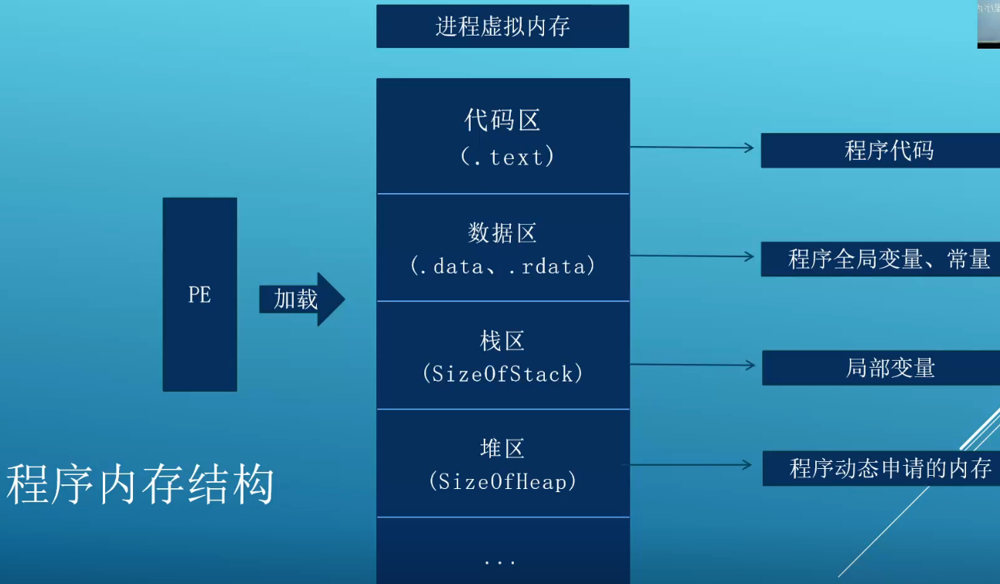
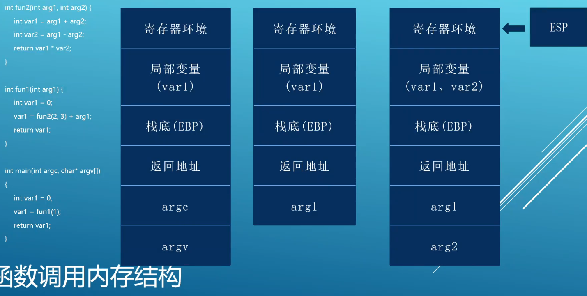
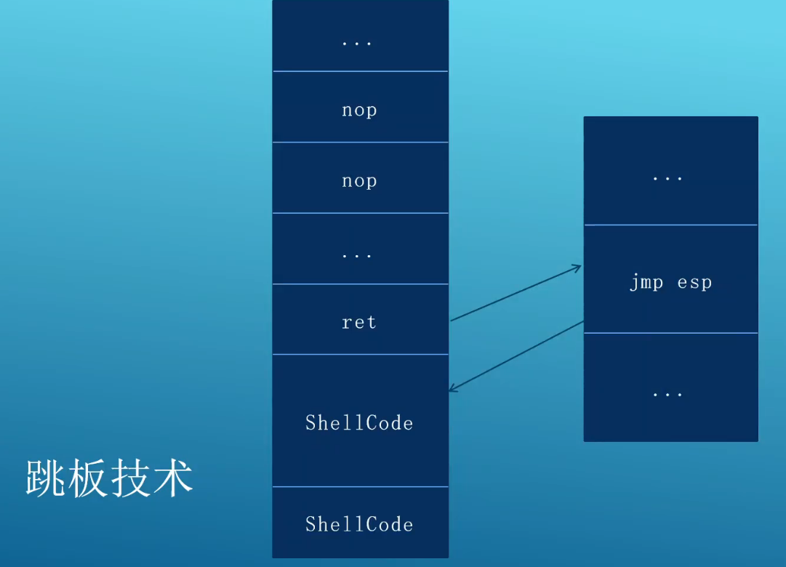

- [ShellCode的概念](#shellcode的概念)
  - [ShellCode 在内存中的代码组织方式](#shellcode-在内存中的代码组织方式)
  - [通用 ShellCode ， 解决API移位问题](#通用-shellcode--解决api移位问题)
  - [ShellCode 的编写](#shellcode-的编写)
  - [ShellCode 的编码和解码](#shellcode-的编码和解码)
- [栈溢出漏洞](#栈溢出漏洞)
  - [程序内存结构](#程序内存结构)
  - [函数调用内存结构](#函数调用内存结构)
  - [跳板技术](#跳板技术)

# ShellCode的概念

1996年， Aleph One 在 Underground 发表了著名论文 《Snshing the Stack for Fun and Profit》， 栈的缓冲区溢出。该论文详细描述了Linux系统中栈的结构和如何利用栈溢出漏洞执行任意代码。并在论文中称这段被植入进程的代码为“ShellCode”。

## ShellCode 在内存中的代码组织方式

* 代码在缓冲区中
* 代码在返回地址之后
* 前两种混合（jmp esp - xxxx）

## 通用 ShellCode ， 解决API移位问题

比较API名称的Hash值，找到API地址。

``` C
DWORD GetHash(char *name){
    DWORD digest = 0;
    while(*name){
        digest = ((digest << 25) - digest) + (*name++);
    }
    return digest;
}
```

## ShellCode 的编写

* 指令
  * xchg eax, ebx 交换eax和ebx寄存器的值
  * lodsd 将esi指向的值加载到eax，并将esi加4
  * lodsb 将esi指向的值加载到al，并将esi加1
  * stosd 将eax的值存储到edi指向的地址，并将edi加4
  * stosb 将al的值存储到edi指向的地址，并将edi加1
  * pushad/popad 将所有通用寄存器压栈/出栈
  * cdq 将eax的符号位复制到edx
  * cld 清除方向标志，确保从低地址到高地址存储
  * jecxz 跳转，如果ecx为0则跳转

## ShellCode 的编码和解码



在编码时需要注意以下几点：
* 用于异或的字符不能在ShellCode中，否则会被异或成0
* 密钥分别对 ShellCode 的不同部分进行异或，但会增加解码的复杂度
* 可以对 ShellCode 进行多轮编码

# 栈溢出漏洞

* 利用溢出修改返回值。

## 程序内存结构



## 函数调用内存结构



## 跳板技术

