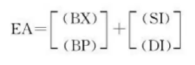

- [寻址](#寻址)
- [立即寻址](#立即寻址)
- [直接寻址](#直接寻址)
- [寄存器寻址](#寄存器寻址)
- [寄存器间接寻址](#寄存器间接寻址)
- [寄存器相对寻址](#寄存器相对寻址)
- [基址变址寻址](#基址变址寻址)
- [基址变址相对寻址](#基址变址相对寻址)

# 寻址

8086CPU的寻址方式有：立即寻址、直接寻址、寄存器寻址、寄存器间接寻址、寄存器相对寻址、基址变址寻址、基址变址相对寻址。

# 立即寻址

立即数寻址，就是指操作数直接包含在指令中，指令中的操作数就是立即数。汇编中**整数常量**称作**立即数**。立即数可以是8位，也可以是16位。

```
mov al, 80h ; 将8位立即数80h送入寄存器al
mov ax, 1000h ; 将16位立即数1000h送入寄存器ax
```

# 直接寻址

直接寻址，就是指操作数在内存中，指令中给出的是操作数的地址。

```
mov ax, [0] ; 将内存单元0中的数据送入寄存器ax
```

# 寄存器寻址

寄存器寻址，就是指操作数在寄存器中，指令中给出的是寄存器的编号。

```
mov ax, bx ; 将寄存器bx中的数据送入寄存器ax
```

# 寄存器间接寻址

寄存器间接寻址，就是指操作数在内存中，指令中给出的是操作数所在单元的地址，这个地址在某个寄存器中。简介寻址的寄存器有`bx、si、di、bp`。其中，`bx、si、di`默认的段地址是`ds`，`bp`默认的段地址是`ss`。


```
mov ax, [bx] ; 将内存单元bx中的数据送入寄存器ax
```

# 寄存器相对寻址

寄存器相对寻址，就是指操作数在内存中，指令中给出的是操作数所在单元的地址，这个地址在某个寄存器中，并且在这个寄存器的基础上增加或减少一个位移量。


```
mov ax, [bx+0] ; 将内存单元bx中的数据送入寄存器ax
mov ax, [bx+8] ; 将内存单元bx+8中的数据送入寄存器ax
mov ax, [bx-8] ; 将内存单元bx-8中的数据送入寄存器ax
```

# 基址变址寻址

基址变址寻址，就是指操作数在内存中，段内偏移由[寄存器+寄存器]计算得来。

可做基址的寄存器有`bx、bp`。`bx`默认的段地址是`ds`，`bp`默认的段地址是`ss`。

可做变址的寄存器有`si、di`。



```
mov ax, [bx+si] ; 将内存单元bx+si中的数据送入寄存器ax
mov ax, [bx+di] ; 将内存单元bx+di中的数据送入寄存器ax
mov ax, [bp+si] ; 将内存单元bp+si中的数据送入寄存器ax
mov ax, [bp+di] ; 将内存单元bp+di中的数据送入寄存器ax
```

# 基址变址相对寻址

基址变址相对寻址，就是指操作数在内存中，段内偏移由[寄存器+寄存器+位移量]计算得来。

可做基址的寄存器有`bx、bp`。`bx`默认的段地址是`ds`，`bp`默认的段地址是`ss`。

可做变址的寄存器有`si、di`。


```
mov ax, [bx+si+8] ; 将内存单元bx+si+8中的数据送入寄存器ax
mov ax, [bx+di+8] ; 将内存单元bx+di+8中的数据送入寄存器ax
mov ax, [bp+si+8] ; 将内存单元bp+si+8中的数据送入寄存器ax
mov ax, [bp+di+8] ; 将内存单元bp+di+8中的数据送入寄存器ax
```