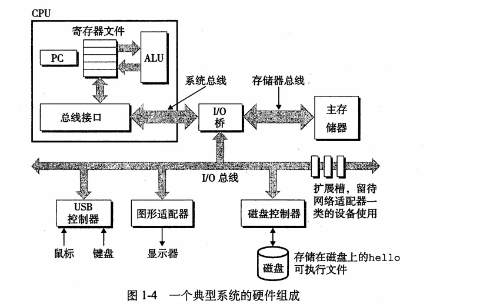
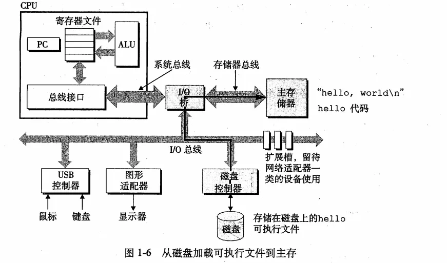
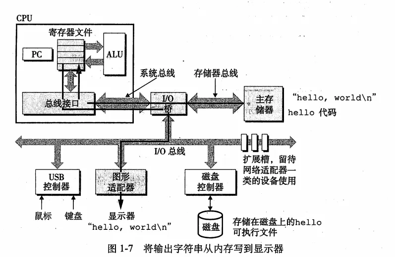
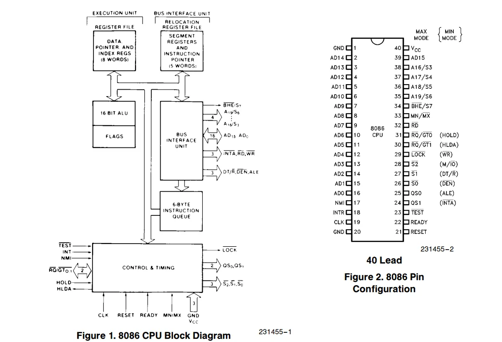
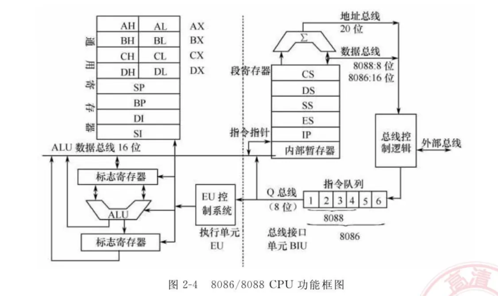
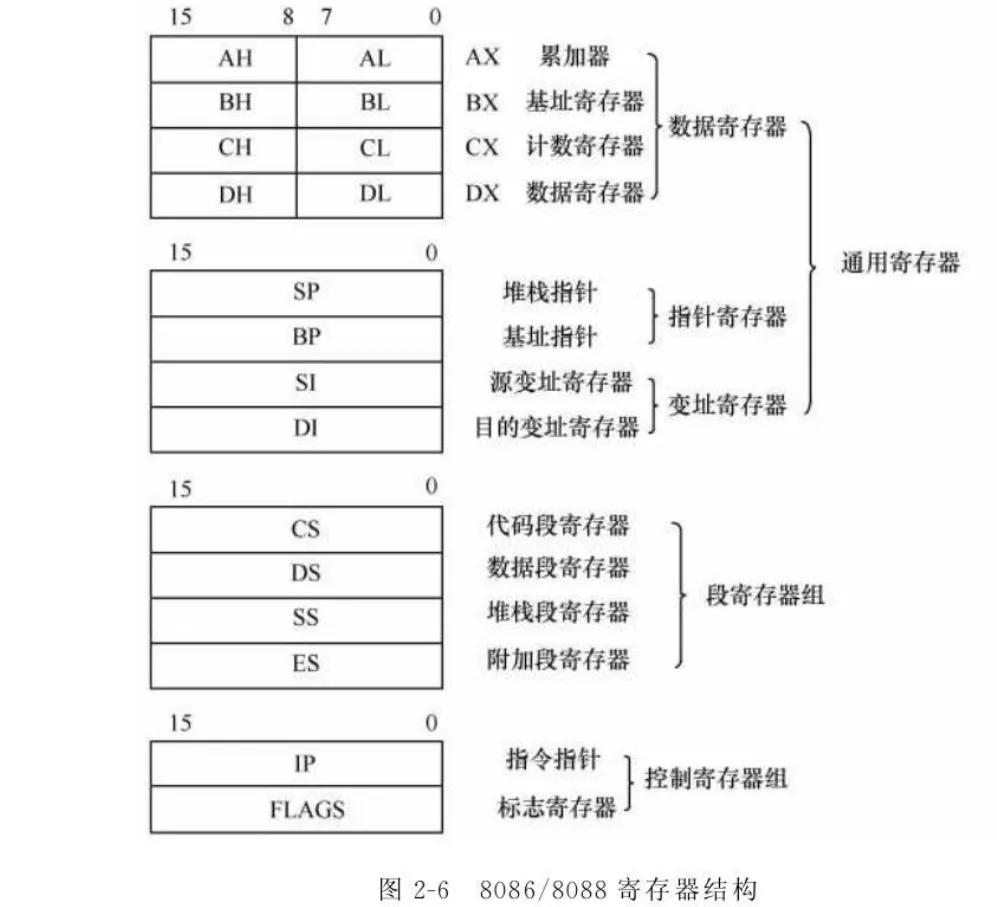
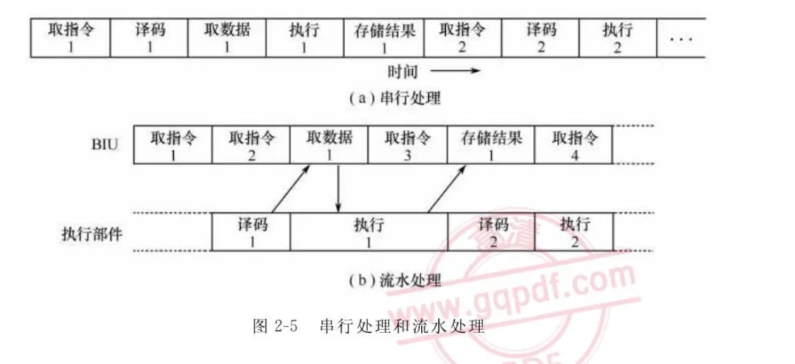
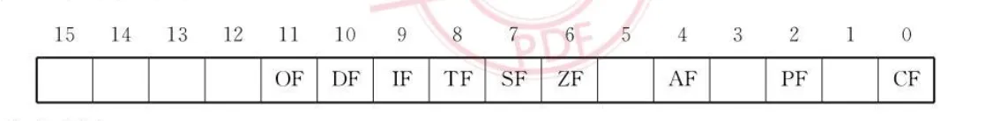
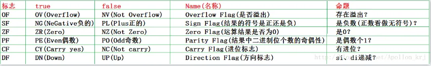

- [硬件理论基础](#硬件理论基础)
  - [CPU](#cpu)
    - [门电路](#门电路)
    - [算术/逻辑单元（ALU）](#算术逻辑单元alu)
  - [计算机硬件](#计算机硬件)
    - [8086CPU功能结构](#8086cpu功能结构)
    - [8086CPU寄存器](#8086cpu寄存器)
- [debug 的使用](#debug-的使用)
- [标志寄存器](#标志寄存器)
  - [状态标志](#状态标志)
  - [控制标志](#控制标志)

# 硬件理论基础

## CPU

CPU 是由晶体管组成的，晶体管是电子元器件。晶体管有两种基本状态：导通和截止。分别对应1和0。

### 门电路

门电路是由晶体管构成的一种基本逻辑电路，用于实现逻辑运算。门电路的主要类型包括：

1. 与门（AND gate）：只有当所有输入都为1时，输出才为1。
2. 或门（OR gate）：只要有一个输入为1，输出就为1。
3. 非门（NOT gate）：输入为1时输出为0，输入为0时输出为1。
4. 与非门（NAND gate）：当所有输入都为1时，输出为0，否则输出为1。
5. 或非门（NOR gate）：只要有一个输入为0，输出就为0，否则输出为1。
6. 异或门（XOR gate）：当两个输入不同时，输出为1，否则输出为0。
7. 同或门（XNOR gate）：当两个输入相同时，输出为1，否则输出为0。

由门电路可以构成更复杂的逻辑电路，如加法器、乘法器等。

```text
一位加法
位 + 位 = 低位 + 进位
1  + 1  = 0   + 进位1
1  + 0  = 1   + 进位0
0  + 1  = 1   + 进位0
0  + 0  = 0   + 进位0

低位可以由异或门实现，进位可以由与门实现，然后低位和进位再进行异或运算得到最终结果。

两位加法，从低位到高位依次进行加法运算，进位需要保存起来，然后进行下一位的加法运算。
```

### 算术/逻辑单元（ALU）

**算术/逻辑单元（ALU）** 是计算机中央处理器（CPU）中的一个重要组成部分，用于执行算术和逻辑运算。ALU可以执行加法、减法、乘法、除法、位运算（如与、或、非、异或等）等操作。

ALU在使用时，通常需要两个操作数和一个操作码。操作码指示ALU要执行的操作类型，而操作数则是指定要执行运算的数值。ALU会根据操作码和操作数执行相应的运算，并将结果输出。

``` text
操作码 操作数1 操作数2
00      01      10
AND      1       2
```

这些**操作码**也叫做**指令**。但是二进制指令太长了，所以需要使用**助记符**来表示，比如ADD表示加法，SUB表示减法，MUL表示乘法，DIV表示除法，AND表示与运算，OR表示或运算，NOT表示非运算，XOR表示异或运算。**助记符**也叫做**汇编**。

## 计算机硬件

计算机硬件是计算机系统的物理组成部分，包括中央处理器（CPU）、内存、输入输出设备等。计算机硬件是计算机系统的基础，负责执行计算机程序和进行数据处理。



hello world 程序在计算机中的显示过程如下：

1. 程序被编译成机器语言代码，存储在磁盘上。
2. 操作系统将程序加载到内存中。
3. CPU从内存中读取指令，并执行这些指令。
4. CPU执行指令时，会从内存中读取操作数，并显示在屏幕上。





### 8086CPU功能结构

**结构图**



**逻辑图**



* EU(execution Unit)：执行单元，执行指令。
* BIU(bus Interface Unit)：总线接口单元，负责内存访问和I/O操作。

### 8086CPU寄存器



8086CPU有14个寄存器，可以分为通用寄存器、段寄存器和控制/状态寄存器。

* 通用寄存器
  * 数据寄存器
    * AX、BX、CX、DX，用于存储数据，每个寄存器可以存储16位的数据。
      * AX(accumulator)：累加器，用于存储运算结果。
      * BX(base)：基址寄存器，用于存储数据地址。
      * CX(counter)：计数寄存器，用于循环计数。
      * DX(data)：数据寄存器，用于存储数据。
    * AL、BL、CL、DL、AH、BH、CH、DH，每个寄存器可以存储8位的数据。
  * 指针寄存器：SP、BP，用于存储栈顶和基址。
    * SP(stack pointer)：堆栈指针，用于存储栈顶地址。
    * BP(base pointer)：基址指针，用于存储基址。
  * 变址寄存器：SI、DI，用于存储数据地址。
    * SI(source index)：源变址寄存器，用于存储源数据地址。
    * DI(destination index)：目的变址寄存器，用于存储目的数据地址。
* 段寄存器
  * CS(code segment)：代码段寄存器，用于存储代码段地址。
  * DS(data segment)：数据段寄存器，用于存储数据段地址。
  * SS(stack segment)：堆栈段寄存器，用于存储堆栈段地址。
  * ES(extra segment)：附加段寄存器，用于存储附加段地址。
* 控制/状态寄存器
  * IP(instruction pointer)：指令指针寄存器，用于存储当前要执行的指令地址。
  * FLAGS(flags register)：标志寄存器，用于存储运算结果的状态标志。

**流水线**

流水线是一种提高计算机性能的技术，通过将指令的执行过程分为多个阶段，使得多个指令可以同时在不同阶段中执行，从而提高指令的吞吐量。

**8086流水线步骤**

1. 取指令：从内存中读取指令，并将其存储在指令寄存器中。
2. 译码：将指令寄存器中的指令译码，确定要执行的操作。
3. 取数据：根据指令译码的结果，从内存中读取操作数，并将其存储在数据寄存器中。
4. 执行：根据指令译码的结果，执行指令，并将结果存储在数据寄存器中。
5. 存储结果：将数据寄存器中的结果存储在内存中。



# debug 的使用

debug 是一个用于调试汇编语言程序的命令行工具，可以用于查看和修改内存中的数据，跟踪程序的执行过程，以及查看寄存器的状态。

**下载 dosbox-x**

* [dosbox-x](https://dosbox-x.com/)

**debug 命令**

* ?: 查看帮助，列出所有可用的命令
* u: 反汇编，将内存中的机器码转换为汇编指令并显示
``` text
u [start_address] [end_address] ;显示指定地址范围内的汇编指令
u [start_address l length] ;查看指定地址开始的汇编指令，长度为length
```
* a：汇编，将汇编指令转换为机器码并存储到内存中
``` text
a [start_address] 指令;在指定地址写入汇编指令
```
* r: 查看和修改寄存器的值
``` text
r [register_name] ; 查看和修改寄存器的值
```
* d: 查看内存中的数据
``` text
d [start_address] [end_address] ; 查看内存中的数据
d [start_address l length] ; 查看内存中的数据，长度为length
```
* e: 修改内存中的数据
``` text
e [address] [data/"hello world"] ; 修改指定地址的数据，可以出入字符串
e [address] ; 从该地址开始，输入数据，空格下一地址，-上一地址，回车退出
```
* g: 执行程序 - F5
``` text
g [start_address] ; 从指定地址开始执行程序
```
* t: 步入 - F11
* p: 步过 - F10
* q: 退出debug
* 写入文件
  * n: 新建文件并打开
  * r: 设置写入的起始位置和长度，bx设为起始位置，cx设为长度
  * w: 写入文件
``` text
n hello.bin
r bx
r cx
w
```

**debug 命令示例**

``` text
debug
-r ax ; 查看AX寄存器的值
-r ax=0x1234 ; 修改AX寄存器的值为0x1234
-d 0x1000 ; 查看内存地址0x1000的数据
-d 0x1000 0x1008 ; 查看内存地址0x1000到0x1008的数据
-e 0x1000 0x1234 ; 修改内存地址0x1000的数据为0x1234
-g 0x1000 ; 从地址0x1000开始执行程序
-t ; 执行下一条指令
-p ; 执行程序
-q ; 退出debug
```

# 标志寄存器





## 状态标志

| 标志 | ture | false | Name(名称) | Description(描述) |
| --- | --- | --- | --- | --- |
| OF | OV(overflow) | NV(Not overflow) | Overflow Flag | 是否溢出 |
| SF | NG(negative) | PL(Plus) | Sign Flag | 正负数 |
| ZF | ZE(zero) | NZ(Not zero) | Zero Flag | 是否为零 |
| PF | PE(parity even) | PO(parity odd) | Parity Flag | 二进制中1的个数的奇偶性 |
| CF | CY(carry) | NC(Not carry) | Carry Flag | 是否进位 |
| AF | AC(auxiliary carry) | NA(Not auxiliary carry) | Auxiliary Carry Flag | 是否辅助进位 |

## 控制标志

| 标志 | ture | false | Name(名称) | Description(描述) |
| --- | --- | --- | --- | --- |
| DF | DN(down) | UP(up) | Direction Flag | 方向标志，决定字符串操作的方向 |
| IF | EI(enable) | DI(disable) | Interrupt Flag | 中断标志，决定是否响应中断 |
| TF | TR(trace) | NT(not trace) | Trap Flag | 跟踪标志，决定是否单步执行 |
