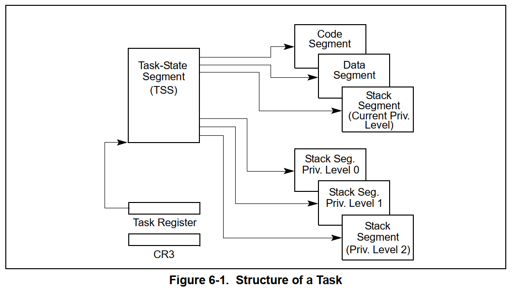
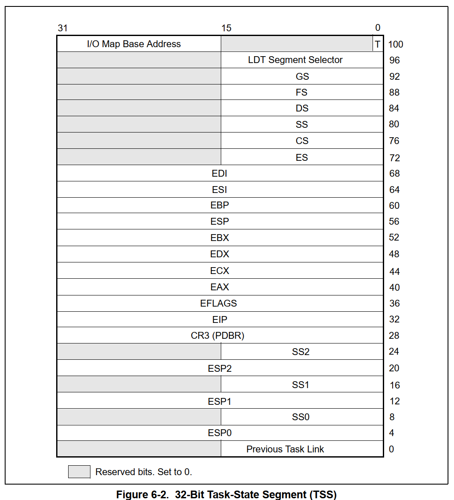
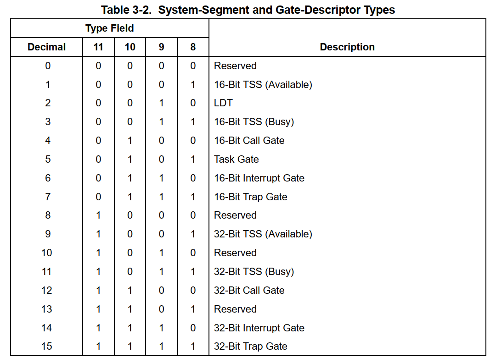
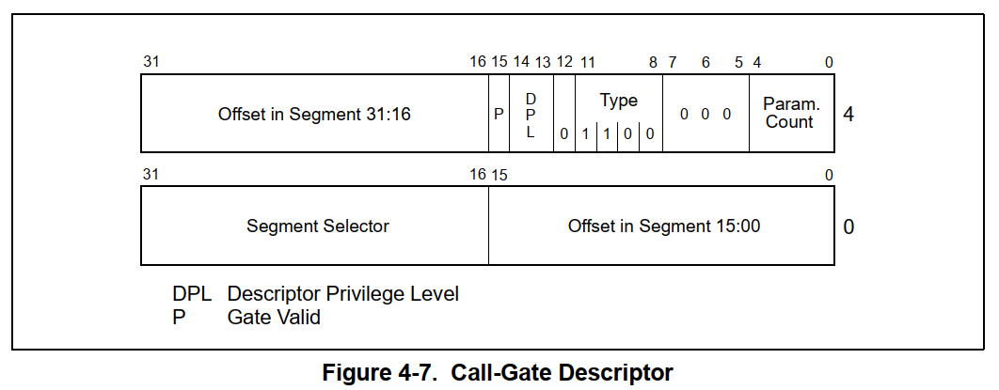
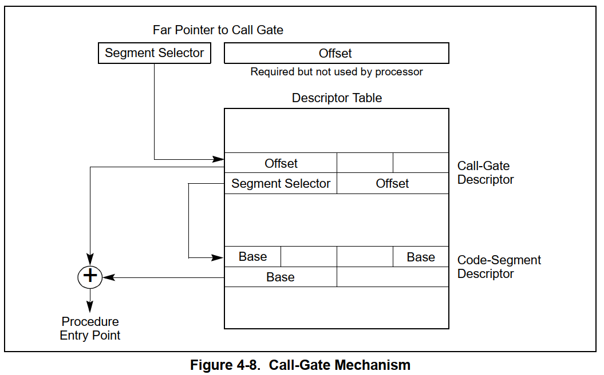
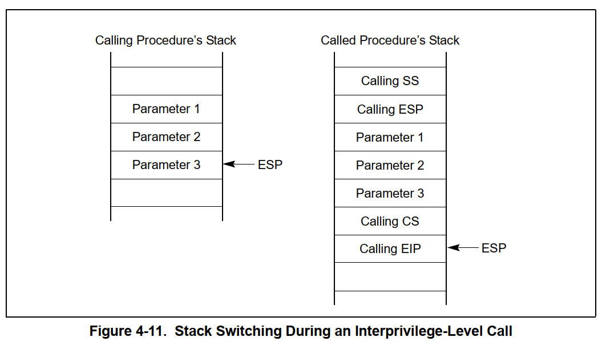

<!-- @import "[TOC]" {cmd="toc" depthFrom=1 depthTo=6 orderedList=false} -->

<!-- code_chunk_output -->

- [任务管理](#任务管理)
- [中断门ShellCode的应用](#中断门shellcode的应用)
- [调用门](#调用门)
- [中断门](#中断门)

<!-- /code_chunk_output -->

# 任务管理

**硬件提供的功能**



* Task Register(TR) 任务寄存器 选择子指向一个任务状态段
* 图中可以看出，在切换特权级时要切换栈
* 如果切换特权级，CPU就会从TR寄存器里面取出SS和ESP寄存器，覆盖当前寄存器

在切换任务时要保存和切换寄存器环境。
* GDT表中查询TR中的选择子指向的基地址，这个地址中保存了寄存器环境



由于任务状态段保存的寄存器环境不完整，所以Windows自己设计了一个线性框架，保存寄存器环境。

``` C++
_KTHREAD
    +0x134 TrapFrame        : Ptr32 _KTRAP_FRAME

0: kd> dt _KTRAP_FRAME
nt!_KTRAP_FRAME
   +0x000 DbgEbp           : Uint4B
   +0x004 DbgEip           : Uint4B
   +0x008 DbgArgMark       : Uint4B
   +0x00c DbgArgPointer    : Uint4B
   +0x010 TempSegCs        : Uint4B
   +0x014 TempEsp          : Uint4B
   +0x018 Dr0              : Uint4B
   +0x01c Dr1              : Uint4B
   +0x020 Dr2              : Uint4B
   +0x024 Dr3              : Uint4B
   +0x028 Dr6              : Uint4B
   +0x02c Dr7              : Uint4B
   +0x030 SegGs            : Uint4B
   +0x034 SegEs            : Uint4B
   +0x038 SegDs            : Uint4B
   +0x03c Edx              : Uint4B
   +0x040 Ecx              : Uint4B
   +0x044 Eax              : Uint4B
   +0x048 PreviousPreviousMode : Uint4B
   +0x04c ExceptionList    : Ptr32 _EXCEPTION_REGISTRATION_RECORD
   +0x050 SegFs            : Uint4B
   +0x054 Edi              : Uint4B
   +0x058 Esi              : Uint4B
   +0x05c Ebx              : Uint4B
   +0x060 Ebp              : Uint4B
   +0x064 ErrCode          : Uint4B
   +0x068 Eip              : Uint4B
   +0x06c SegCs            : Uint4B
   +0x070 EFlags           : Uint4B
   +0x074 HardwareEsp      : Uint4B
   +0x078 HardwareSegSs    : Uint4B
   +0x07c V86Es            : Uint4B
   +0x080 V86Ds            : Uint4B
   +0x084 V86Fs            : Uint4B
   +0x088 V86Gs            : Uint4B
```

* 在切换特权级时，栈无法手工切换，所以没有保存特权级的栈信息。

* 切换线程也是中断，任务门
* 调用任务门，CPU会自动保存当前线程到当前TR，然后读取任务门中的寄存器环境赋值

**系统中的切换**

WRK中可以查看对应函数
* `KiSwapThread` 切换线程, 获取可以切换的线程
* `SwapContext` 切换线程的寄存器环境

# 中断门ShellCode的应用

**提权**

1. 找到一个任意地址写入漏洞
2. idt表的地址固定，将中断门的地址改为我们自己的函数地址

# 调用门



* 12号为调用门



* 在ring3应用程序调用API访问硬件时，调用系统API进入内核，这种系统API叫系统调用。

**系统调用**
* 应用程序(ring3) => 系统调用 => 切换权限到ring0 => 执行系统调用 => 切换权限到ring3 => 应用程序(ring3)

**CPU什么情况下会进入ring0权限**
1. 中断
2. 异常
3. 调用门、中断门



* 调用门的调用



* 调用门的栈切换

* windbg 调试时，会自动修改fs寄存器，所以在调试时需要手动修改fs寄存器
* 但是如果不调试，系统会自动切换fs寄存器

``` C++
// 注册系统调用
#include <ntifs.h>
#include <ntddk.h>
#include <intrin.h>

extern "C" NTSTATUS
DriverEntry(
    __in struct _DRIVER_OBJECT* DriverObject,
    __in PUNICODE_STRING  RegistryPath
);

void UnRegisterSystemCall();

#pragma pack(push, 1)
struct GDTR
{
    unsigned short limit;
    unsigned int base;
};
#pragma pop

struct CallGateDes
{
    unsigned int OffsetLow : 16;
    unsigned int Selector : 16;
    unsigned int ParamCount : 5;
    unsigned int Res : 3;
    unsigned int Type : 4;
    unsigned int s : 1;
    unsigned int DPL : 2;
    unsigned int P : 1;
    unsigned int OffsetHei : 16;
};

void Unload(struct _DRIVER_OBJECT* DriverObject) {
    UNREFERENCED_PARAMETER(DriverObject);
    DbgPrint("[driver] Unload\n");
    UnRegisterSystemCall();
}

void Syscall1() {
    DbgPrint("[driver] Syscall1\n");
}

void Syscall2(int n1) {
    DbgPrint("[driver] Syscall2 n1:%d\n", n1);
}

void Syscall3(int n1, int n2) {
    DbgPrint("[driver] Syscall3 n1:%d n2:%d\n", n1, n2);
}

void(*g_SysServiceTable[]) = {
    Syscall1,
    Syscall2,
    Syscall3,
};

UCHAR g_ServiceParam[] = {
    0,
    4,
    8,
};

// 系统调用函数代理
__declspec(naked) void SysCallProxy() {
    __asm {
        push ebp
        mov ebp, esp
        push fs
        push 30h
        pop fs

        cmp eax, 3
        jge exit

        ; 拷贝参数
        movzx ecx, byte ptr g_ServiceParam[eax]
        sub esp, ecx
        cld
        mov esi, edx
        mov edi, esp
        rep movsb

        call dword ptr g_SysServiceTable[eax*4]
exit:
        pop fs
        mov esp, ebp
        pop ebp
        retf
    }
}

// 注册系统调用
void RegisterSystemCall() {
    GDTR gdt;

    // 创建调用门
    CallGateDes CallGate = { 0 };
    CallGate.P = 1;
    CallGate.OffsetLow = (ULONG)SysCallProxy & 0xFFFF;
    CallGate.OffsetHei = (ULONG)SysCallProxy >> 16;
    CallGate.Selector = 0x08;
    CallGate.DPL = 3;
    CallGate.Type = 12;

    // 遍历处理器
    KAFFINITY Mask = KeQueryActiveProcessors();
    KAFFINITY Shift = 1;
    while (Mask) {
        KeSetSystemAffinityThread(Shift);
        __asm sgdt gdt
        DbgPrint("[driver] gdt.base:%p gdt.limit:%p\n", gdt.base, gdt.limit);

        // 将创建的调用门填入段描述符表
        CallGateDes* pGdt = (CallGateDes*)gdt.base;
        pGdt[0x09] = CallGate;

        Mask >>= 1;
        Shift <<= 1;
    }
}

// 取消注册系统调用
void UnRegisterSystemCall() {
    GDTR gdt;

    // 创建调用门
    CallGateDes CallGate = { 0 };

    // 遍历处理器
    KAFFINITY Mask = KeQueryActiveProcessors();
    KAFFINITY Shift = 1;
    while (Mask) {
        KeSetSystemAffinityThread(Shift);
        __asm sgdt gdt
        DbgPrint("[driver] gdt.base:%p gdt.limit:%p\n", gdt.base, gdt.limit);

        // 将创建的调用门填入段描述符表
        CallGateDes* pGdt = (CallGateDes*)gdt.base;
        pGdt[0x09] = CallGate;

        Mask >>= 1;
        Shift <<= 1;
    }
}

NTSTATUS
DriverEntry(
    __in struct _DRIVER_OBJECT* DriverObject,
    __in PUNICODE_STRING  RegistryPath
)
{
    UNREFERENCED_PARAMETER(RegistryPath);
    DriverObject->DriverUnload = Unload;

    RegisterSystemCall();

    return STATUS_SUCCESS;
}
```

``` C++
// 调用系统调用
// Sysall.cpp : 此文件包含 "main" 函数。程序执行将在此处开始并结束。
//

#include <stdio.h>
#include <Windows.h>
#include <stdlib.h>

__declspec(naked) void Syscall() {
	__asm {
		int 3
		push fs
		push 30h
		pop fs

		mov eax, cr0

		pop fs
		retf
	}
}

__declspec(naked) void __stdcall CallGate() {
	__asm {
		_emit 9ah
		_emit 00h
		_emit 00h
		_emit 00h
		_emit 00h
		_emit 4bh
		_emit 00h
		ret
	}
}

__declspec(naked) void __stdcall SysCall1() {
	__asm {
		push ebp
		mov ebp, esp
		
		mov eax, 0
		lea edx, [esp+8]

		call CallGate
		
		leave
		retn 0
	}
}

__declspec(naked) void __stdcall SysCall2(int n1) {
	__asm {
		push ebp
		mov ebp, esp

		mov eax, 1
		lea edx, [esp + 8]

		call CallGate

		leave
		retn 4
	}
}

__declspec(naked) void __stdcall SysCall3(int n1, int n2) {
	__asm {
		push ebp
		mov ebp, esp

		mov eax, 2
		lea edx, [esp + 8]

		call CallGate

		leave
		retn 8
	}
}
int main()
{
	SysCall1();
	SysCall2(1);
	SysCall3(1, 2);
	system("pause");
	return 0;
}
```

# 中断门

操作系统的系统API一般使用中断门实现。

操作系统的API表（SSDT）在使用以下全局变量进行管理：
* KeServiceDescriptorTable (SSDT)
* KeServiceDescriptorTableShadow (ShadowSSDT) 

``` C++
// driver
#include <Ntifs.h>
#include <ntddk.h>
#include <intrin.h>

/*
* 系统调用
* 
* 应用程序(ring3) => 系统调用 => 切换权限到ring0 => 执行系统调用 
                => 切换权限到ring3  => 应用程序(ring3)

CPU什么情况下会进入ring0权限
1.中断
2.异常
3.调用门、中断门

MSR寄存器  模式指定寄存器
mov ecx, ?
RDMSR
edx.eax

mov ecx, ?
edx.eax, ?
WRMSR

SYSENTER_CS_MSR  Target Ring 0 CS Selector 174h
SYSENTER_ESP_MSR Target Ring 0 ESP 175h
SYSENTER_EIP_MSR Target Ring 0 Entry Point EIP 176h

SYSENTER
CS register set to the value of (SYSENTER_CS_MSR)
EIP register set to the value of (SYSENTER_EIP_MSR)
SS register set to the sum of (8 plus the value in SYSENTER_CS_MSR)
ESP register set to the value of (SYSENTER_ESP_MSR)

SYSEXIT
CS register set to the sum of (16 plus the value in SYSENTER_CS_MSR)
EIP register set to the value contained in the EDX register
SS register set to the sum of (24 plus the value in SYSENTER_CS_MSR)
ESP register set to the value contained in the ECX register

CPUID

KiSystemService  中断系统调用
KiFastCallEntry  快速系统调用

KeServiceDescriptorTableShadow ShadowSSDT
win32k.sys
*/

typedef struct _KSERVICE_TABLE_DESCRIPTOR {
    PULONG_PTR Base;
    PULONG Count;
    ULONG Limit;
    PUCHAR Number;
} KSERVICE_TABLE_DESCRIPTOR, * PKSERVICE_TABLE_DESCRIPTOR;

//SSDT
//KeServiceDescriptorTable
extern PKSERVICE_TABLE_DESCRIPTOR KeServiceDescriptorTable;

void UnRegisterSystemCall();

#pragma pack(push, 1)
typedef struct _IDTR {
    unsigned short limit;
    unsigned int   base;
}IDTR;
#pragma pop

typedef struct _GateDes {
    unsigned int offsetLow : 16;
    unsigned int selector : 16;
    unsigned int Param : 5;
    unsigned int res : 3;
    unsigned int type : 4;
    unsigned int s : 1;
    unsigned int dpl : 2;
    unsigned int p : 1;
    unsigned int offsetHei : 16;
}GateDes;

void __stdcall SystemCall1() {
    DbgPrint("[51asm] SystemCall1\n");
}

void __stdcall SystemCall2(int p1) {
    DbgPrint("[51asm] SystemCall2 p1:%d\n", p1);
}

void __stdcall SystemCall3(int p1, int p2) {
    DbgPrint("[51asm] SystemCall3 p1:%d p2:%d\n", p1, p2);
}

void (*g_SysServiceTable[])() = {
    SystemCall1,
    SystemCall2,
    SystemCall3,
};
UCHAR g_ServiceParam[] = {
    0, 
    4, 
    8,
};

__declspec(naked) void SyscallProxy() {
    __asm {
        push ebp
        mov  ebp, esp
        push fs
        push 30h
        pop  fs

        cmp eax, 3
        jge exit

        ;拷贝参数
        movzx ecx, byte ptr g_ServiceParam[eax]
        sub esp, ecx
        cld
        mov esi, edx
        mov edi, esp
        rep movsb

        call dword ptr g_SysServiceTable[eax * 4]
exit:
        pop fs
        mov esp, ebp
        pop ebp
        iretd
    }
}

VOID Unload(_In_ struct _DRIVER_OBJECT* DriverObject) {
    UNREFERENCED_PARAMETER(DriverObject);
    DbgPrint("[51asm] Unload\n");
}

void RegisterSystemCall() {
    IDTR idt;
    KAFFINITY Mask = KeQueryActiveProcessors();
    KAFFINITY Shift = 1;
    GateDes Gate = { 0 };
    Gate.p = 1;
    Gate.offsetLow = (ULONG)SyscallProxy & 0xFFFF;
    Gate.offsetHei = (ULONG)SyscallProxy >> 16;
    Gate.selector = 0x8;
    Gate.dpl = 3;
    Gate.type = 0X0e; //32位中断门

    while (Mask)  {
        KeSetSystemAffinityThread(Shift);
        __sidt(&idt);
        DbgPrint("[51asm] GDT base:%p limit:%p\n", idt.base, idt.limit);

        GateDes* pGate = (GateDes*)idt.base;
        pGate[0X20] = Gate;
        Mask >>= 1;
        Shift <<= 1;
    }
}

NTSTATUS DriverEntry(
    __in struct _DRIVER_OBJECT* DriverObject,
    __in PUNICODE_STRING  RegistryPath) {
    UNREFERENCED_PARAMETER(RegistryPath);

    ULONG SYSENTER_CS_MSR = 0;
    ULONG SYSENTER_ESP_MSR = 0;
    ULONG SYSENTER_EIP_MSR = 0;
    __asm {
        int 3
        mov ecx, 174h
        rdmsr
        mov SYSENTER_CS_MSR, eax
        mov ecx, 175h
        rdmsr
        mov SYSENTER_ESP_MSR, eax
        mov ecx, 176h
        rdmsr
        mov SYSENTER_EIP_MSR, eax
    }

    DbgPrint("[51asm] DriverEntry KeServiceDescriptorTable:%p\n", KeServiceDescriptorTable);

    DbgPrint("[51asm] DriverEntry SYSENTER_CS_MSR:%08X SYSENTER_ESP_MSR:%08X SYSENTER_EIP_MSR:%08X\n",
        SYSENTER_CS_MSR, 
        SYSENTER_ESP_MSR, 
        SYSENTER_EIP_MSR);

    DriverObject->DriverUnload = Unload;
    RegisterSystemCall();

    return STATUS_SUCCESS;
}
```

``` C++
// 调用
// Syscall.cpp : 此文件包含 "main" 函数。程序执行将在此处开始并结束。
//

#include <stdio.h>
#include <windows.h>
#include <stdlib.h>

/*
*
* ExitProcess => Kernel32.ExitProcess  => ntdll.NtTerminateProcess(101)
*/
__declspec(naked) void Syscall(){
	__asm {
		int 3
		push fs
		push 30h
		pop  fs

		mov eax, cr0
		

		pop fs
		retf
	}
}

//ntdll.dll
__declspec(naked) void __stdcall CallGate() {
	__asm {
		_emit 9ah
		_emit 00h
		_emit 00h
		_emit 00h
		_emit 00h
		_emit 4bh
		_emit 00h
		ret
	}
}

__declspec(naked) void __stdcall IntGate() {
	__asm {
		int 20h
		ret
	}
}

void (__stdcall *g_pfnGate)() = IntGate;

__declspec(naked) void __stdcall SystemCall1() {
	__asm {
		push ebp
		mov  ebp, esp

		mov eax, 0
		lea edx, [esp+8]

		call dword ptr [g_pfnGate]

		leave
		retn 0
	}
}

__declspec(naked) void __stdcall SystemCall2(int p1) {
	__asm {
		push ebp
		mov  ebp, esp

		mov eax, 1
		lea edx, [esp + 8]

		call dword ptr[g_pfnGate]

		leave
		retn 4
	}
}

__declspec(naked) void __stdcall SystemCall3(int p1, int p2) {
	__asm {
		push ebp
		mov  ebp, esp

		mov eax, 2
		lea edx, [esp + 8]

		call dword ptr[g_pfnGate]

		leave
		retn 8
	}
}

int main()
{
	/*__asm int 3
	SystemCall1();
	SystemCall2(1);
	SystemCall3(1, 2);
	system("pause");*/
	__asm {
		mov ecx, 174h
		rdmsr 
	}
	ExitProcess(0);
	return 0;
}
```