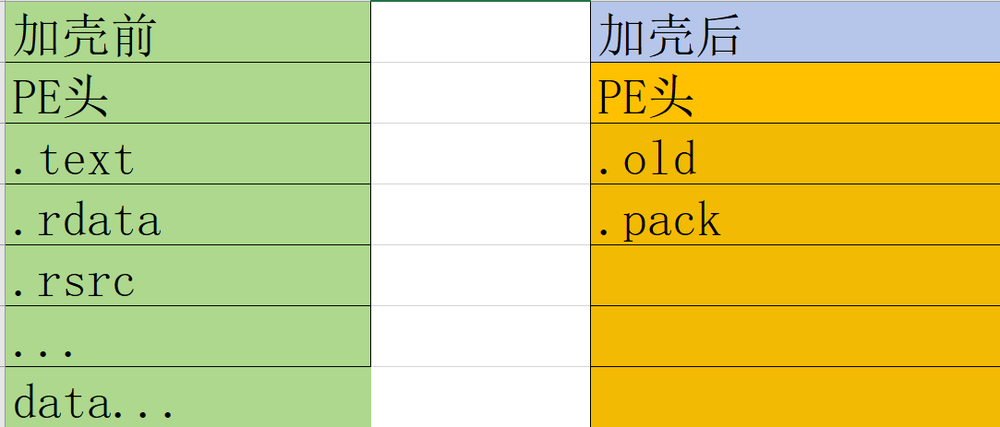
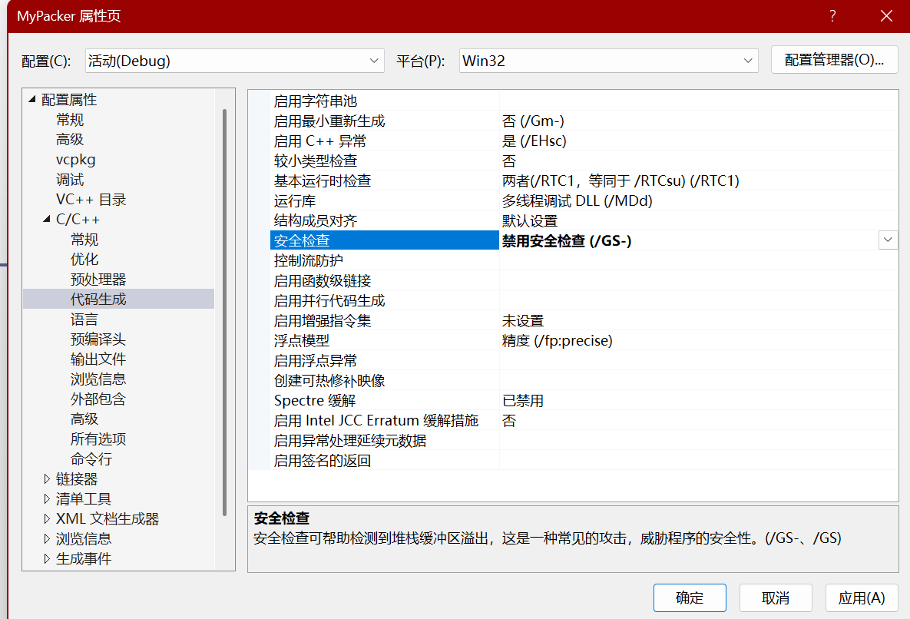

- [软件加壳 (Packer) 保护软件](#软件加壳-packer-保护软件)
- [压缩壳](#压缩壳)
  - [商业加壳](#商业加壳)
  - [脱壳](#脱壳)
- [反DUMP](#反dump)
- [跳过反调试手段](#跳过反调试手段)
- [现代加密体系](#现代加密体系)

# 软件加壳 (Packer) 保护软件

1. 压缩壳 => 压缩程序大小(zlib) upx
2. 加密壳 => (反调试, 放内存dump, 防补丁, ...)

ASProtect, Themida, Armadillo, WinLincense ...

现代加壳体系: 外壳 + 内壳 增加分析的工作量

3. 代码混淆(ollvm)
4. 虚拟机保护

一. 暴力破解(改返回值)
二. 完美破解(注册机)

# 压缩壳

.pack节中包含压缩信息，压缩后数据，解压缩代码。

1. 解压缩代码使用C语言实现，将二进制拷贝到内存。
2. 不能使用全局变量和调用API防止重定位问题。禁用C语言的`安全检查`。
3. `kernel32`库是系统默认加载库，可以遍历`LDR`链表得到`kernel32.dll`基址。通过`GetprocAddress`得到`LoadLibraryA`函数地址。

1. 解压缩数据
2. 解压缩PE头
3. 填写IAT
4. 重定位
5. 跳转OPE

## 商业加壳

1. 保存环境
2. 解压缩代码
3. 恢复环境
4. jmp OEP

## 脱壳

1. 找OEP
   1. ESP 定律 保存寄存器环境之后在栈里面下内存断点。恢复环境的时候会停在内存断点。
   2. 脚本找 jmp reg 

* 内存DUMP
   * 对抗，删除导入表
* 根据IAT还原导入表
   * 恶意构造无效IAT
   * IAT加密、API字符串加密
      * 跳板 => 修改IAT表为自己的地址
        * `mov eax, xxxxx`
        * `xor eax, xxx`
        * `push eax`
        * `ret`
  * （反IAT加密）补丁法 ==> 找到IAT加密代码的填IAT数据的代码，将壳的填IAT的数据的代码修改为正常的填IAT的数据的代码。
* 偷入口代码
  * 反 => 补代码 

# 反DUMP

运行中程序的全局变量已经被修改，所以需要在停在OEP时，进行DUMP。如果是自己的程序，可以通过检测全局变量，来防止DUMP。

# 跳过反调试手段

通过静态分析，找到`jmp register`指令或`call register`指令，将该指定修改为`CC`，运行时启动即时调试器，再到OPE跳过反调试。

# 现代加密体系

* 代码混淆 =》 增加工作量、破环可读性
  * 源码级混淆 =》 OLLVM、源码进行混淆
  * 二进制混淆 =》 汇编进行混淆

* 反混淆：
  * trac思路 =》利用调试器自动走代码，记录指令。