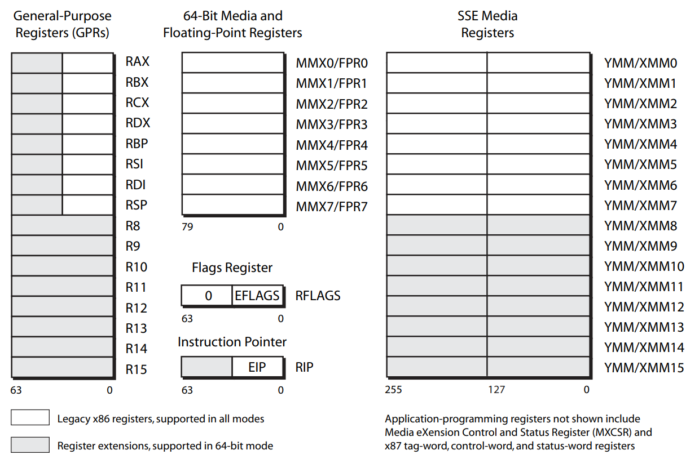
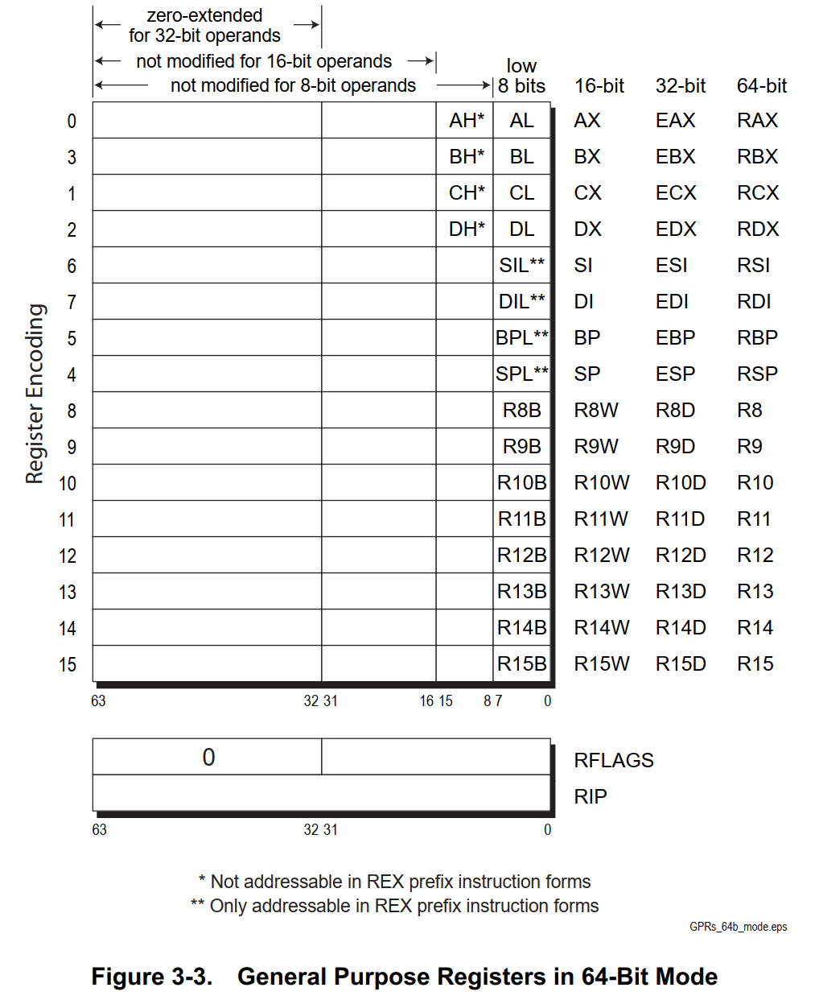
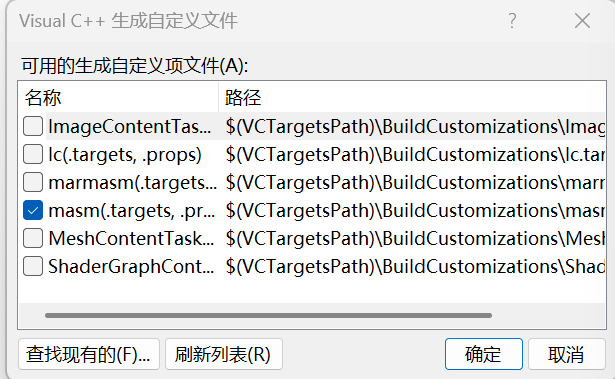
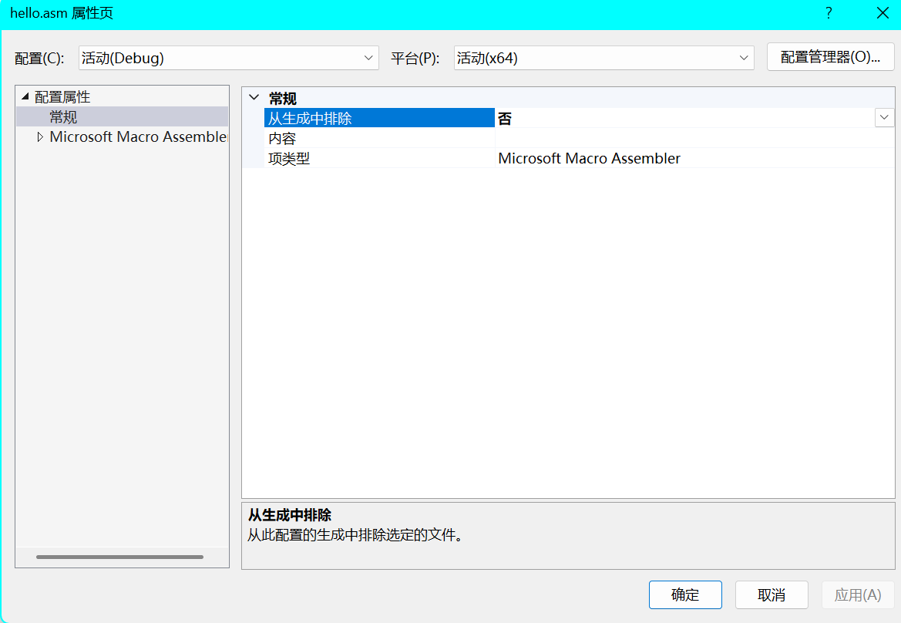

# x64 寄存器





> 由上图可知修改低32位寄存器时，寄存器的高32位会被清零。

## 调用约定

https://learn.microsoft.com/zh-cn/cpp/build/x64-calling-convention?view=msvc-170

* 在x64中，函数的参数通过RCX、RDX、R8、R9传递，浮点数通过 XMM0-XMM3传递，其余参数通过栈传递。
* 如果参数多于4个，则多余的参数通过栈传递，这里栈的传递方式和x86不一样。
* 所以需要我们在调用函数之前在栈上分配0x20大小空间作为影子存储，供被调用方使用。
  * 影子空间用来让被调用放存放参数，以达到API可以遍历堆栈获取参数。
* 由于SSE指令集的原因，操作的内存地址必须是16字节对齐的，而系统调用你时也会遵守这个规则，然后进入函数后栈顶入了8个字节的返回地址，所以我们需要手动抬栈8个字节用于对齐。
* 一般情况下，进入函数后都会提前将栈抬到函数中最多参数的栈，这样中间不用平栈和抬栈以防止破坏栈平衡。

## 开发环境

* 手动编译链接
  * 使用`ml.exe /c hello.asm`编译
  * 使用`link /ENTRY:main /SUBSYSTEM:WINDOWS hello.obj`链接

* 使用Visual Studio
  * 新建空项目 -> 新建.asm文件
  * 右键项目 -> 生成依赖项 -> 生成自定义 -> 勾选`masm` -> 确定

  * 右键文件 -> 属性页 -> 生成排除选`否` -> 项类型选`Microsoft Macro Assembler` -> 确定


``` masm
includelib libcmt.lib

extern MessageBoxA :proc
.const
	szMsg db "Hello World", 0
	szTitle db "Title", 0

.code
WinMain proc
	sub rsp, 28h
	mov ecx, 0
	mov rdx, offset szMsg
	mov r8, offset szTitle
	mov r9, 0
	call MessageBoxA
	add rsp, 28h
	ret
WinMain endp
end
```

一个简单的计算器程序：
``` masm
includelib libcmt.lib
includelib User32.lib

SW_SHOW		equ			 3

WM_COMMAND  equ			 111h
DLG_CALC	equ			 101
EDIT_INPUT  equ          1001
BTN_ADD     equ          1003
BTN_SUB     equ          1004
BTN_CLEAR   equ          1005
BTN_MUL     equ          1006
BTN_DIV     equ          1007
EDIT_RESULT equ          1008
BTN_CALC    equ          1009


CALC_ADD     equ          1
CALC_SUB     equ          2
CALC_MUL     equ          3
CALC_DIV     equ          4

; 函数声明
extern DialogBoxParamA :proc
extern ShowWindow	   :proc
extern DefWindowProcA  :proc
extern EndDialog	   :proc
extern GetDlgItemInt   :proc
extern SetDlgItemInt   :proc

.data
	Operator db 0
	qResult qword 0
	bIsFirst db 0
.code
; 计算
MyCalc proc
	push rbp
	mov rbp, rsp
	mov [rsp+10h], rcx
	sub rsp, 30h

	; 获取文本框数据
	mov rcx, [rbp+10h]
	mov rdx, EDIT_INPUT
	xor r8d, r8d
	mov r9d, 1
	call GetDlgItemInt

	cmp bIsFirst, 0
	jnz jnz_bool
		mov qResult, rax
		mov bIsFirst, 1
		jmp label_calc_break
	jnz_bool:

	cmp Operator, CALC_ADD
	jnz label_CALC_ADD
		add rax, qResult
		mov qResult, rax
		mov Operator, 0
		jmp label_calc_break
	label_CALC_ADD:

	cmp Operator, CALC_SUB
	jnz label_CALC_SUB
		sub qResult, rax
		mov rax, qResult
		mov qResult, rax
		mov Operator, 0
		jmp label_calc_break
	label_CALC_SUB:
		
	cmp Operator, CALC_MUL
	jnz label_CALC_MUL
		mul qResult
		mov qResult, rax
		mov Operator, 0
		jmp label_calc_break
	label_CALC_MUL:
		
	cmp Operator, CALC_DIV
	jnz label_CALC_DIV
		xchg rax, qResult
		xor edx, edx
		div qResult
		mov qResult, rax
		mov Operator, 0
		jmp label_calc_break
	label_CALC_DIV:
	label_calc_break:

	; 设置文本框数据
	mov rcx, [rbp+10h]
	mov rdx, EDIT_INPUT
	mov r8, qResult
	mov r9d, 1
	call SetDlgItemInt
	mov Operator, 0

	add rsp, 30h
	pop rbp
	ret
MyCalc endp

; 对话框回调函数
DlgProc proc
	push rbp
	mov rbp, rsp
	mov [rsp+10h], rcx
	mov [rsp+18h], rdx
	mov [rsp+20h], r8
	mov [rsp+28h], r9
	sub rsp, 30h
	xor eax, eax

	; 消息处理
	cmp rdx, WM_COMMAND
	jnz label_DEFAULT

		cmp word ptr [rbp+20h], BTN_ADD ; +
		jnz label_BTN_ADD
			; 计算结果
			mov rcx, [rbp+10h]
			call MyCalc
			mov Operator, CALC_ADD
			jmp label_EXIT
		label_BTN_ADD:
		
		cmp word ptr [rbp+20h], BTN_SUB ; -
		jnz label_BTN_SUB
			; 计算结果
			mov rcx, [rbp+10h]
			call MyCalc
			mov Operator, CALC_SUB
			jmp label_EXIT
		label_BTN_SUB:
		
		cmp word ptr [rbp+20h], BTN_MUL ; *
		jnz label_BTN_MUL
			; 计算结果
			mov rcx, [rbp+10h]
			call MyCalc
			mov Operator, CALC_MUL
			jmp label_EXIT
		label_BTN_MUL:
		
		cmp word ptr [rbp+20h], BTN_DIV ; /
		jnz label_BTN_DIV
			; 计算结果
			mov rcx, [rbp+10h]
			call MyCalc
			mov Operator, CALC_DIV
			jmp label_EXIT
		label_BTN_DIV:
		
		cmp word ptr [rbp+20h], BTN_CALC ; =
		jnz label_BTN_CALC
			; 计算结果
			mov rcx, [rbp+10h]
			call MyCalc
			mov Operator, 0
			jmp label_EXIT
		label_BTN_CALC:

		cmp word ptr [rbp+20h], BTN_CLEAR ; 清除
		jnz label_BTN_CLEAR
			mov Operator, 0
			mov qResult, 0
			mov bIsFirst, 0
			jmp label_EXIT
		label_BTN_CLEAR:

	label_DEFAULT:
		; 默认处理
		mov rcx, [rbp+10h]
		mov rdx, [rbp+18h]
		mov r8, [rbp+20h]
		mov r9, [rbp+28h]
		call DefWindowProcA
		add rsp, 30h
		pop rbp
		ret
	label_EXIT:
	add rsp, 30h
	xor eax, eax
	pop rbp
	ret
DlgProc endp

WinMain proc
	sub rsp, 38h
	; 创建对话框
	xor ecx, ecx
	mov rdx, DLG_CALC
	xor r8d, r8d
	mov r9, offset DlgProc
	mov dword ptr [rsp+20h], 0
	call DialogBoxParamA

	; 显示对话框
	mov ecx, SW_SHOW
	mov rdx, rax
	call ShowWindow

	xor eax, eax
	add rsp, 38h
	ret
WinMain endp
end
```