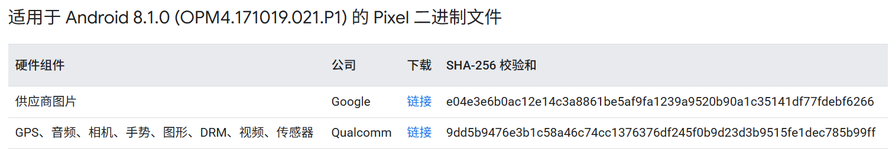

# AOSP8编译

* [安卓官网](https://source.android.com/docs/setup/start?hl=zh-cn)

## 环境配置

* [clash-verge](https://github.com/clash-verge-rev/clash-verge-rev/releases/tag/v2.0.1)

* 准备至少300G的磁盘空间，4G内存
* 安装Ubuntu系统
    * AOSP8 - Ubuntu 18
    * AOSP9以上 - 最新Ubuntu
* 设置交换分区
    > 如果内存不够用，可以设置交换分区，将磁盘空间作为内存使用
``` bash
# 创建交换(swap)文件
mkdir /home/jlw/swap
sudo dd if=/dev/zero of=/home/jlw/swap/swapfile bs=1G count=32

# 将创建的交换文件格式转换成swap类型
# 或者使用 sudo chmod 0600 /home/jlw/swap/swapfile
sudo mkswap -f /home/jlw/swap/swapfile

# 激活swap文件
# 激活后可以使用fee查看
sudo swapon /home/jlw/swap/swapfile

# 重启启用
# 将下面内容写入/etc/fstab中
/home/jlw/swap/swapfile none swap defaults 0 0
```

* 安装jdk
``` bash
sudo apt update
sudo apt install -y openjdk-8-jdk
```

* 其他工具
``` bash
sudo apt-get install git-core gnupg flex bison build-essential zip curl zlib1g-dev libc6-dev-i386 x11proto-core-dev libx11-dev lib32z1-dev libgl1-mesa-dev libxml2-utils xsltproc unzip fontconfig
```

## 源码下载

* [清华AOSP](https://mirrors.tuna.tsinghua.edu.cn/help/AOSP/)

* 安装repo
``` bash
curl https://storage.googleapis.com/git-repo-downloads/repo > repo
chmod +x ./repo
```
* 配置 git 身份
``` bash
git config --global user.name "your name"
git config --global user.email "your email"
```
* repo 的运行过程中会尝试访问官方的 git 源更新自己，如果想使用镜像源进行更新
    * 添加配置文件 `~/.bashrc`
    * `source ~/.bashrc`
``` bash
export REPO_URL='https://mirrors.tuna.tsinghua.edu.cn/git/git-repo'
```
* 下载源码
``` bash
./repo init -u https://mirrors.tuna.tsinghua.edu.cn/git/AOSP/platform/manifest -b android-8.1.0_r38
./repo sync
```

## 编译

* 从[代号、标记和build号](https://source.android.com/docs/setup/reference/build-numbers?hl=zh-cn)找到对应版本
    
* [驱动程序](https://developers.google.com/android/drivers?hl=zh-cn#sailfishopm4.171019.021.p1)
* 下载驱动二进制文件，
    
* 将下载解压后的shell脚本放入源码根目录，执行shell脚本
* 设置本地语言环境
``` bash
export LC_ALL=C
```
* 加载配置脚本
``` bash
source build/envsetup.sh
```
* 选择编译目标
``` bash
lunch
# 24 sailfish 
```
* 编译
``` bash
m
```

* Port 8077 is used by another process (pid=
    * 编辑/etc/java-8-openjdk/security/java.security
    * 找到下面的内容，删除TLSv1和TLSv1.1
``` shell
jdk.tls.disabledAlgorithms=SSLv3, TLSv1, TLSv1.1, RC4, DES, MD5withRSA, \
    DH keySize < 1024, EC keySize < 224, 3DES_EDE_CBC, anon, NULL, \
    include jdk.disabled.namedCurves
```
执行下面指令，然后重新开始编译
``` bash
jack-admin kill-server
```

## 刷机

* 编译 adb + fastboot
``` bash
m adb fastboot
```
* 编译完后目录位于 `/out/host/` ，可以将其设置到环境变量
* 重启手机到 `bootloader` 模式
``` bash
adb reboot bootloader
```
* 然后到系统镜像目录下 `/out/target/product/flame` ，执行刷机命令
``` bash
fastboot flashall -w
```

## 虚拟机建议

* 不建议在虚拟机里面操作，建议安装ssh，然后在主机通过shell连接
``` bash
# 安装ssh
sudo apt install -y openssh-server
# 启动ssh
sudo service ssh start
```