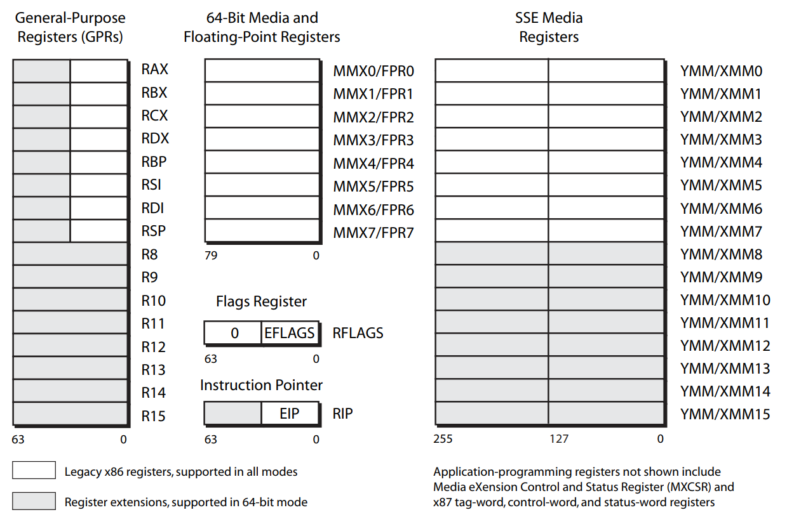
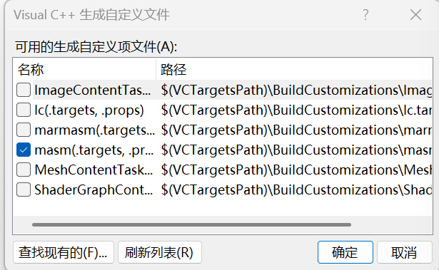
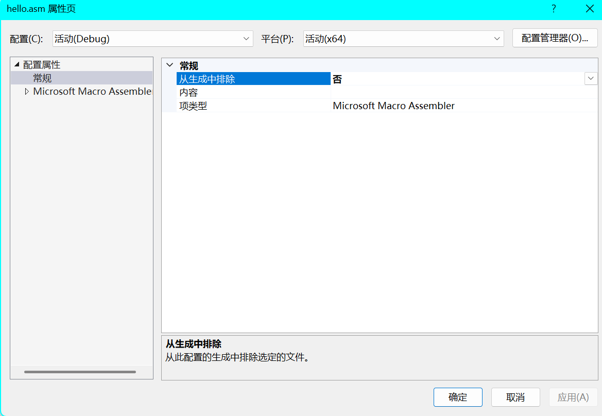

# x64 寄存器




> 由上图可知修改低32位寄存器时，寄存器的高32位会被清零。

## 调用约定

https://learn.microsoft.com/zh-cn/cpp/build/x64-calling-convention?view=msvc-170

* 在x64中，函数的参数通过RCX、RDX、R8、R9传递，浮点数通过 XMM0-XMM3传递，其余参数通过栈传递。
* 如果参数多于4个，则多余的参数通过栈传递，这里栈的传递方式和x86不一样。
* 所以需要我们在调用函数之前在栈上分配0x20大小空间作为影子存储，供被调用方使用。
  * 影子空间用来让被调用放存放参数，以达到API可以遍历堆栈获取参数。
* 由于SSE指令集的原因，操作的内存地址必须是16字节对齐的，而系统调用你时也会遵守这个规则，然后进入函数后栈顶入了8个字节的返回地址，所以我们需要手动抬栈8个字节用于对齐。
* 一般情况下，进入函数后都会提前将栈抬到函数中最多参数的栈，这样中间不用平栈和抬栈以防止破坏栈平衡。

## 开发环境

* 手动编译链接
  * 使用`ml.exe /c hello.asm`编译
  * 使用`link /ENTRY:main /SUBSYSTEM:WINDOWS hello.obj`链接

* 使用Visual Studio
  * 新建空项目 -> 新建.asm文件
  * 右键项目 -> 生成依赖项 -> 生成自定义 -> 勾选`masm` -> 确定

  * 右键文件 -> 属性页 -> 生成排除选`否` -> 项类型选`Microsoft Macro Assembler` -> 确定


``` masm
includelib libcmt.lib

extern MessageBoxA :proc
.const
	szMsg db "Hello World", 0
	szTitle db "Title", 0

.code
WinMain proc
	sub rsp, 28h
	mov ecx, 0
	mov rdx, offset szMsg
	mov r8, offset szTitle
	mov r9, 0
	call MessageBoxA
	add rsp, 28h
	ret
WinMain endp
end
```