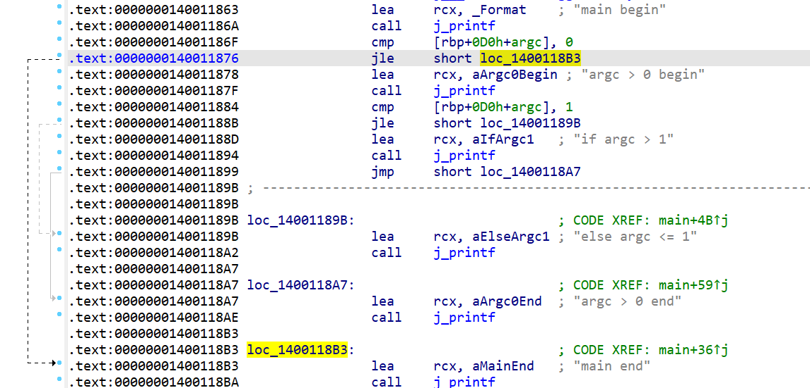
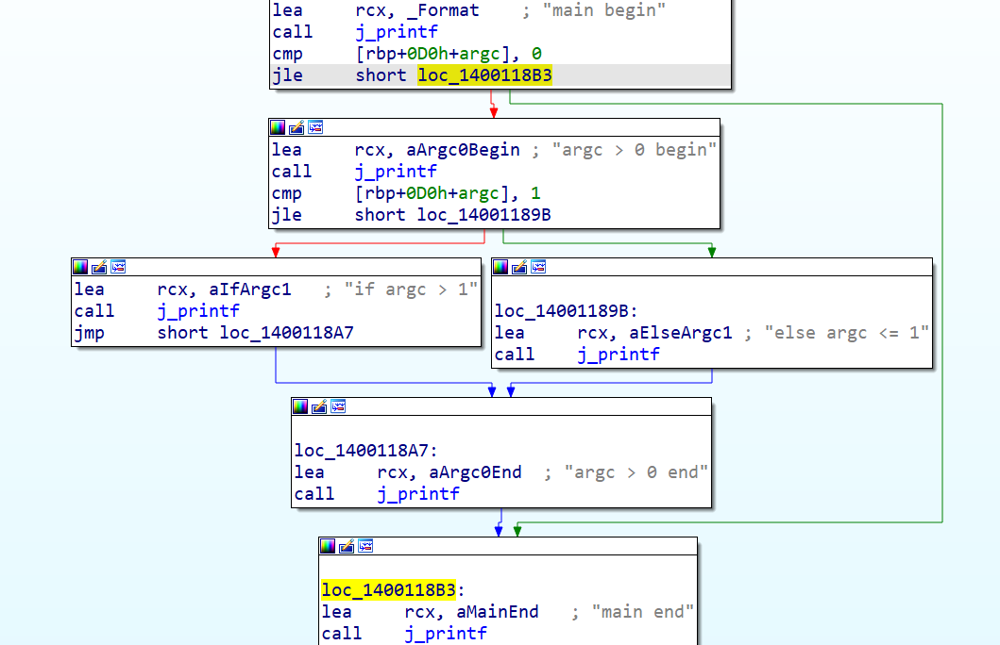
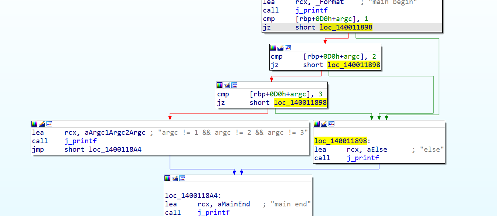
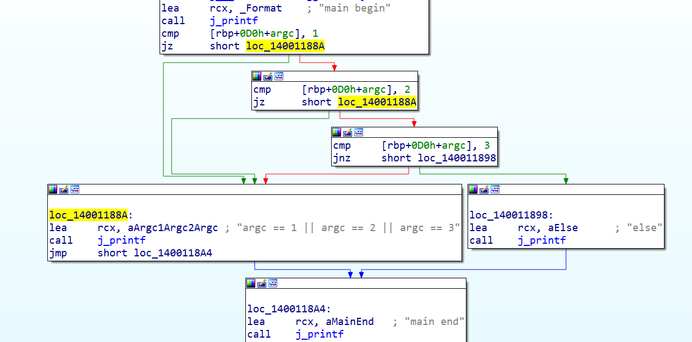
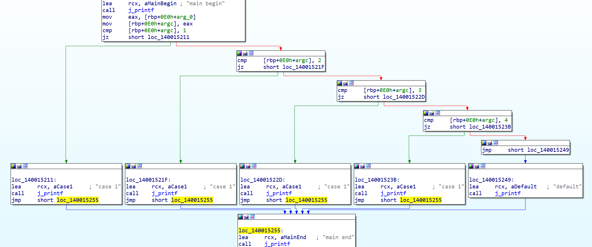
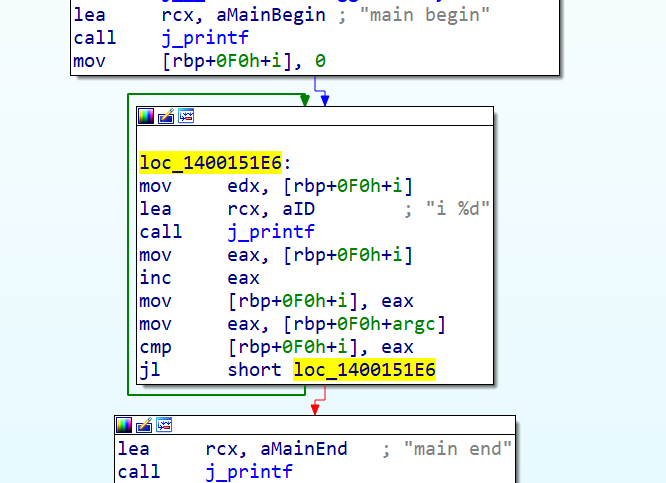
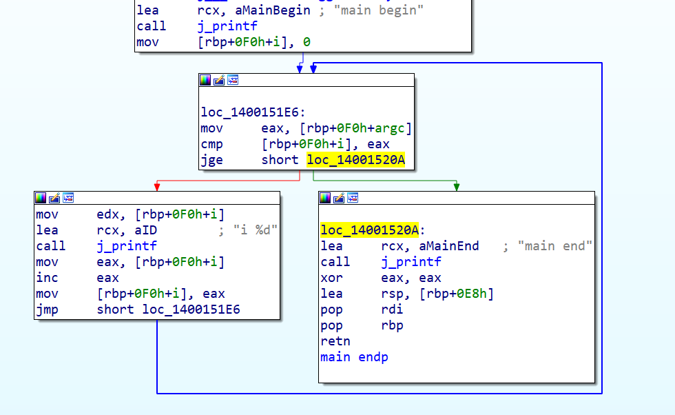
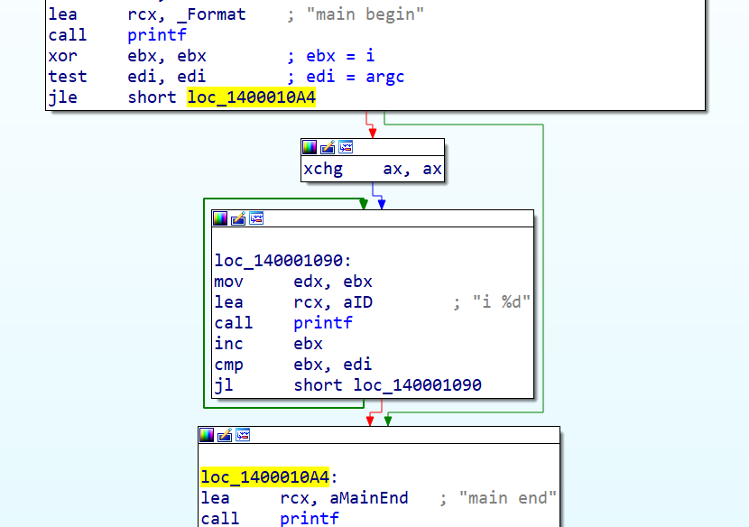
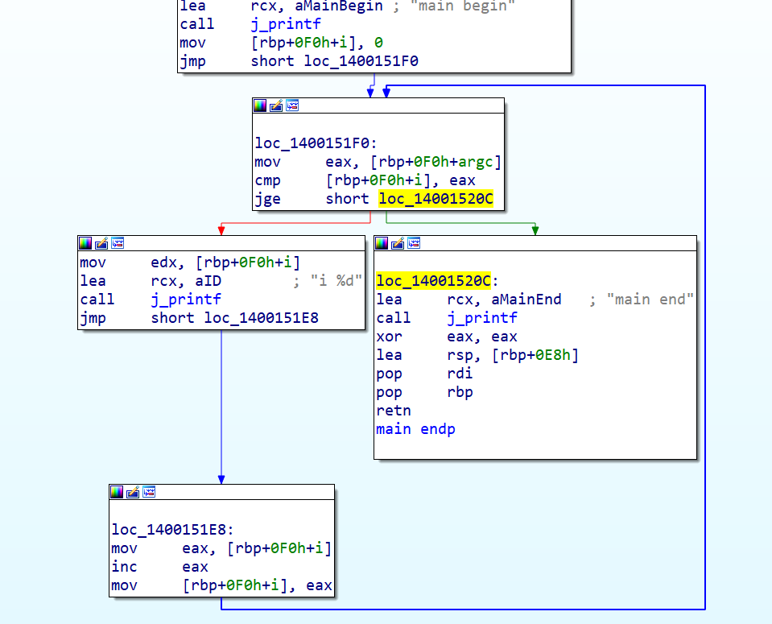
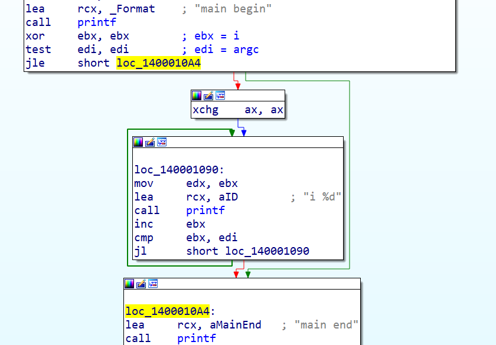

# 分支

> 64位程序的分支和32位程序的分支基本一致。
> 这里介绍一些 ida 工具的使用技巧

总的来说，不关心代码，只关心逻辑，先还原分支，再还原分支的条件，最后再还原代码块。

``` C++
    printf("main begin");
    if (argc > 0) {
        printf("argc > 0 begin");
        if (argc > 1) {
            printf("if argc > 1");
        }
        else {
            printf("else argc <= 1");
        }
        printf("argc > 0 begin");
    }
    printf("main end");
```



* ida的左侧，虚线表示有条件跳转，实线表示无条件跳转。
* 上图可以看到，if的分支结构为一条虚线，if-else的分支结构为一条虚线，一条实线。
* 虚线范围内部就是if的代码块，实线范围内部就是else的代码块。

## 控制流程图

同样的反汇编代码，使用 ida `空格` 键，可以生成控制流程图。



* 红线，条件不满足；绿线，条件满足。
* 蓝线，无条件跳转。
* 一条指令，只有两个分支，红线表示条件不满足，绿线表示条件满足。
* 一般情况下，红线表示if，绿线表示else。
* 如果在红线和绿线共同结束点之前，还有其他代码块，则为if或else的中的代码。
* 图中最外侧绿线，结束点前没有其他代码块，则表示else没有代码，也就是没有else分支。
* 图中同一层次的并列代码块，分别表示 if 和 else 的代码块，它们的结束都是一样的，其中左侧是 if 的代码块，右侧是 else 的代码块。

### &&控制流程图

``` C++
    printf("main begin");
    if (argc != 1 && argc != 2 && argc != 3) {
        printf("argc != 1 && argc != 2 && argc != 3");
    }
    else {
        printf("else");
    }
    printf("main end");
```



* 图中我们可以看到，第二个条件和第三个条件，都跳转到了第一个else代码块，说明三个条件有共同的else。而且三个条件的if都是相同的，由此可知&&的特点。

### ||控制流程图

``` C++
    printf("main begin");
    if (argc == 1 || argc == 2 || argc == 3) {
        printf("argc == 1 || argc == 2 || argc == 3");
    }
    else {
        printf("else");
    }
    printf("main end");
```



* 图中可以看到，最后一个条件被取反。
* 如果将最后一个条件取反，则可知||的特点，即三个条件有共同的if。
* 满足走人，是且；满足继续，是或。

### switch控制流程图

``` C++
    printf("main begin");
	switch (argc)
	{
	case 1:
		printf("case 1");
		break;
	case 2:
		printf("case 1");
		break;
	case 3:
		printf("case 1");
		break;
	case 4:
		printf("case 1");
		break;
	default:
		printf("default");
		break;
	}
    printf("main end");
```



* switch的特征是，每个case都跳转到了同一个代码块，而且default分支的结束点，就是所有case的结束点。

# 循环

## do-while

``` C++
    printf("main begin");
    int i = 0;
    do
    {
        printf("i %d", i);
        i++;
    } while (i < argc);
    printf("main end");
```



* 图中可以看到条件满足时，循环是一个闭合的圈，圈中是循环体。

## while

``` C++
    printf("main begin");
    int i = 0;
    while (i < argc) {
        printf("i %d", i);
        i++;
    }
    printf("main end");
```



* 图中可以看到有一个闭合的圈，圈中是循环体，循环体中有一个条件判断，用来退出循环。
* 所以也可以理解为以下代码。

``` C++
    printf("main begin");
    int i = 0;
    while(true){
        if(i >= argc){
            break;
        }
        printf("i %d", i);
        i++;
    }
    printf("main end");
```



* 上图为Release版本，优化为if{do-while}。

## for

``` C++
    printf("main begin");
    for (int i = 0; i < argc; i++) {
        printf("i %d", i);
    }
    printf("main end");
```



* 上图为DeBug版本，没有优化，可以看到步长被外提。



* 上图为Release版本，优化为if{do-while}。